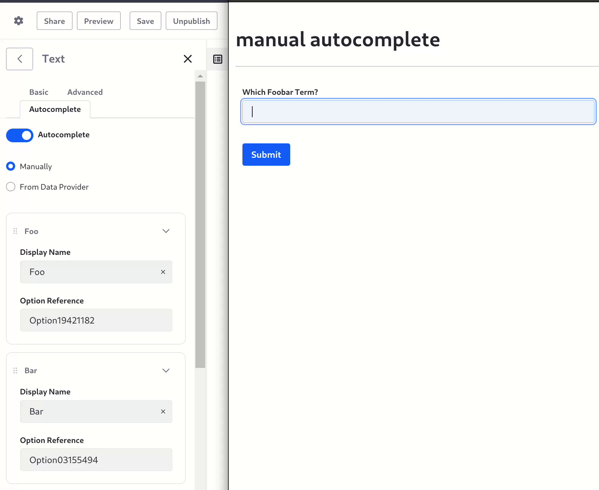
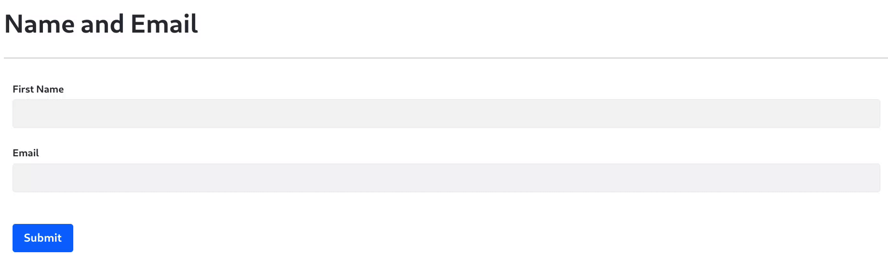

---
taxonomy-category-names:
- Platform
- Forms
- Liferay Self-Hosted
- Liferay PaaS
- Liferay SaaS
uuid: 6013366c-80d9-4e6f-9b2b-049fcb824727
---
# Field Autocompletion

You can configure form field autocompletion in the Forms application:

| Autocompletion Type    | Description                                   | Field Types                 |
|------------------------|-----------------------------------------------|-----------------------------|
| Manual                 | Type a list of autocompletion options         | Text                        |
| Data Provider          | Call an API to provide autocompletion options | Text                        |
| Browser Autocompletion | Configure the `autocomplete` HTML attribute   | Date Numeric Text |

## Manual Autocompletion

To enable text field autocompletion from a list of manually entered options, 

1. Go to the Forms application. Open *Site Menu*  &rarr; *Content & Data* &rarr; *Forms*.

1. Add a form and a text field.

1. In the text field's configuration sidebar, add the options a user sees while typing in the field.

   

## Autocompletion from a Data Provider

To enable text field autocompletion from a list of options returned by a [REST data provider](../data-providers/using-the-rest-data-provider-to-populate-form-options.md), 

1. Go to the Forms application. Open *Site Menu*  &rarr; *Content & Data* &rarr; *Forms*.

1. Open *Data Providers* and add a [REST data provider](../data-providers/using-the-rest-data-provider-to-populate-form-options.md) configured like this:

   * **Name**: REST Countries
   * **URL**: `https://restcountries.com/v3.1/all`
   * **Output Path**: `$..name.common`
   * **Output Type**: List
   * **Output Label**: Country Name

   To understand more about these values, see [Data Providers Overview](../data-providers/data-providers-overview.md).

1. [Add a form](./creating-forms.md) with a text field named *Country*.

1. In the field editor sidebar, click *Autocomplete*.

1. From the newly appearing options, choose *From Data Provider*.

1. Select *REST Countries* and its output parameter, *Country Name*.

1. Save and publish the form.

1. Go to the form and begin entering data into the field:

   

## Browser Autocompletion

{bdg-secondary}`DXP 2024.Q2+; Portal 7.4 GA120+`

Date, Numeric, and Text fields can leverage autocompletion or autofill from the [browser through HTML attributes](https://html.spec.whatwg.org/multipage/form-control-infrastructure.html#autofill).

To see how it works,

1. First, make sure your browser settings have at least one address configured for autofill. For example,

   

   This example uses the Name and Email fields.

1. Go to the Forms application. Open *Site Menu*  &rarr; *Content & Data* &rarr; *Forms*.

1. Add a form with these fields and configuration:

   Field 1:

      * **Label:** Name
      * **HTML Autocomplete Attribute (Advanced):** name

   Field 2:

      * **Label:** Email
      * **HTML Autocomplete Attribute (Advanced):** email

1. Save and publish the form.

1. Go to the form and confirm that the browser's autocomplete is working:

   

Autocompletion in form fields can make users more likely to fill out your forms.

## Related Topics

* [Using a REST Data Provider to Populate Form Options](../data-providers/using-the-rest-data-provider-to-populate-form-options.md) 
* [Using the Autofill Rule](../form-rules/using-the-autofill-rule.md)
* [Using Fragments to Build Forms](../../../liferay-development/objects/using-fragments-to-build-forms.md)
