---
taxonomy-category-names:
- Platform
- Forms
- Objects
- Liferay Self-Hosted
- Liferay PaaS
- Liferay SaaS
uuid: 548428c2-6577-41e5-bae3-5ea41396262e
---
# Migrating to Liferay Objects

Dynamic Data Lists is deprecated and scheduled for removal by the end of 2024. To prevent data loss and achieve the same functionality, please migrate your structures and data to Liferay Objects. [Objects](../../../building-applications/objects.md) provides low-code capabilities for building applications in the Liferay UI without having to write code or deploy modules. Each application is fully integrated with Liferay's core frameworks (e.g., headless, permissions, workflow) and can be accessed via the UI or dedicated REST APIs to create and manage data entries.

Working with Dynamic Data Lists involves creating data definitions and then using them to create forms (`DDLRecordSet`) that store lists of data entries (`DDLRecords`). Using Objects involves creating, relating, and publishing object definitions. Once published, you can then access the application to create object entries. In comparison with DDL, Objects provides a far more robust and integrated experience for modeling data structures while including additional tools for implementing custom business logic and designing user interfaces.

To migrate your data, 

1. Create an object definition for your dynamic data list. If the list includes select or radio fields, you must also create picklists for defining these options.

1. Export your data list's records as an XML or CSV file and convert it to a JSON file.

1. Import the JSON file to your object definition using the [Data Migration Center](../../../headless-delivery/consuming-apis/data-migration-center.md).

!!! note
    To use the Data Migration Center, you must enable the COMMERCE-8087 [beta feature flag](../../../system-administration/configuring-liferay/feature-flags.md#beta-feature-flags).

## Creating an Object Definition for a Dynamic Data List

1. Open the *Global Menu* (), go to the *Control Panel* tab, and click *Objects*.

1. Go to the desired object folder and click the *Add* button ().

1. Provide these details for the draft.

   **Label**: Identifies the object in the Objects admin and supported application contexts (e.g., Workflow, Display Page Templates, Forms).

   **Plural Label**: Determines the display name for the object application in the UI.

   **Object Name**: Determines the object's `definition.name` and cannot be changed after publishing.

   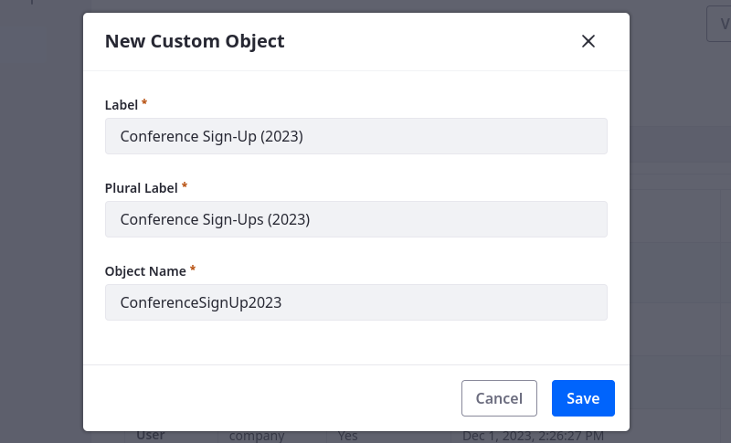

1. Click *Save*.

Once created, you can edit the object to configure its scope, platform integrations, and more. See [Editing Object Drafts](../../../building-applications/objects/creating-and-managing-objects/creating-objects.md#editing-object-drafts) for more information.

If your dynamic data list includes Select and Radio fields, you must [add picklists](#adding-picklists) to store these field options. Otherwise, you can continue to [add data fields](#adding-data-fields) to the object definition.

### Adding Picklists

1. Open the *Global Menu* (), go to the *Control Panel* tab, and click *Picklists*.

1. Click *Add* ().

1. Enter a name for the list.

   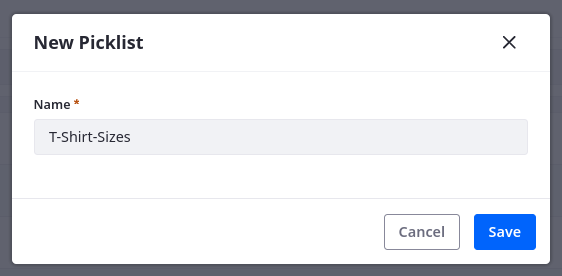

1. Edit the picklist.

1. Under Items, click *Add* ().

1. Enter a name and key for the item.

   **Name**: Determines the item's display name and can be localized after creation.

   **Key**: Determines the item's value stored by object fields and uses camel case.

   !!! important
       The item's key value must match the option names set in the data list's Select or Radio field. If the Select and Radio fields do not use camel case, update the option names to match the picklist item keys.

   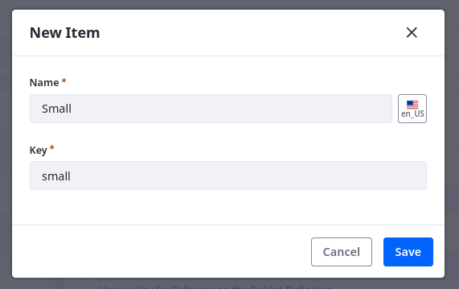

1. Click Save.

1. Repeat the above steps to add other items.

   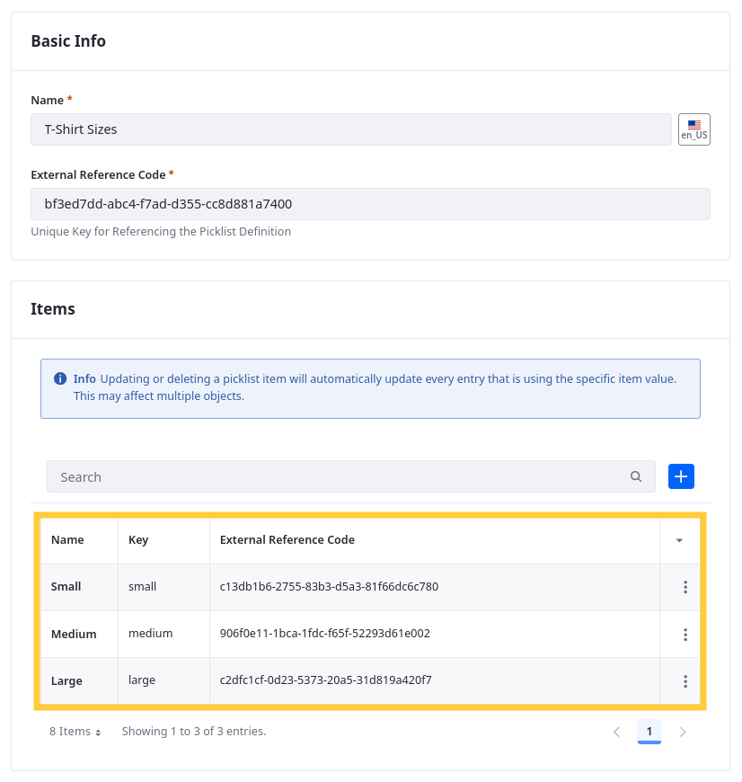

Once you've created your picklists, you can use them for data fields in your object definition. 

### Adding Data Fields

1. Begin editing your object definition.

1. Go to the *Fields* tab and click *Add* ().

1. Enter a *Label* and *Field Name*.

   **Label**: This value identifies the field in the Objects UI and can be localized after the field is created.

   **Field Name**: This value determines the field's name in the backend and uses camel case. Once a field is published, this value cannot be changed.

1. Select a field *Type*. See [Field Compatibility Reference](#field-compatibility-reference) for which field types are compatible with DDL fields.

1. Determine whether the field is mandatory.

   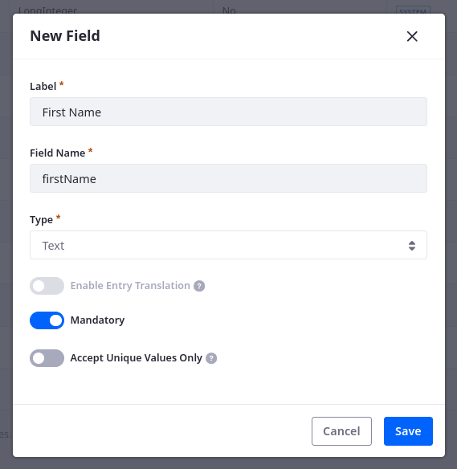

1. Click Save.

1. Repeat the above steps to add other fields.

   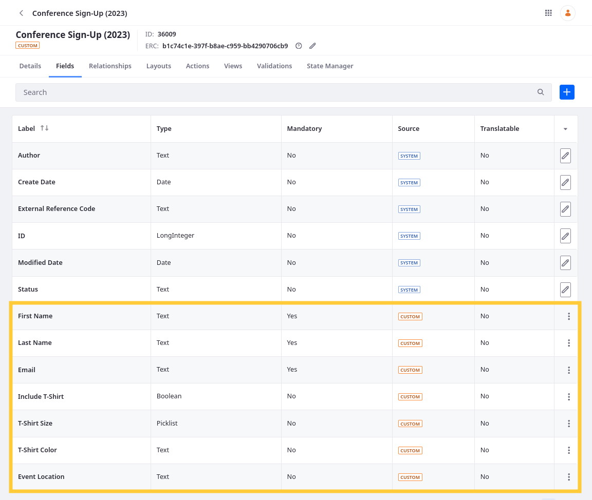

Once you've added data fields, edit them to configure additional settings, such as searchability, default values, and localizability. See [Fields](../../../building-applications/objects/creating-and-managing-objects/fields.md) for more information. 

### Publishing the Object Definition

After configuring your object definition and adding data fields, publish the object to make it available for use. To do this, go to the object's *Details* tab and click *Publish*. Once published, you can design forms and displays for the object. To design administrative interfaces, see [Layouts](../../../building-applications/objects/creating-and-managing-objects/layouts.md) and [Views](../../../building-applications/objects/creating-and-managing-objects/views.md). To learn about object integrations with the info framework and page builder features, see [Displaying Object Entries](../../../building-applications/objects/displaying-object-entries.md) and [Using Fragments to Build Forms](../../../building-applications/objects/using-fragments-to-build-forms.md). 

Next, export your data list records and import them to the custom object definition.

## Exporting and Converting Data Entries

1. Open the *Site Menu* (), expand *Content & Data*, and click *Dynamic Data Lists*.

1. Click the *Actions* button () for the desired data list and select *Export*.

   !!! important
       Nested field values are not exported.

1. Select *CSV* or *XML* and click *OK*.

   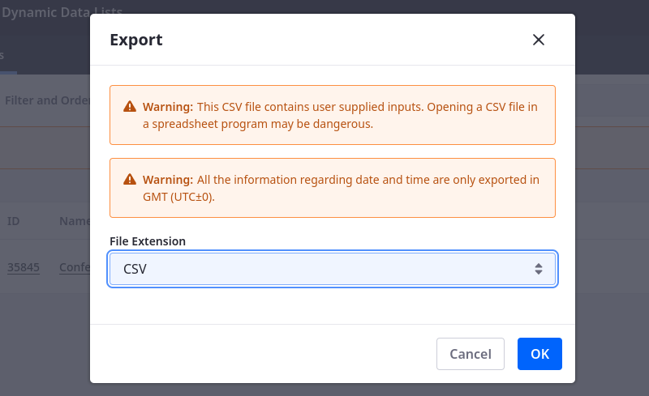

1. Use a third party service to convert the file to JSON.

Once your JSON file is ready, you can import it to the custom object definition.

## Importing DDL Entries

1. Open the *Global Menu* (), go to the *Applications* tab, and click *Data Migration Center*.

1. Click *Add* () and select *Import File*.

1. Enter a *Name* for the import.

1. For Entity Type, select your *custom object*.

   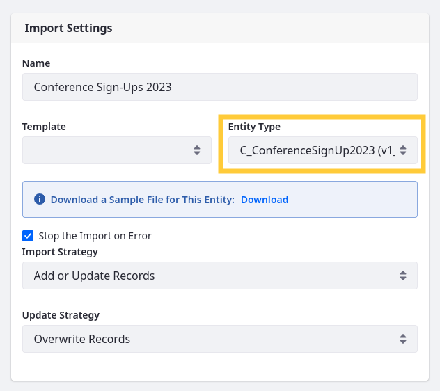

1. Select the *JSON file* with your data list records.

   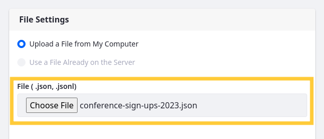

1. Map the *source file fields* to object definition fields.

   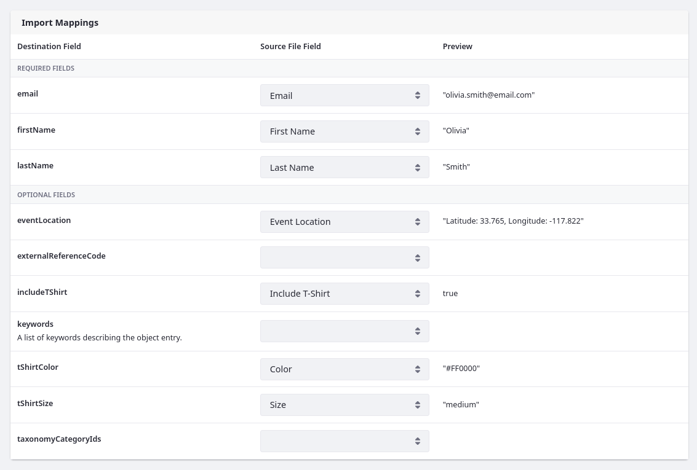

1. Click *Next*.

1. Review the field mapping for your records and click *Start Import*. 

   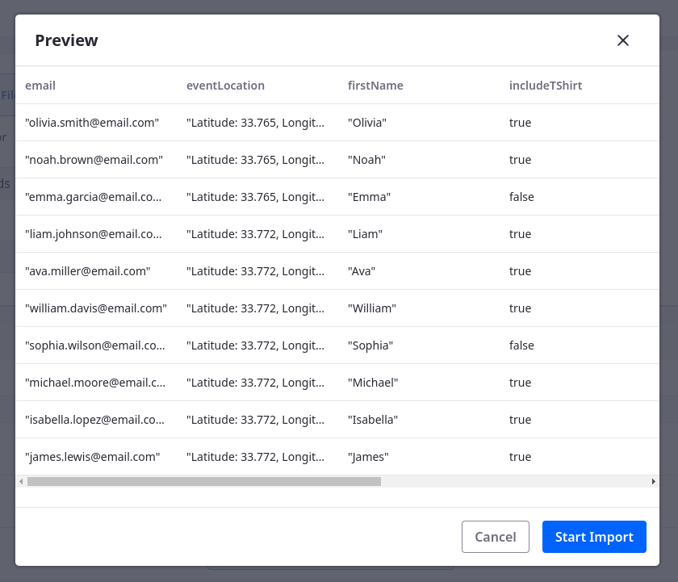

1. Confirm the import is successful.

   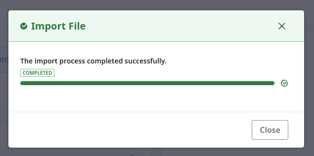

1. Verify the entries appear in the custom object.

   

## Field Compatibility Reference

| DDL Field Type      | Object Field Type |
|:--------------------|:------------------|
| Boolean             | Boolean           |
| Color               | Text              |
| Date                | Date              |
| Decimal             | Decimal           |
| Documents and Media | Attachments       |
| Geolocation         | Text              |
| HTML                | Rich Text         |
| Integer             | Integer           |
| Link to Page        | Rich Text         |
| Number              | Decimal           |
| Radio               | Picklist          |
| Select              | Picklist          |
| Text                | Text              |
| Text Box            | Long Text         |
| Web Content         | Rich Text         |

## Related Topics

* [Objects](../../../building-applications/objects.md)
* [Creating Objects](../../../building-applications/objects/creating-and-managing-objects/creating-objects.md)
* [Adding Fields to Objects](../../../building-applications/objects/creating-and-managing-objects/fields/adding-fields-to-objects.md)
* [Creating Picklists](../../../building-applications/objects/picklists/creating-picklists.md)
