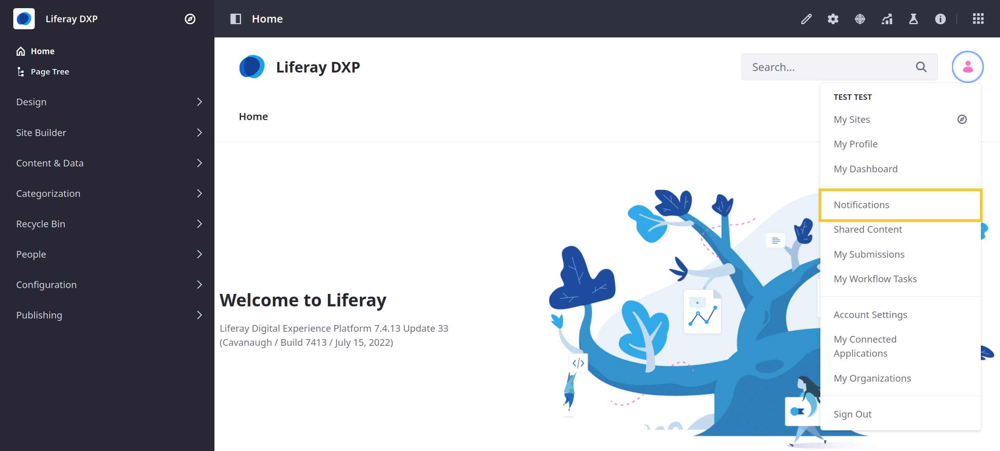
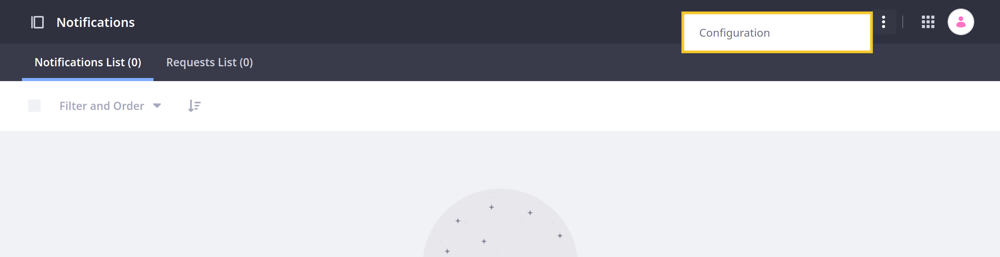
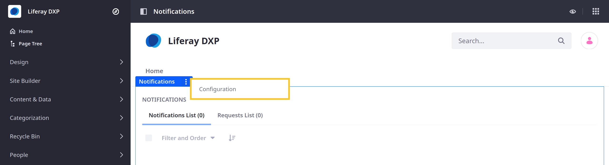

---
taxonomy-category-names:
- Platform
- Notifications and Notification Templates
- Liferay Self-Hosted
- Liferay PaaS
- Liferay SaaS
uuid: 7bb10ad4-6e30-4077-b993-e61aa41c51ec
---

# Configuring Personal Notifications

Liferay provides integrated notification tools, so you can ensure users are alerted to platform events. Users can customize which notifications they receive by enabling email, or website notifications for the desired applications. These settings are global in scope and determine the user's personal notifications for all sites. To customize individual notifications,

1. Open your *Personal Menu* and click *Notifications*.

   

1. Click *Actions* () in the Application Bar and select *Configuration*.

   

   Alternatively, you can access these settings wherever the Notifications widget is deployed. Click the widget's *Options* button () and select *Configuration*.

   

1. Enable or disable notifications for the desired application triggers.

1. Click *Save*.

Customization options include the following application triggers.

## Blogs

| Trigger                                     | Email    | Website  |
|:--------------------------------------------|:---------|:---------|
| Adds a new blog entry you are subscribed to | &#10004; | &#10004; |
| Updates a blog entry you are subscribed to  | &#10004; | &#10004; |

## Comments

| Trigger                                          | Email    | Website  |
|:-------------------------------------------------|:---------|:---------|
| Adds a comment to comments you are subscribed to | &#10004; | &#10004; |
| Updates a comment you are subscribed to          | &#10004; | &#10004; |

## Contacts Center

| Trigger                                 | Email | Website  |
|:----------------------------------------|:------|:---------|
| Sends you a social relationship request |       | &#10004; |

## Documents and Media

| Trigger                                                  | Email    | Website  |
|:---------------------------------------------------------|:---------|:---------|
| Adds a new document in a folder you are subscribed to    | &#10004; | &#10004; |
| A document in a folder you are subscribed to has expired | &#10004; | &#10004; |
| Review a document in a folder you are subscribed to      | &#10004; | &#10004; |
| Updates a document you are subscribed to                 | &#10004; | &#10004; |

## Import/Export Center

| Trigger                       | Email | Website  |
|:------------------------------|:------|:---------|
| Import or export job finishes |       | &#10004; |

## Invite Members

| Trigger                        | Email | Website  |
|:-------------------------------|:------|:---------|
| Sends you a membership request |       | &#10004; |

## Mentions

| Trigger                                                           | Email    | Website  |
|:------------------------------------------------------------------|:---------|:---------|
| Mentions you in a blogs entry, comment, or message boards message | &#10004; | &#10004; |

## Message Boards

| Trigger                                                       | Email    | Website  |
|:--------------------------------------------------------------|:---------|:---------|
| Adds a new post in a thread or category you are subscribed to | &#10004; | &#10004; |
| Updates a post you are subscribed to                          | &#10004; | &#10004; |

## My Workflow Tasks

| Trigger                   | Email    | Website  |
|:--------------------------|:---------|:---------|
| Interacts with a workflow | &#10004; | &#10004; |

## Publications

| Trigger                              | Email | Website  |
|:-------------------------------------|:------|:---------|
| Invites you to work on a publication |       | &#10004; |

## Segments Experiment

| Trigger                                           | Email    | Website  |
|:--------------------------------------------------|:---------|:---------|
| When someone changes the status of your A/B tests | &#10004; | &#10004; |

## Sharing

| Trigger                                               | Email    | Website  |
|:------------------------------------------------------|:---------|:---------|
| Shares content with you                               | &#10004; | &#10004; |
| Modifies your permissions for content shared with you | &#10004; | &#10004; |

## Web Content

| Trigger                                                | Email    | Website  |
|:-------------------------------------------------------|:---------|:---------|
| Adds new web content in a folder you are subscribed to | &#10004; | &#10004; |
| Moves from folder web content you are subscribed to    | &#10004; | &#10004; |
| Restores from trash web content you are subscribed to  | &#10004; | &#10004; |
| Moves to folder web content you are subscribed to      | &#10004; | &#10004; |
| Moves to trash web content you are subscribed to       | &#10004; | &#10004; |
| Updated web content you are subscribed to              | &#10004; | &#10004; |

## Wiki

| Trigger                                              | Email    | Website  |
|:-----------------------------------------------------|:---------|:---------|
| Adds a new wiki page in a wiki you are subscribed to | &#10004; | &#10004; |
| Updates a wiki page you are subscribed to            | &#10004; | &#10004; |

## Related Topics

- [Configuring Mail](../../installation-and-upgrades/setting-up-liferay/configuring-mail.md)
- [Email Settings](../../system-administration/configuring-liferay/virtual-instances/email-settings.md)
- [Notifications](../notifications.md)
