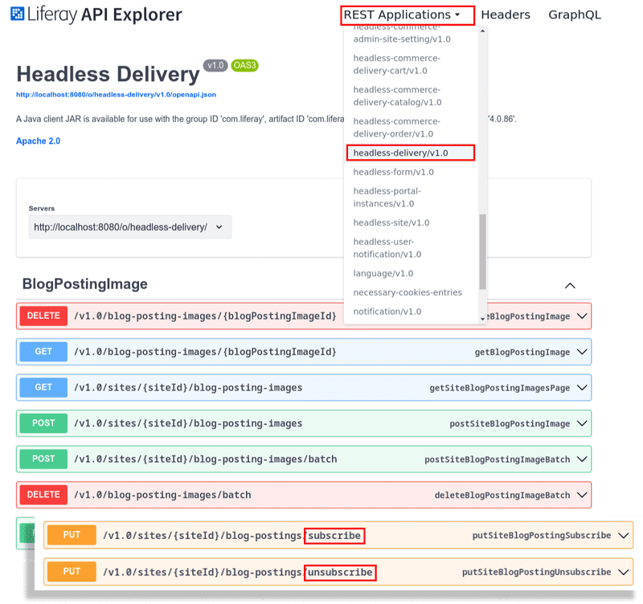

---
taxonomy-category-names:
- Platform
- Notifications and Notification Templates
- Liferay Self-Hosted
- Liferay PaaS
- Liferay SaaS
uuid: 8ccdf354-85e1-455a-9b5d-ea9449379595
---

# Notifications API Basics

Liferay's headless delivery application provides REST and GraphQL services for subscribing to or unsubscribing from notifications for platform events across several default applications. Access these services using methods such as cURL commands and Java classes.

Manage notifications for the following applications under the `headless-delivery` namespace: blogs, document folders, knowledge base articles, message board messages, message board sections, message board threads, structured content folders, structured content, wiki nodes, and wiki pages.

Start by setting up the environment and gathering the necessary information.

## Setting Up the Environment

```{include} /_snippets/run-liferay-portal.md
```

When signed in, [retrieve the site ID](../../../headless-delivery/consuming-apis/consuming-rest-services.md#identify-the-site-containing-the-data). Use this ID in several service calls. In this example, the ID is `20117`.

Then, follow these steps:

1. Download and unzip the [example project](https://resources.learn.liferay.com/dxp/latest/en/process-automation/notifications/developer-guide/liferay-v3g2.zip):

   ```bash
   curl https://resources.learn.liferay.com/dxp/latest/en/process-automation/notifications/developer-guide/liferay-v3g2.zip -O
   ```

   ```bash
   unzip liferay-v3g2.zip
   ```

1. Check which subscriptions are active under your user account by executing the `Subscriptions_GET_FromMyUserAccount.sh` script.

   ```bash
   ./Subscriptions_GET_FromMyUserAccount.sh
   ```

   The response should be empty since there are no active subscriptions:

   ```json
   {
      "actions": {},
      "facets": [],
      "items": [],
      "lastPage": 1,
      "page": 1,
      "pageSize": 20,
      "totalCount": 0
   }
   ```

   !!! important
       Ensure the email and password specified in the `--user` option match those used in the scripts.

## Subscribing to Notifications

Subscribe to notifications for various applications under the `headless-delivery` namespace.

To find which applications are available for subscription, use the Liferay API Explorer at [server]:[port]/o/api (e.g., http://localhost:8080/o/api).

In the API Explorer, click *REST Applications* and select the `headless-delivery/v1.0` option.

Look for PUT methods that include "subscribe" or "unsubscribe" in their endpoint paths. For example, you can find endpoints like `/v1.0/sites/{siteId}/blog-postings/subscribe` for blog posting subscription actions.



### Using REST Services

Use the REST API to subscribe to an application with the `BlogPostings_PUT_Subscribe_ToSites.sh` script. This script subscribes to notifications for blog postings on a site.

```bash
curl \
   "http://localhost:8080/o/headless-delivery/v1.0/sites/${1}/blog-postings/subscribe" \
   --header "Content-type: application/json" \
   --request "PUT" \
   --user "test@liferay.com:learn"
```

!!! tip
    Modify the endpoint path to subscribe to other applications. For instance, to subscribe to notifications from a document folder, use `http://localhost:8080/o/headless-delivery/v1.0/document-folders/{documentFolderId}/subscribe`. The API Explorer provides additional details about available endpoints and their requirements.

1. On the command line, navigate to the `curl` folder. Execute the `BlogPostings_PUT_Subscribe_ToSites.sh` with your site ID as a parameter.

   ```bash
   BlogPostings_PUT_Subscribe_ToSites.sh [site-ID]
   ```

1. This call returns no output. Verify the subscription by executing `Subscriptions_GET_FromMyUserAccount.sh`. The result should include the `contentType` and the `id` for the subscription:

   ```json
   {
      "actions" : { },
      "facets" : [ ],
      "items" : [ {
         "contentId" : 20117,
         "contentType" : "BlogPosting",
         "dateCreated" : "2024-09-09T21:56:12Z",
         "dateModified" : "2024-09-09T21:56:12Z",
         "frequency" : "instant",
         "id" : 32471,
         "siteId" : 20117
      } ],
      "lastPage" : 1,
      "page" : 1,
      "pageSize" : 20,
      "totalCount" : 1
   }
   ```

1. The REST service can also be called with a Java class. Navigate out of the `curl` folder and into the `java` folder. Compile the source files:

   ```bash
   javac -classpath .:* *.java
   ```

1. Run the `BlogPostings_PUT_Subscribe_ToSites` Java class. Replace the `siteId` value with your site ID:

```bash
java -classpath .:* -DsiteId=1234 BlogPostings_PUT_Subscribe_ToSites
```

!!! tip
    For subscribing to other applications, identify the corresponding class for the target application. For example, use `DocumentFolderResource` for document folders. Update the method call to match the correct subscription method for the new resource.

1. Run the `Subscriptions_GET_FromMyUserAccount` class to verify the action was successful.

```json
{"actions": {}, "items": [{"contentId": "20117", "contentType": "BlogPosting", "dateCreated": "2024-09-10T09:53:32-0300", "dateModified": "2024-09-10T09:53:32-0300", "frequency": "instant", "id": 32471, "siteId": 20117}], "page": 1, "pageSize": 10, "totalCount": 1}
```

#### Examine the cURL Command

The `BlogPostings_PUT_Subscribe_ToSites.sh` script subscribes to notifications for blog postings on a given site by calling a `headless-delivery` application REST service.

Here are the command's arguments:

| Arguments                                                                             | Description                                                                                                        |
|:--------------------------------------------------------------------------------------|:-------------------------------------------------------------------------------------------------------------------|
| `"http://localhost:8080/o/headless-delivery/v1.0/sites/${1}/blog-postings/subscribe"` | The REST service endpoint. Your site ID parameter replaces `${1}`.                                                 |
| `--header "Content-type: application/json" \`                                         | The media type ([MIME type](https://en.wikipedia.org/wiki/Media_type)) of the resource sent to the server is JSON. |
| `--request "PUT"`                                                                     | The HTTP method to invoke at the specified endpoint.                                                               |
| `--user "test@liferay.com:learn"`                                                     | Basic authentication credentials.                                                                                  |

!!! note
    Basic authentication is used here for demonstration purposes. For production, you should authorize users via [OAuth 2.0](../../../headless-delivery/using-oauth2.md). See [Using OAuth2 to Authorize Users](../../../headless-delivery/using-oauth2/using-oauth2-to-authorize-users.md) for a sample React application that uses OAuth2.

#### Examine the Java Class

The `BlogPostings_PUT_Subscribe_ToSites.java` class subscribes to notifications for blog postings on a given site.

| Line (abbreviated)                                                               | Description                                                                               |
|:---------------------------------------------------------------------------------|:------------------------------------------------------------------------------------------|
| `BlogPostingResource.Builder builder = ...`                                      | Gets a `Builder` for generating a `BlogPostingResource` service instance.                 |
| `BlogPostingResource blogPostingResource = builder.authentication(...).build();` | Specifies basic authentication and generates a `BlogPostingResource` service instance.    |
| `blogPostingResource.putSiteBlogPostingSubscribe(...);`                          | Calls the `blogPostingResource.putSiteBlogPostingSubscribe` method, passing in a site ID. |

Note that the project includes the `com.liferay.headless.delivery.client.jar` file as a dependency. You can find client JAR dependency information for all REST applications in the API explorer in your installation at `/o/api`.

!!! important
    See [BlogPostingResource](https://github.com/liferay/liferay-portal/blob/[$LIFERAY_LEARN_PORTAL_GIT_TAG$]/modules/apps/headless/headless-delivery/headless-delivery-client/src/main/java/com/liferay/headless/delivery/client/resource/v1_0/BlogPostingResource.java) for service details.

### Using GraphQL Services

Use GraphQL services to subscribe to notifications. Access the Liferay API Explorer to perform this action. Read [Consuming GraphQL APIs](../../../headless-delivery/consuming-apis/consuming-graphql-apis.md) to learn more about GraphQL queries and mutations.

1. Click *GraphQL* in the top right corner, add the following mutation query to the left column, and replace `siteKey` with your site ID:

   ```graphql
   mutation {
      headlessDelivery_v1_0 {
         updateSiteBlogPostingSubscribe(siteKey: "20117")
      }
   }
   ```

1. Click *Execute Query*. The response should include a boolean value indicating whether the subscription was successful:

   ```json
   {
      "data": {
         "headlessDelivery_v1_0": {
            "updateSiteBlogPostingSubscribe": true
         }
      }
   }
   ```

1. Verify the subscription with this query:

   ```graphql
   {
      headlessAdminUser_v1_0 {
         myUserAccountSubscriptions {
            items {
            contentType
            dateCreated
            dateModified
            frequency
            id
            siteId
            }
         }
      }
   }
   ```

   The response should confirm the subscription to blog postings:

   ```json
   {
      "data": {
         "headlessAdminUser_v1_0": {
            "myUserAccountSubscriptions": {
            "items": [
               {
                  "contentType": "BlogPosting",
                  "dateCreated": "2024-09-09T21:56:12Z",
                  "dateModified": "2024-09-09T21:56:12Z",
                  "frequency": "instant",
                  "id": 32471,
                  "siteId": 20117
               }
            ]
            }
         }
      }
   }
   ```

## Unsubscribing From Notifications

Unsubscribe from notifications for applications under the `headless-delivery` namespace.

### Using REST Services

To unsubscribe using the REST API, use the endpoint with the unsubscribe action. This is the counterpart to the subscribe endpoint used for notifications. In this example, the `./BlogPostings_PUT_Unsubscribe_ToSites.sh` script unsubscribes from notifications for blog postings on a site.

```bash
curl \
	"http://localhost:8080/o/headless-delivery/v1.0/sites/${1}/blog-postings/unsubscribe" \
	--header "Content-type: application/json" \
	--request "PUT" \
	--user "test@liferay.com:learn"
```

Replace `[site-ID]` with your site ID and run `BlogPostings_PUT_Unsubscribe_ToSites.sh`.

```bash
BlogPostings_PUT_Unsubscribe_ToSites.sh [site-ID]
```

This call returns no response. Verify the unsubscription by executing `Subscriptions_GET_FromMyUserAccount.sh`. The result should be empty:

```json
{
   "actions" : { },
   "facets" : [ ],
   "items" : [ ],
   "lastPage" : 1,
   "page" : 1,
   "pageSize" : 20,
   "totalCount" : 0
}
```

Alternatively, execute the corresponding Java class:

```bash
java -classpath .:* -DsiteId=1234 BlogPostings_PUT_Unsubscribe_ToSites
```

Run `Subscriptions_GET_FromMyUserAccount.java` to confirm the unsubscription was successful:

```json
{"actions": {}, "items": [], "page": 1, "pageSize": 10, "totalCount": 0}
```

### Using GraphQL Services

Unsubscribe from notifications using GraphQL services. Access the Liferay API Explorer for this task.

1. Click *GraphQL* in the top right corner. Add the following mutation query to the left column, replacing `siteKey` with your site ID:

   ```graphql
   mutation {
      headlessDelivery_v1_0 {
         updateSiteBlogPostingUnsubscribe(siteKey: "20117")
      }
   }
   ```

1. Click *Execute Query*. The response indicates whether the user is unsubscribed:

   ```json
   {
      "data": {
         "headlessDelivery_v1_0": {
            "updateSiteBlogPostingUnsubscribe": true
         }
      }
   }
   ```

## Deleting a Subscription

Delete a subscription using the `headless-admin-user` namespace using an endpoint similar to the one used for `Subscriptions_GET_FromMyUserAccount.sh`. Execute the `Subscriptions_DELETE_FromMyUserAccount.sh` script, replacing [subscription-ID] with the specific subscription ID.

If the operation is successful, the server returns a 204 No Content response with no body.

Run the following command:

```bash
./Subscriptions_DELETE_FromMyUserAccount.sh [subscription-ID]
```

Verify the deletion by running `Subscriptions_GET_FromMyUserAccount.sh`.

Alternatively, delete a subscription by executing the `Subscriptions_DELETE_FromMyUserAccount` Java class, replacing `-DsubscriptionId` with the specific subscription ID:

```bash
java -classpath .:* -DsubscriptionId=1234 Subscriptions_DELETE_FromMyUserAccount
```

Verify the deletion by running `Subscriptions_GET_FromMyUserAccount.java`.

### Using GraphQL Services

Delete a subscription using GraphQL services. Access the Liferay API Explorer for this task.

1. Click *GraphQL* in the top right corner. Add the following mutation query to the left column, replacing `subscriptionId` with your subscription ID:

   ```graphql
   mutation {
      headlessAdminUser_v1_0 {
         deleteMyUserAccountSubscription(subscriptionId: 32672)
      }
   }
   ```

1. Click *Execute Query*. The response indicates whether the subscription is deleted:

   ```json
   {
      "data": {
         "headlessAdminUser_v1_0": {
            "deleteMyUserAccountSubscription": true
         }
      }
   }
   ```

## Related Topics

- [Consuming REST Services](../../../headless-delivery/consuming-apis/consuming-rest-services.md)
- [API Headers Reference](../../../headless-delivery/consuming-apis/api-headers-reference.md)
- [Consuming GraphQL APIs](../../../headless-delivery/consuming-apis/consuming-graphql-apis.md)
