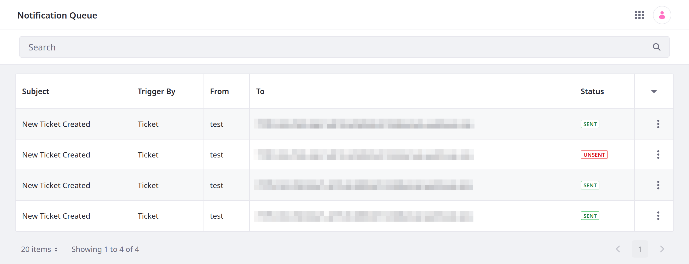
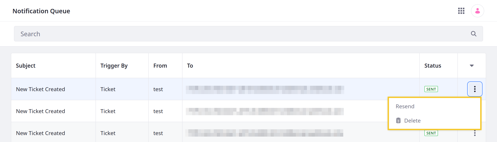
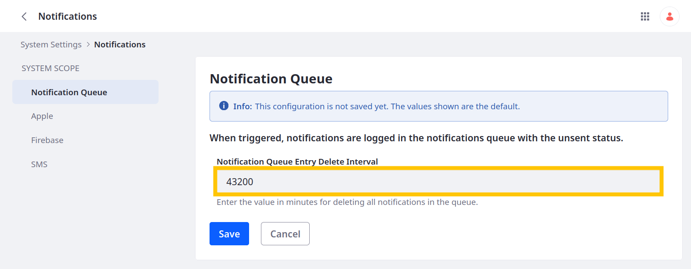

---
taxonomy-category-names:
- Platform
- Notifications and Notification Templates
- Liferay Self-Hosted
- Liferay PaaS
- Liferay SaaS
uuid: 355cd01a-1910-4066-8b7f-fff359cc14f5
---

# Using the Notification Queue

{bdg-secondary}`Liferay 7.4 U75+/GA75+`

Liferay provides the Notification Queue application for reviewing email notifications triggered by an object action. You can verify the status of notifications and resend them if needed.

The application lists the following details for each notification:

| Column     | Description                                                                                                                                                                               |
|:-----------|:------------------------------------------------------------------------------------------------------------------------------------------------------------------------------------------|
| Subject    | The notification's subject, which is set in the [notification template](./creating-notification-templates.md).                                                                            |
| Trigger By | The object responsible for triggering the [notification action](../../liferay-development/objects/creating-and-managing-objects/actions/defining-object-actions.md#notification-actions). |
| From       | The notification's sender, which is set in the [notification template](./creating-notification-templates.md).                                                                             |
| To         | The notification's recipients, which are set in the [notification template](./creating-notification-templates.md).                                                                        |
| Status     | Indicates the notification status, whether it was sent (*Sent*) or is in the process of sending (*Unsent*).                                                                               |

Click *Actions* () for an entry to *delete* it or *resend* the notification.

## Clearing the Notification Queue

By default, Liferay clears the notification queue every `43200` minutes (i.e., 30 days). This deletes all notifications in the queue, regardless of status.

To configure the deletion interval,

1. Open the *Global Menu* (  ), go to the *Control Panel* tab, and click *System Settings*.

1. Under Platform, click *Notifications*.

1. Under Notification Queue, enter the number of minutes between deletion operations.

   The interval must be greater than `15` minutes.

   

1. Click *Save*.

## Related Topics

- [Creating Notification Templates](./creating-notification-templates.md)
- [Configuring Personal Notifications](./configuring-personal-notifications.md)
