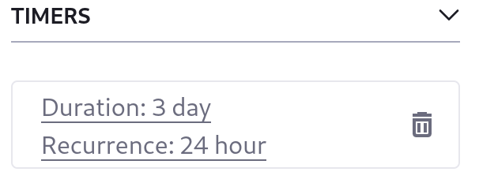
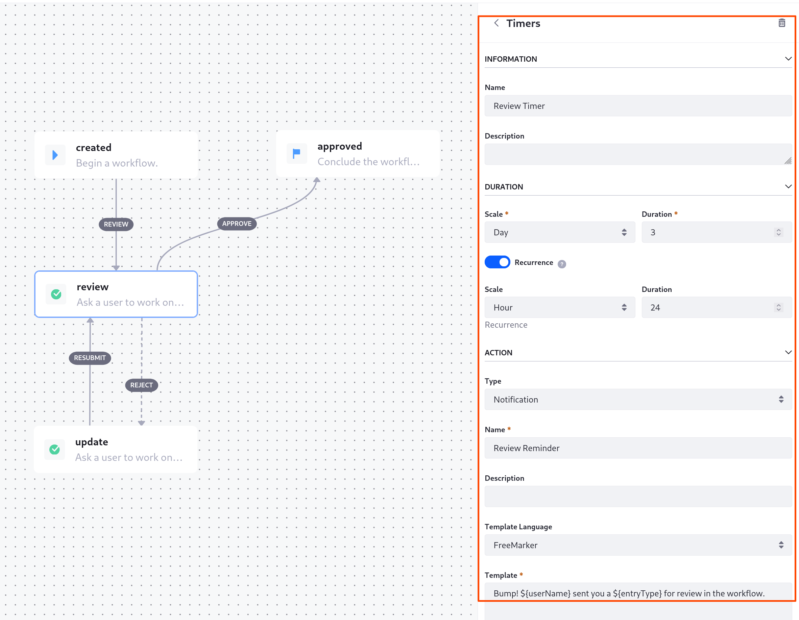

---
taxonomy-category-names:
- Platform
- Workflow
- Liferay Self-Hosted
- Liferay PaaS
- Liferay SaaS
uuid: 52c9479a-c8a0-4d82-b0d4-07edb4a8492a
---

# Using Task Timers

Task nodes can include [task timers](../../developer-guide/workflow-task-node-reference.md#task-timers) to trigger an action after a specified time period. Timers are useful for ensuring a task does not go unattended for too long. Available timer actions include sending an additional notification, reassigning the asset, or creating a timer action.

You can modify the out-of-the-box Single Approver workflow definition to use a timer in its Review task:

1. Open _Global menu_ () &rarr; _Applications_ &rarr; _Process Builder_.

1. Click _Single Approver_ in the workflow definitions list.

1. Click the _Review_ task node.

1. Click _New_ from the Task Timers section of the configuration sidebar.

1. Fill out the new timer form:

   * **Name:** Review Timer
   * **Duration:** 3 days
   * **Recurrence:** Enabled
   * **Duration:** 24 hours
   * **Type:** Notification
   * **Name** Review Reminder
   * **Template Language:** FreeMarker
   * **Template:** Bump! ${userName} sent you a ${entryType} for review in the workflow.
   * **Notification Types:** Email and User Notification
   * **Recipient Type:** Task Assignees

   

1. Click _Update_.

When a review task is idle for three days, the timer now reminds task assignees to complete their reviews. The reminder notification repeats daily.

## Related Topics

* [Task Timers](../../developer-guide/workflow-task-node-reference.md#task-timers)
* [Workflow Definition Node Reference](../../developer-guide/workflow-definition-node-reference.md)
* [Configuring Workflow Actions and notifications](./configuring-workflow-actions-and-notifications.md)
