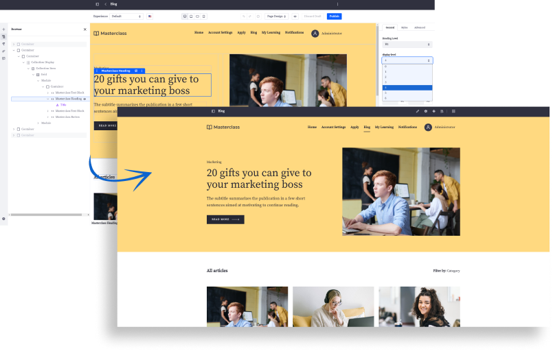

---
toc:
  - ./creating-pages/understanding-pages.md
  - ./creating-pages/adding-pages.md
  - ./creating-pages/using-content-pages.md
  - ./creating-pages/defining-headers-and-footers.md
  - ./creating-pages/using-widget-pages.md
  - ./creating-pages/page-fragments-and-widgets.md
  - ./creating-pages/page-settings.md
taxonomy-category-names:
- Sites
- Pages and Composition
- Liferay Self-Hosted
- Liferay PaaS
- Liferay SaaS
uuid: 2bb5e389-2ced-48e3-b571-11a9b1d920ba
---

# Creating Pages

Pages form the foundation of your site's content and user experience. With Liferay, you can create dynamic and engaging web experiences using flexible, low-code tools to define content, arrange layout elements, and manage functionality.

Start by learning how to [add pages](./creating-pages/adding-pages.md) and leverage the power of [content pages](./creating-pages/using-content-pages.md) for flexible layouts. Customize your pages using [fragments](./creating-pages/page-fragments-and-widgets.md) to easily create visually rich, modular sections that require minimal coding.

Explore further customization through [headers and footers](./creating-pages/defining-headers-and-footers.md) with master page templates, and manage [widget pages](./creating-pages/using-widget-pages.md) when functional widgets are needed. You can also configure important [page settings](./creating-pages/page-settings.md) like permissions and friendly URLs to fine-tune your page's behavior.
