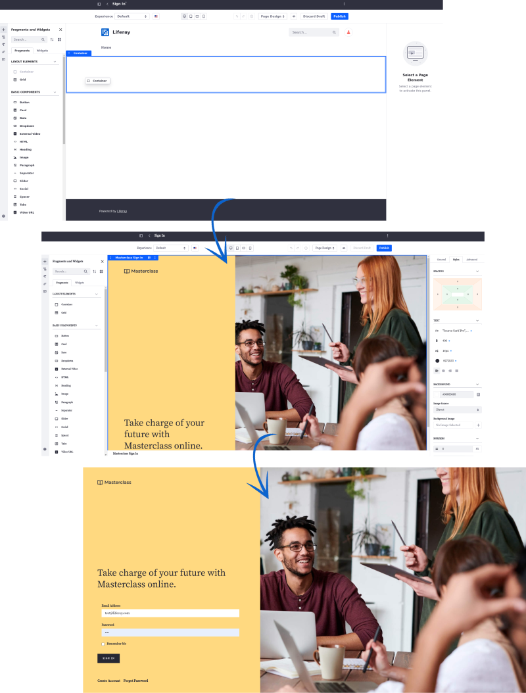
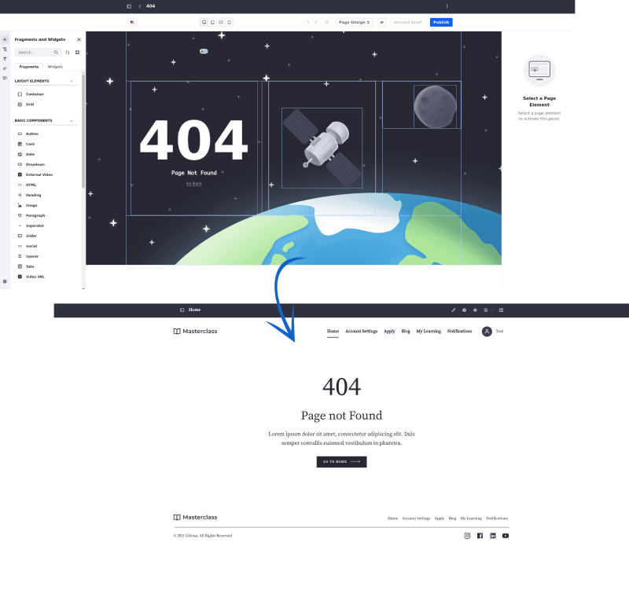

---
toc:
  - ./adding-pages/adding-a-page-to-a-site.md
  - ./adding-pages/creating-a-page-template.md
  - ./adding-pages/exporting-and-importing-page-templates.md
  - ./adding-pages/using-the-full-page-application-page-type.md
  - ./adding-pages/using-utility-pages.md
taxonomy-category-names:
- Sites
- Pages and Composition
- Liferay Self-Hosted
- Liferay PaaS
- Liferay SaaS
uuid: b01430f5-357d-498c-a551-bc9b07fbcf8f
---

# Adding Pages

Managing a Liferay site involves adding and customizing pages to deliver content and create a personalized user experience.

Learn how to [create new pages and child pages](./adding-pages/adding-a-page-to-a-site.md) from the Pages application and the page tree menu.

To streamline development, create predefined layouts and content with [page templates](./adding-pages/creating-a-page-template.md). These templates help maintain consistency across multiple pages. Export them for offline editing before importing them back into Liferay to ensure your site's design system remains cohesive.

Liferay supports various page types, each suited for different needs:

- Use [content pages](./using-content-pages.md) to create visually engaging, flexible layouts using drag-and-drop widgets and fragments with minimal coding.

- Use [widget pages](./using-widget-pages.md) when you must display and manage functional widgets that require a fixed layout or significant customization.

!!! tip
    In older versions, widget pages provided exclusive features, such as custom layouts and customizable columns. Many of these exclusive features are available on content pages since 7.3. So, in most cases, you should opt for a content page.

- Use [full page application pages](./adding-pages/using-the-full-page-application-page-type.md) to host a complete, standalone web application within a single page.

- Use [display page templates](../displaying-content/using-display-page-templates.md) to showcase specific content, such as products or assets, through customizable templates.

- Use [utility pages](./adding-pages/using-utility-pages.md) for system-level functions like login and error handling.

