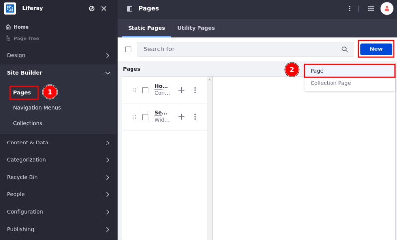
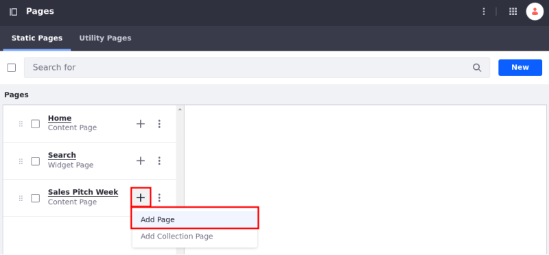
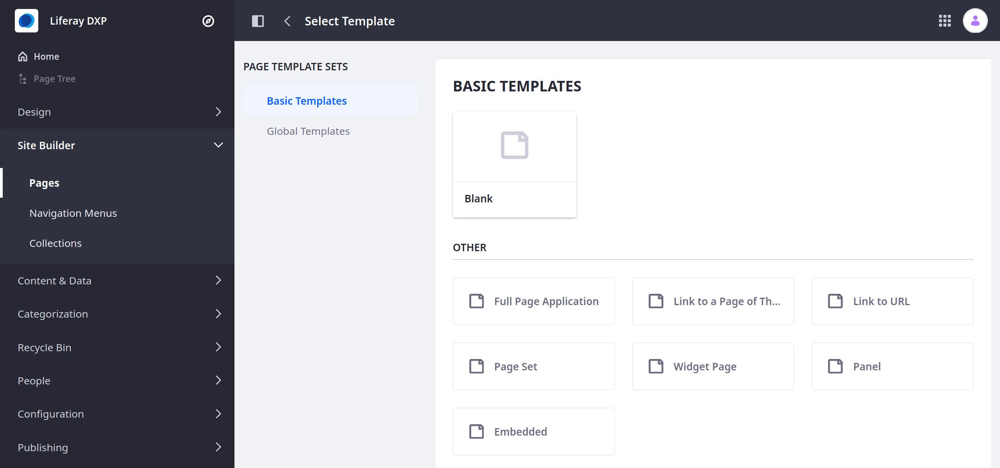
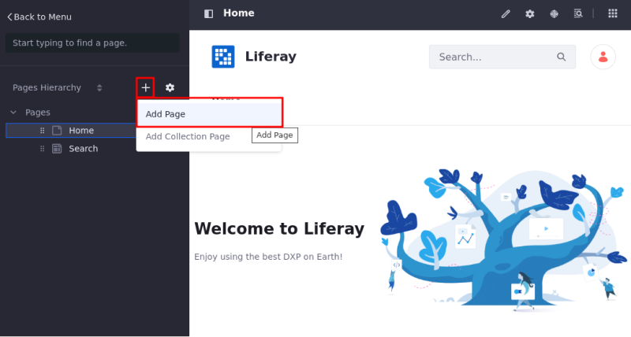
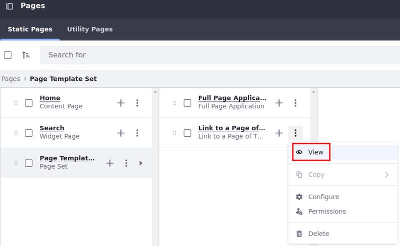
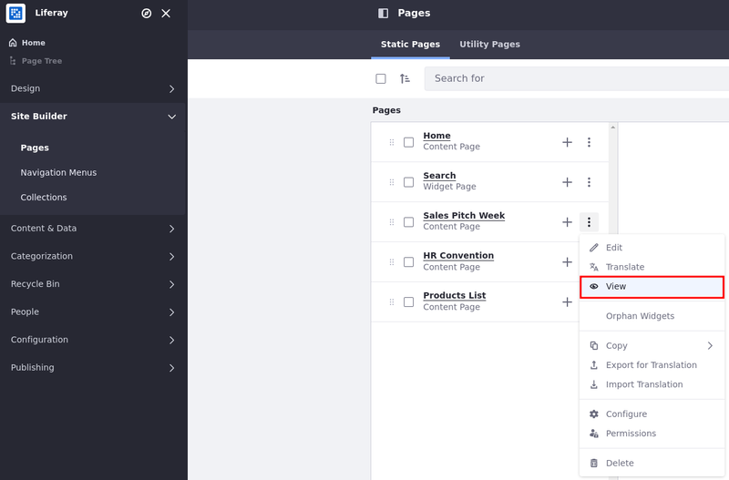

---
taxonomy-category-names:
- Sites
- Pages and Composition
- Liferay Self-Hosted
- Liferay PaaS
- Liferay SaaS
uuid: 1079119c-21f5-48e6-aebb-4a6dfc8262ea
---

# Adding a Page to a Site

Adding and customizing pages is a key part of managing your Liferay site. With pages, you can organize content, create a tailored user experience, and enhance site functionality. You can add pages using the [Pages application](#adding-a-new-page-from-the-pages-application) or through the [Page Tree menu](#adding-a-new-page-from-the-page-tree-menu).

!!! note
    For Liferay 7.4 U22+ and GA22+, private pages are disabled for new installations. To enable them, see [Enabling Private Pages](../understanding-pages.md#enabling-private-pages) for more information.

## Adding a New Page from the Pages Application

1. Open the *Site Menu* (), expand *Site Builder*, and click *Pages* (1).

1. To create a new page, click *New* and select *Page* (2).

   

1. To create a child page, click *Add* () next to an existing page and select *Add Page*.

   

   !!! tip
       Using the Actions menu () next to the page, you can preview a content page draft (Liferay DXP 7.2+). These options are available for pages in draft status and users with page editing permission.

1. Under Page Template Sets, select a Basic or Global template.

   To start with an empty [content page](../understanding-pages.md#page-types), select the *Blank* [master page template](../defining-headers-and-footers/master-page-templates.md).

   Alternatively, select from other available templates.

   

1. In the Add Page dialog, enter a name and click *Add*.

If you created a content page, you're redirected to the page editor to add fragments and widgets; if you created a widget page, you're redirected to the page's configuration options.

To learn how to configure the remaining page settings, see [Configuring Individual Pages](../page-settings/configuring-individual-pages.md) or see [Configuring Page Sets](../page-settings/configuring-page-sets.md) to configure options for a [page set](../understanding-pages.md#page-sets).

!!! tip
    By default, new pages are included in the navigation menu for the site. To configure this navigation menu, see [Using the Navigation Menus Application](../../site-navigation/configuring-menu-displays.md).

## Adding a New Page from the Page Tree Menu

{bdg-secondary}`Liferay DXP/Portal 7.3+`

1. Open the *Site Menu* () and click *Page Tree* ().

1. Click *Add* () and select *Add Page*.

   

1. To create a child page, click *Actions* () next to an existing page and select *Add Child Page*.

   

1. Follow the standard steps for [adding a new page](#adding-a-new-page).

!!! tip
    Pages in the draft status have an asterisk (*) next to their name in the page tree.

## Previewing Pages

You can preview the created pages before making them live or to identify the ones you must work on:

1. Open the *Site Menu* (), expand *Site Builder*, and click *Pages*.

1. Click *Actions* () next to the page you want to preview and select *View*.

   

!!! tip
    When multiple [experiences](../../personalizing-site-experience/experience-personalization/creating-and-managing-experiences.md) are in place, users with edit page permissions can view/preview the page based on the selected experience.

## Related Topics

- [Understanding Pages](../understanding-pages.md)
- [Using Content Pages](../using-content-pages.md)
