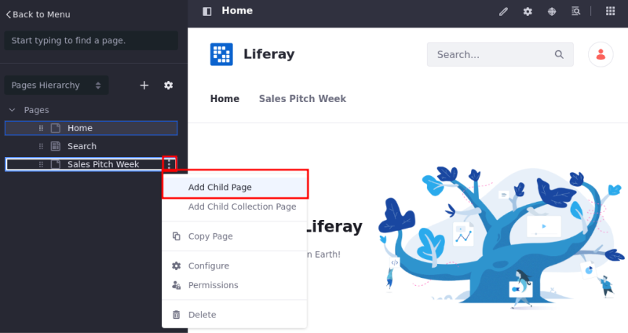

---
taxonomy-category-names:
- Sites
- Pages and Composition
- Liferay Self-Hosted
- Liferay PaaS
- Liferay SaaS
uuid: 1079119c-21f5-48e6-aebb-4a6dfc8262ea
---
# Adding a Page to a Site

The steps below describe how to add a new page to your site and configure the general options. To learn how to configure the remaining page settings, see [Configuring Individual Pages](../page-settings/configuring-individual-pages.md), or see [Configuring Page Sets](../page-settings/configuring-page-sets.md) to configure options for a [page set](../understanding-pages.md#page-sets).

```{note}
For Liferay 7.4 U22+ and GA22+, private pages are disabled for new installations. To enable them, see [Enabling Private Pages](../understanding-pages.md#enabling-private-pages) for more information.
```

## Adding a New Page

You can add a new page from the pages administration screen or from the page tree (Liferay DXP 7.3+ only).

### Adding a New Page from Pages Administration

1. Open the *Site Menu* (), expand *Site Builder*, and click *Pages*.

1. Click *Add* () and select *Page*.

   

1. Under Page Template Sets, select a Basic or Global template.

   To start with an empty [content page](../understanding-pages.md#page-types), select the *Blank* [master page template](../defining-headers-and-footers/master-page-templates.md).

   Alternatively, select from other available templates.

   

1. In the Add Page dialog, enter a name and click *Add*.

If you created a content page, you're redirected to the draft content page where you can begin adding fragments and widgets.

If you created a widget page, you're redirected to the page's configuration options.

```{tip}
By default, new pages are included in the navigation menu for the site. To configure this navigation menu, see [Using the Navigation Menus Application](../../site-navigation/configuring-menu-displays.md).
```

### Adding a New Page from the Page Tree Menu

{bdg-secondary}`Available: Liferay DXP/Portal 7.3+`

1. Open the *Site Menu* () and click *Page Tree* ().

1. Click *Add* () and select *Add Page*.

   

1. Follow the standard steps for creating a page, as shown in [Adding a New Page](#adding-a-new-page).

```{tip}
Pages in the draft status have an asterisk (*) next to their name in the page tree.
```

## Adding a Child Page

You can add child pages from the page administration or the page tree (Liferay DXP 7.3+ only).

### Adding a Child Page from Pages Administration

1. Open the *Site Menu* (), expand *Site Builder*, and click *Pages*.

1. Click *Add* () for an existing page.

   

1. Follow the standard steps for creating a page, as outlined in  [Adding a New Page](#adding-a-new-page).

```{tip}
Using the Actions menu () next to the page, you can preview a content page draft (Liferay DXP 7.2+). These options are available for pages in draft status and users with page editing permission.
```

### Adding a Child Page from the Pages Tree

{bdg-secondary}`Available: Liferay DXP/Portal 7.3+`

1. Open the *Site Menu* () and click *Page Tree* ().

1. On the desired page, click *Actions* () and select *Add Child Page*.

   

1. Follow the standard steps for creating a page, as outlined in [Adding a New Page](#adding-a-new-page).

## Previewing Pages

You can preview pages you create before making them live or to identify the ones you need to work on:

1. Open the *Site Menu* () and select *Site Builder* &rarr; Pages.

1. Click *Actions* () on the page you want to preview and select *View*.


```{tip}
If users are logged in and have permission to edit the page, and there are multiple [experiences](../../personalizing-site-experience/experience-personalization/creating-and-managing-experiences.md) in place, they can view/preview the page based on an experience they select.
```

## Related Topics

[Understanding Pages](../understanding-pages.md)

[Using Content Pages](../using-content-pages.md)

