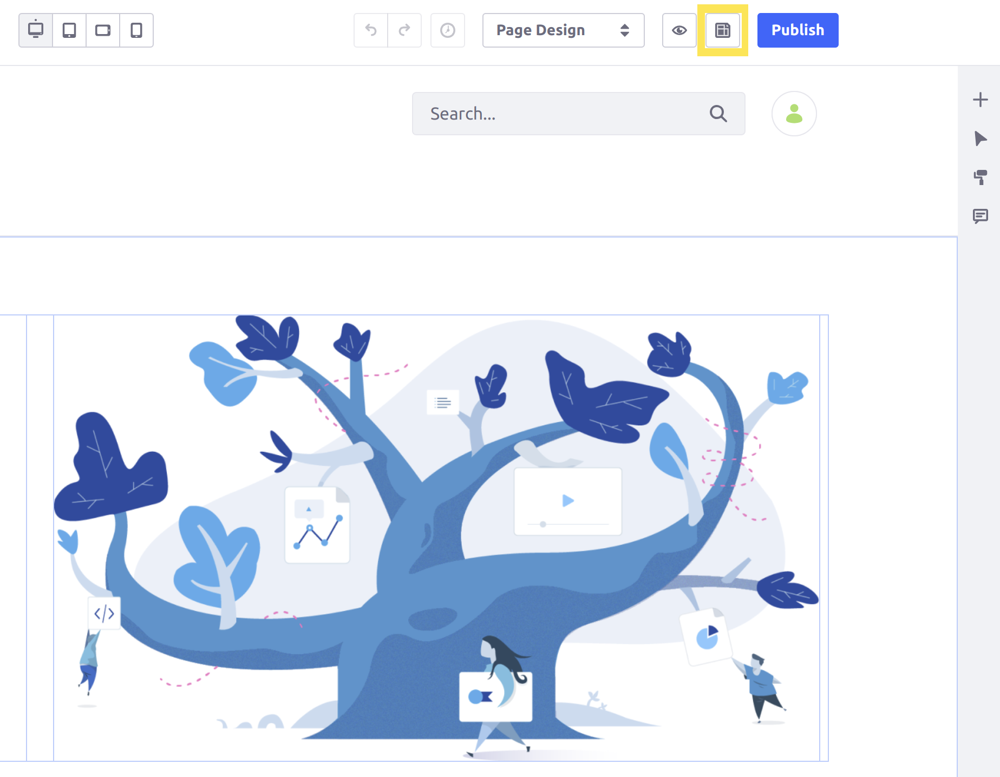
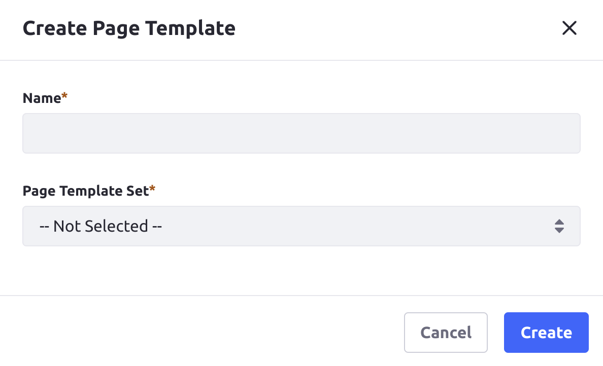
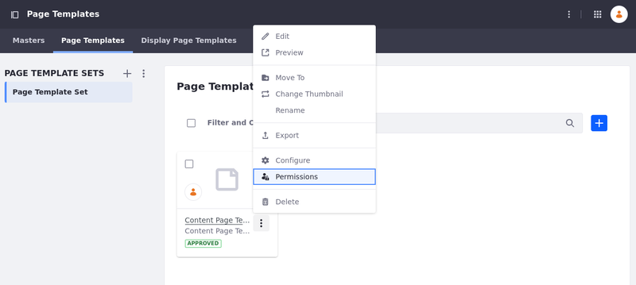

---
taxonomy-category-names:
- Sites
- Page Templates
- Liferay Self-Hosted
- Liferay PaaS
- Liferay SaaS
uuid: 22635fa9-bca6-427c-8e6d-ab9f22b5c4c7
---

# Creating a Page Template

{bdg-secondary}`Liferay DXP/Portal 7.3+`

With page templates, you can create pages based on predefined layouts and content. There are several basic page templates available out-of-the-box.

You may also create your own [content page](../using-content-pages.md) templates and [widget page](../understanding-pages.md#widget-pages) templates.

!!! note
    For Liferay DXP 7.4+, Page Template Collections are called Page Template Sets in the Liferay UI.

## Creating a New Page Template

1. Open the *Site Menu* (), expand *Design*, and go to *Page Templates*.

1. Select the *Page Templates* tab.

1. Click *New* and create a new page template set to organize your page templates.

   

1. Click *Add* () and select *Content Page Template* or *Widget Page Template*.

1. Enter a Name and click *Save*.

The new page template appears. Follow the instructions in [Building Content Pages](../using-content-pages/adding-elements-to-content-pages.md) to configure your content page template. Likewise, see [Widget Pages](../understanding-pages.md#widget-pages) to create your widget page template.

You can edit the page template at any time by clicking *Actions* () &rarr; *Edit* next to the page template in the set.

!!! tip
    To preview your newly created page template, select *Actions* () &rarr; *Preview* next to the template you want to preview.

## Creating a Page Template from an Existing Page

You can also create a page template from a page while editing it. The new page template keeps all the configurations for fragments and widgets when it is created. This saves you time while expanding your site.

To make a page template from a page,

1. While [editing the page](../using-content-pages/adding-elements-to-content-pages.md), click *Options* () at the top right corner of the page and select *Convert to Page Template*

   

1. In the modal that appears on the screen, select an existing page set or select *Save In New Set* to create a new page template set for the page template.

   

   If you do not have a page template set, choose a *Name* and, optionally, a *Description* for a new page template set. Click *Save* to save your page as a template in the newly created template set.

1. Click *Save*.

The chosen page template set now has a new page template based on the page you are currently editing, as a draft.

!!! important
    You must publish the page template draft to use it with new pages.

## Sharing a New Page Template

By default, only the creator of the page template can use it. To give other users access to a newly created page template,

1. Open the Page Templates application and select the Page Templates tab.

1. Click Actions () for the page template you want to share and select *Permissions*.

   

1. Enable the *View* permission for the roles that should access the page template. To allow all users who can create pages to use it, enable the View permission for the user role.

1. Click *Save*.

Users with the roles specified now have access to the page template.

## Propagating Changes for Widget Pages

When creating a page from a widget page template, changes are inherited from the page template by default, so future changes are propagated automatically to the pages that use the page template. Site administrators can disable this behavior through the [settings for the individual page](../page-settings/configuring-individual-pages.md#general).

## Propagating Changes for Content Pages

Changes for content pages are not propagated automatically when created using a content page template. However, you can propagate changes to fragments used on a content page. See [Propagating Fragment Changes](../page-fragments-and-widgets/using-fragments/propagating-fragment-changes.md) for more information.

## Sharing Page Templates With Other Sites

You can share your page templates with other sites using the same process as you would for pages. Follow the instructions in [Exporting/Importing Site Pages and Content](../../sites/exporting-importing-site-pages-and-content.md) to learn how.

## Staging and Page Templates

If staging has been enabled, changes to the widget page template are propagated automatically to the staged page. These changes must still be approved before the page is published to the live site. For this reason, the automatic propagation of widget page template changes to the staged page cannot be turned off and the *Inherit Changes* selector does not appear.

## Related Topics

- [Adding a Page to a Site](./adding-a-page-to-a-site.md)
- [Exporting and Importing Page Templates](./exporting-and-importing-page-templates.md)
- [Using the Full Page Application Page Type](./using-the-full-page-application-page-type.md)
