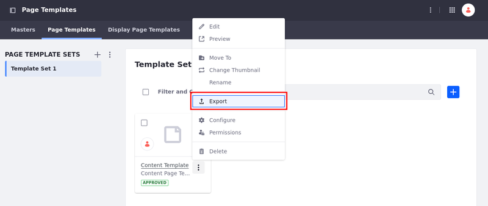
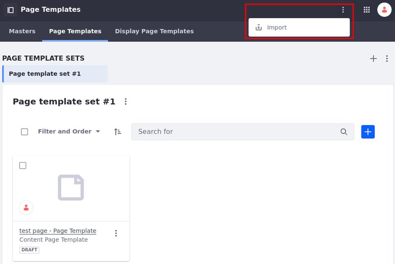
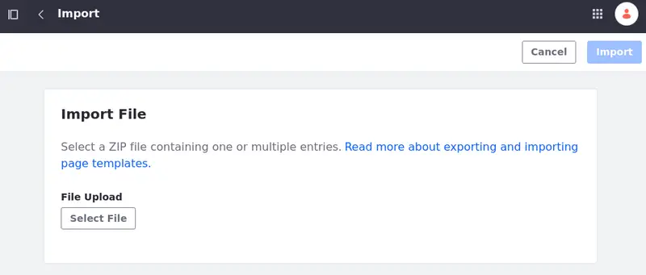
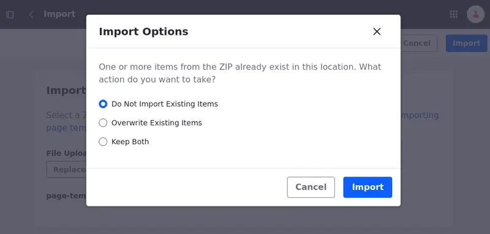
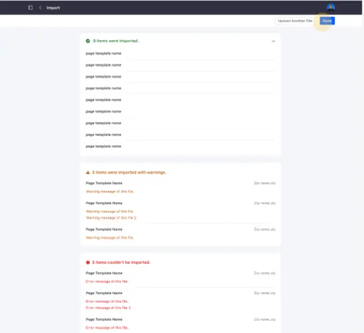

---
taxonomy-category-names:
- Sites
- Page Templates
- Liferay Self-Hosted
- Liferay PaaS
- Liferay SaaS
uuid: b2f71d60-7c6b-4be7-94fd-d8ea048c6dbf
---

# Exporting and Importing Page Templates

Sometimes, it's easier to edit templates in a code editor. After you [create a page template](./creating-a-page-template.md), you can [export](#exporting-a-page-template) it for local editing. Once you've made the necessary changes, you can [import](#importing-a-page-template) the template back into Liferay and use it in any site in the system.

For more general information about the export/import framework, see [Exporting/Importing Site Pages and Content](../../sites/exporting-importing-site-pages-and-content.md).

!!! warning
    Widget pages can't be exported. Instead, use content pages.

## Exporting a Page Template

1. Open the *Site Menu* (), expand *Design*, and go to *Page Templates*.

1. Select the *Page Templates* tab.

1. Select the page template set that contains the desired template.

1. Click *Actions* () for the desired content page template and select *Export*.

   

The content page template downloads as a ZIP file to your local machine.

!!! tip
    You can export more than one content page template at once.

The last published version of the page template is always exported. If the page template has never been published, it can't be exported.

The exported ZIP file contains these files:

- `page-template-collection.json`: Includes the name of the set where the page template is saved and any other metadata.
- An optional thumbnail file
- `page-template.json`: Contains the page template name and any other metadata.
- `page-definition.json`: Specifies the structure and content of the page template.

The ZIP file may contain different types of page templates as well, like `display-page-template.json`, `master-page.json`, `page-template-collection.json` and `page-template.json`.

## Importing a Page Template

1. In the Page Templates application, click *Options* () in the Application Bar and select *Import*.

   

1. Select the desired page template file.

   Click *Replace File* if you want to change it.

1. Click *Import*.

   If you import an existing page template, see [Importing an Existing Page Template](#importing-an-existing-page-template) for more information.

   To cancel the operation and go back to the page templates page, click *Cancel*.

   

1. Once the importing process is complete, you are redirected to an [import outcome page](#import-outcome-page).

1. Click *Upload Another File* to import another file or *Done* to go back to the page templates page.

!!! Important
    To transfer page templates between DXP environments, use the LAR export and import method.

### Importing an Existing Page Template

If you import a page template and items from the ZIP file already exist, you can select one of three options:

**Do Not Import Existing Items**: Only new items are imported.

**Overwrite Existing Items**: Duplicated existing items are overwritten.

**Keep Both**: A numbered copy of existing items is imported.

Once the importing process is complete, you are redirected to an [import outcome page](#import-outcome-page).

### Import Outcome Page

When users import files, they are redirected to a new page with details about the importing process.

On the import outcome page, users can see the successfully imported entries, warnings (successful imports that could cause malfunctions), and errors (entries that weren't imported).

## Related Topics

- [Creating a Page Template](./creating-a-page-template.md)
- [Exporting/Importing Site Pages and Content](../../sites/exporting-importing-site-pages-and-content.md)
- [Creating Collections](../../../site-building/displaying-content/collections-and-collection-pages/creating-collections.md)
