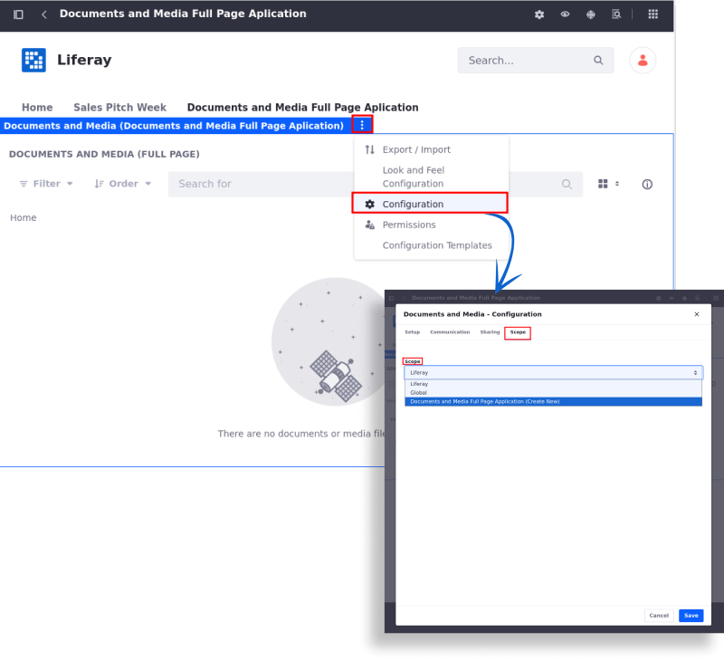

---
taxonomy-category-names:
- Sites
- Pages and Composition
- Liferay Self-Hosted
- Liferay PaaS
- Liferay SaaS
uuid: d3d3b087-cf75-4ab5-a288-06f4018e0ad4
---

# Using the Full Page Application Page Type

1. [Create a new page](./adding-a-page-to-a-site.md) and select *Full Page Application* under Other.

1. Enter a name and click *Add*.

1. Under Layout, select the *Full Page Application* you want to display from a list of available options.

   By default, you can set the Blogs, Wiki, Media Gallery, Message Boards, RSS Publisher, Documents and Media, or Application Authorization Request to be the sole application for the page. Developers can also make their applications full page applications.

   

1. Click *Save* to apply the changes.

## Scoping Full Page Application Data

All applications supported by the full page application page type are non-instanceable, and the content of the application you choose is based on the instance for that site. Therefore, if you already had data in your application, such as Documents and Media, it appears on the page. If you want to configure a full page application to be scoped to a specific page, you can configure that through the application's settings. Below is an example for a Documents and Media application:

1. From the page, click () for the widget and select *Configuration*.

1. In the Configuration modal, select the *Scope* tab.

1. Select the scope from a list of available scopes or create a new one.

The application is now scoped to a specific page.

## Related Topics

- [Adding Pages](../adding-pages.md)
- [Adding a Page to a Site](./adding-a-page-to-a-site.md)
- [Using Utility Pages](./using-utility-pages.md)
