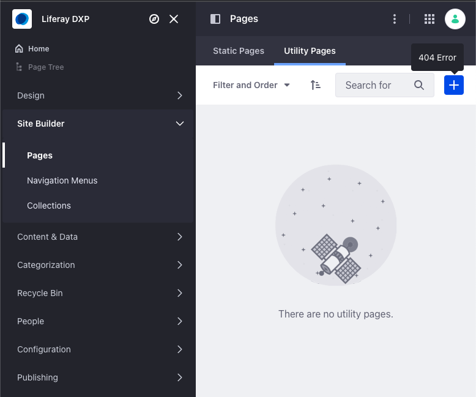
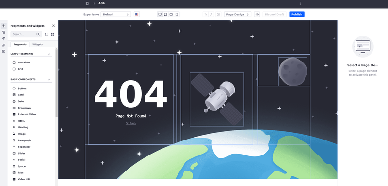
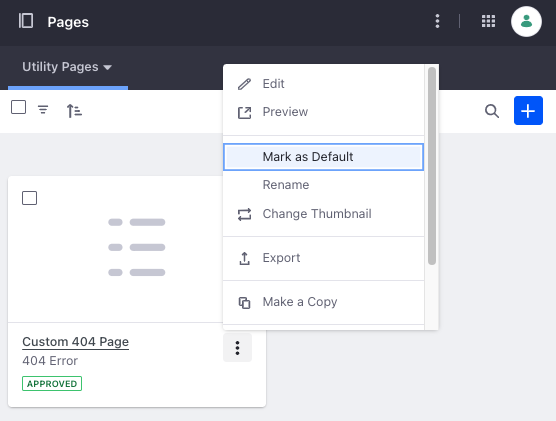

---
taxonomy-category-names:
- Sites
- Page Templates
- Liferay Self-Hosted
- Liferay PaaS
- Liferay SaaS
uuid: db41d849-e555-4e28-a2fb-4337125b6b4a
---

# Using Utility Pages

{bdg-secondary}`7.4 U86+ and GA86+`

Utility pages serve specific operational tasks and actions and are usually essential for users to interact with a website or application effectively. Utility pages can be configured for a site's 500 and 404 error pages.

<!-- In the future, this capability will expand to include other common pages (e.g. sign-in and terms of use pages). -->

Liferay provides [out-of-the-box utility pages](#viewing-utility-pages) that are easily customizable. You can also [create utility pages](#creating-a-new-utility-page) from scratch.

## Viewing Utility Pages

You can edit, preview, or copy utility pages.

1. Open the *Site Menu* (), expand *Site Builder*, and go to *Pages*. Select the *Utility Pages* tab.

   The out-of-the-box pages are marked with a `PROVIDED BY LIFERAY` tag.

1. Choose a page and click *Actions* () to view and select one of the [available actions](#utility-pages-actions-menu-reference).

!!! tip
    Edit the utility page the same way you would edit a [content page](../using-content-pages/adding-elements-to-content-pages.md).

## Creating a New Utility Page

1. In the Pages application, under the Utility Pages tab, click *New* and choose the type of utility page you want to create.

1. Select *Blank* for an empty content page or choose an available master page template.

1. Name the utility page and click *Save*.

You can edit the newly created utility page the same way you would edit a [content page](../using-content-pages/adding-elements-to-content-pages.md).

## Utility Pages Actions Menu Reference

Use the actions menu to perform certain actions with your utility page:

1. In the Pages application, under the Utility Pages tab, select *Actions* () for the utility page you want and choose one of the available actions:

| Action                                                                                                            | Description                                                                                                                                                                                                  |
|:------------------------------------------------------------------------------------------------------------------|:-------------------------------------------------------------------------------------------------------------------------------------------------------------------------------------------------------------|
|  Edit                                                           | Edit the utility page in the page editor.                                                                                                                                                                    |
|  Preview                                                       | Preview the utility page in a new tab.                                                                                                                                                                       |
| Mark/Unmark as Default                                                                                            | Mark/Unmark the utility page as the default.                                                                                                                                                                 |
| Rename                                                                                                            | Rename the utility page. Click *Save* to rename your page.                                                                                                                                                   |
|  Change Thumbnail                                                  | Change the thumbnail that shows in your card. Drag and drop an image. Before adding the new thumbnail, you can edit and see information about the image.                                                     |
| Remove Thumbnail                                                                                                  | Remove the utility page's thumbnail from the card.                                                                                                                                                           |
|  Export                                                            | Export the utility page in ZIP format.                                                                                                                                                                       |
|  Make a Copy                                                    | Create a copy of the utility page. The copy is named `{Original page's name} (Copy)` automatically, and it's created as a draft.                                                                             |
| {bdg-secondary}`Liferay DXP 2024.Q1+/Portal 7.4 GA112+`  Configure | Configure some SEO settings such as HTML Title and Description. See [Configuring SEO and Open Graph](../../displaying-content/using-display-page-templates/configuring-seo-and-open-graph.md) to learn more. |
|  Permissions                                             | Manage permissions related to the utility pages.                                                                                                                                                             |
|  Delete                                                             | Delete the utility page, with confirmation.                                                                                                                                                                  |

!!! note
    If a site contains no pages, the default 404 error page is shown even if a utility page is applied.

## Utility Pages Options Menu Reference

Use the options menu to configure, import pages, or import translations for your utility page.

1. In the Pages application, under the Utility Pages tab, select *Options* () in the top right corner and choose an option:

| Option                                                            | Description                                                                                                                                                                                   |
|:------------------------------------------------------------------|:----------------------------------------------------------------------------------------------------------------------------------------------------------------------------------------------|
|  Import            | Select the ZIP file containing the utility page you want to import and click *Import*. Choose whether to overwrite existing utility pages in case you're importing a page with the same name. |
|  Configuration | [Configure](../page-settings/configuring-individual-pages.md) your utility page: design, basic settings, customization, and SEO.                                                              |
| Import Translations                                               | [Import translations](../../../content-authoring-and-management/translating-pages-and-content/translating-web-content.md#importing-content-translations) for your utility page.               |

## Utility Page Permissions

Utility pages have permissions that govern their use.

1. Open the *Global Menu* (), go to the *Control Panel* tab, and click *Roles* under Users.

1. Click *Actions* () for the desired role and select *Edit*.

   Alternatively, you can click the name of the role you want to manage.

1. Click the *Define Permissions* tab and go to *Site and Asset Library Administration* &rarr; *Site Builder* &rarr; *Pages* in the permissions sidebar menu.

1. You can find the utility pages permissions under Resource Permissions &rarr; Site.

1. Use the checkboxes to assign the desired language permissions to the selected role.

   | Permission Name             | Description                                       |
   | :-------------------------- | :------------------------------------------------ |
   | Add Utility Page            | Required to add a utility page.                   |
   | Assign Default Utility Page | Required to assign a utility page a default page. |

1. Click *Change* () under the Scope column to adjust the permission's scope. By default, the change applies to all sites and asset libraries, but you can customize the list.

   Browse recently used sites in the Recent tab, all sites in My Sites, and asset libraries in Asset Libraries to select the scope.

   You can repeat this process to select additional sites or asset libraries, expanding the scope of permissions.

1. Click *Save* at the bottom of the page.

<!-- TASK: LPS-155184 Document 404 Error pages can be added to custom site initializers -->

## Related Topics

- [Adding Pages](../adding-pages.md)
- [Adding a Page to a Site](./adding-a-page-to-a-site.md)
