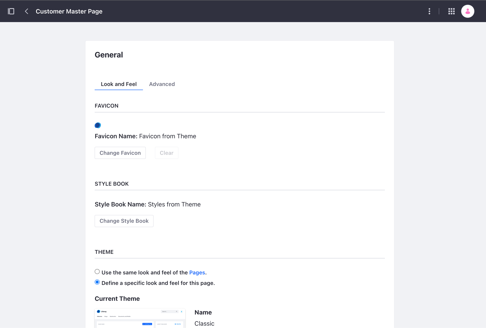

# Managing Master Page Templates

> Available: Liferay DXP/Portal 7.3+

To manage a Master Page Template, follow these steps:

1. Open the Product Menu and go to *Design* &rarr; *Page Templates*
1. Select the *Masters* tab.
1. Open the *Actions* () Menu for a Master Page Template and select one of the options. 

    

**Edit:** Configure the Master Page Template.

**Change Thumbnail:** Select a thumbnail image to display for the Master Page Template's card in the *Masters* tab.

**Rename:** Change the name of the Master Page Template.

**Make a Copy:** Duplicate the Master Page Template. The copy uses the same name with "Copy" appended to the end.

**Export:** Export and download the Master Page Template definition. This option is available when the Master Page Template is in the *Approved* status.

**Permissions:** Define permissions for the Master Page Template.

**Delete:** Remove the Master Page Template. You can also delete multiple Master Page Templates at once by checking the box for each template and clicking the `X`, or selecting the *Delete* action from the Management Toolbar.

**Discard Draft:** Discard the Master Page Draft. This option is available when the Master Page Template is in the *Draft* status.

```{note}
After changes are made and published, they are propagated to all pages that use the Master Page Template.
```

## Changing the Master Page Template of a Page

You can change the Master Page Template of a Page in the [Content Page Editor](../using-content-pages/content-page-editor-ui-reference.md). Follow these steps:

1. Navigate to the Page where you want to change the Master Page Template.
1. Click *Edit* ()
1. In the Editing Sidebar, click the *Page Design* menu ().
1. Under the Masters section, click the *Master Page Template* you want to use.

    

## Changing a Master Page Template's Look and Feel

To manage a Master Page Templates's Look and Feel and other options, follow these steps:

1. Open the Product Menu, go to *Design* &rarr; *Page Templates*.

1. Select the *Masters* tab.

1. Open the *Actions* menu () &rarr; *Edit* for the Master Page Template you want to configure.

1. Click the *Page Design* menu () &rarr; *More Page Design Options*()

    

1. In the Look and Feel tab, is where the styling of the Master Page Template can be tailored to your needs. 

    

**Favicon:** Change the default Favicon applied from the theme.

**Style Book:** Change the default Style Book applied from the theme.

**Theme:** Select whether to use theme from pages of a site or select a specific theme for the current Master Page Template.

**Settings:** Toggles to determine whether to show aspects of the theme such as the Footer and Header Search bar. Custom CSS can also be applied is loaded after the theme.

**Theme CSS Client Extension:** Add [Theme CSS Client Extensions](../../../building-applications/client-extensions/front-end-client-extensions.md#theme-css-client-extensions) to fully replace the default CSS from a theme without deploying an entire theme. 

**CSS Client Extensions:** Add [CSS Client Extensions](../../../building-applications/client-extensions/front-end-client-extensions.md#css-client-extensions) to override CSS styling of a content page that uses the Master Page Template.

**JavaScript Code and JavaScript Client Extension:** In the *Advanced* tab, JavaScript code can be added that is executed at the bottom of the page. [JavaScript Client Extentions](../../../building-applications/client-extensions/front-end-client-extensions.md#javascript-client-extensions) can be added to have JavaScript run when the page using this Master Page template is visited.

```{note}
A theme is applied to a content page through a Master Page Template. When a Master Page Template is applied to a content page, the look and feel of the content page is defined by the Master Page Template.
```

## Additional Information

- [Master Pages Templates](./master-page-templates.md)
- [Creating a Master Page Template](./creating-a-master-page-template.md)
