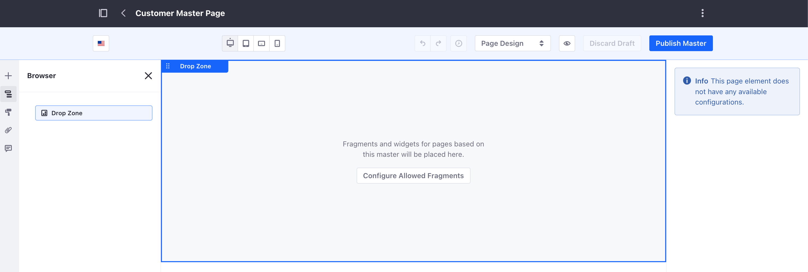

# Master Page Templates

{bdg-secondary}`Available: Liferay DXP/Portal 7.3+`

Master page templates provide a way to define elements common to every page using fragments (e.g. headers and footers previously provided by themes), so you can maintain and manage them easily in portal without having to deploy a plugin. You can use the same master page template across an entire site or have unique templates for each page. Each page and page template must have an associated master page template.

By default, the out-of-the-box Blank master page template doesn't provide any common elements.

## Building Master Page Templates

Building a master page template is similar to the process of creating a content page. A master page template can contain any number of page fragments, like a content page. However, a master page template differs in that it has one key area defined, called a Drop Zone, that specifies where you can place page fragments. This area can't be removed, but it can be placed somewhere else in the page layout. You can also define which page fragments can be added to the Drop Zone. A typical use case for a master page template is to have a header, a footer, and a drop zone. See [Creating a Master Page Template](./creating-a-master-page-template.md) for more information.

## Related Topics

[Creating a Master Page Template](./creating-a-master-page-template.md)

[Managing Master Page Templates](./managing-master-page-templates.md)
