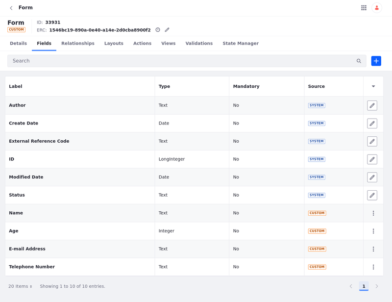
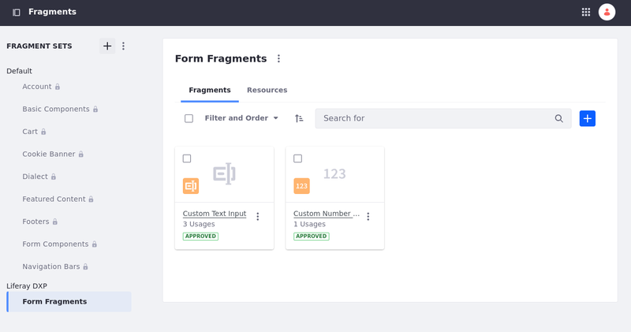
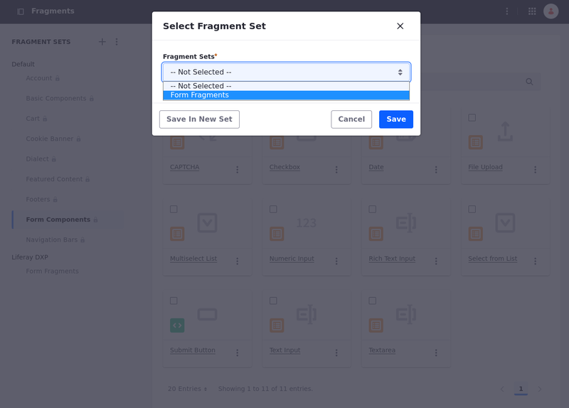
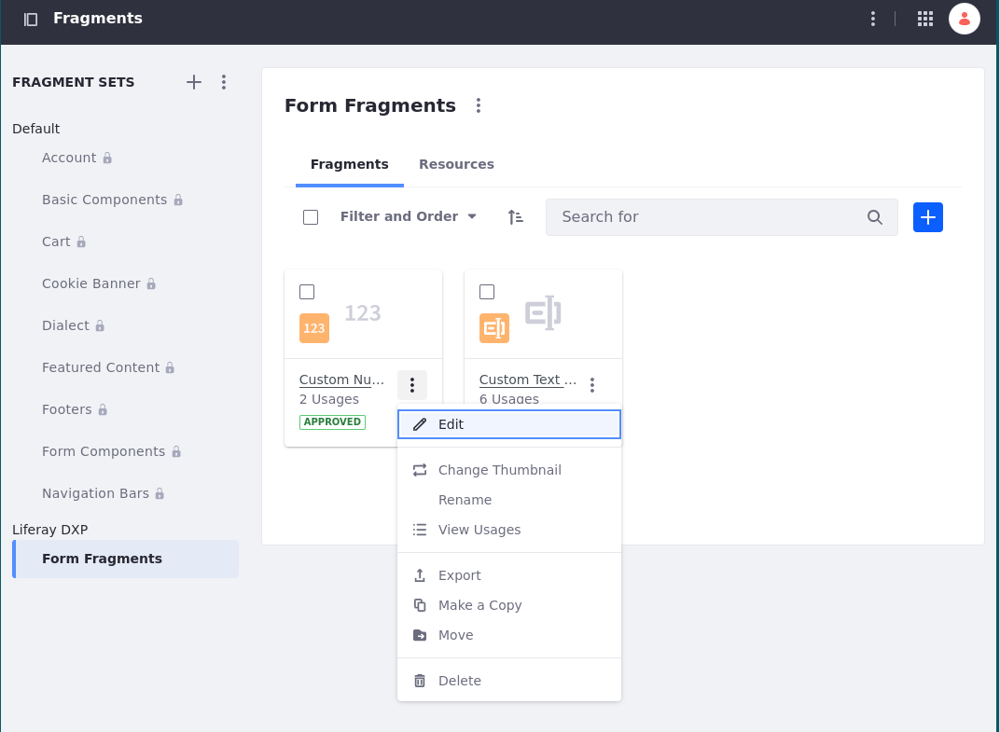
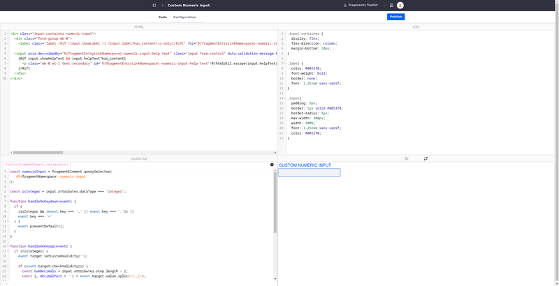
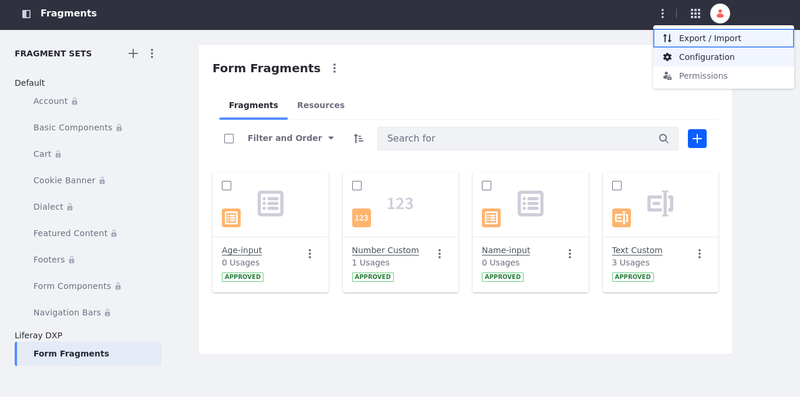
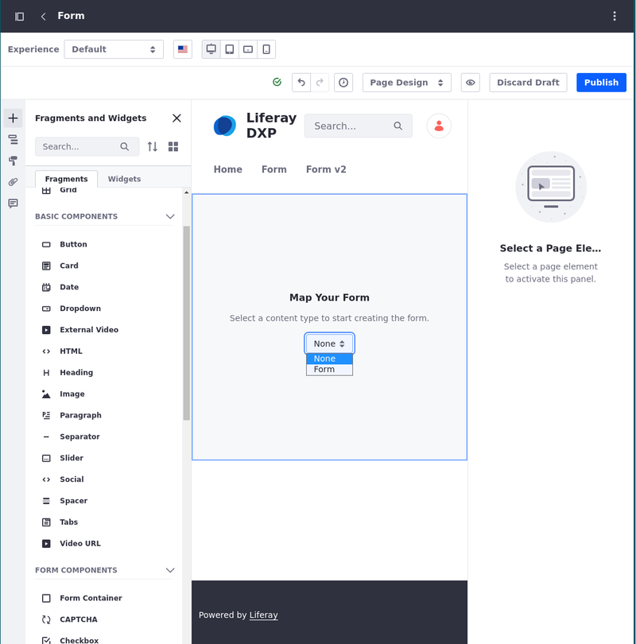
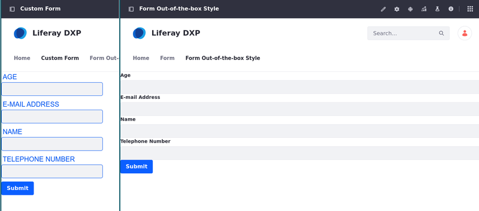

# Personalizing Custom Forms Using Form Fragments

Page fragments are extensible and reusable drag-and-drop elements for building [content pages](../../using-content-pages.md) and their related templates (i.e., [masters](../defining-headers-and-footers/master-page-templates.md), [pages](../adding-pages/creating-a-page-template.md), and [display pages](../../displaying-content/using-display-page-templates.md)). They are built using CSS, HTML, and JavaScript and can provide both structure and functionality to your pages. See [Using Fragments](./using-fragments.md) to learn more about fragments.

## Form Fragments

Among the out-of-the-box solutions provided with fragments, Liferay includes form fragments for building forms based on custom objects. To learn more about creating form fragments, see [Creating Form Fragments](../../developer-guide/developing-page-fragments/creating-form-fragments.md)

```{important}
Form fragments can only be used with custom objects. Therefore, Liferay hides the Form Components fragment set until you have at least one published object. Once published, users with access to the object can view and use the Form Components fragments. See [Creating Objects](../../../building-applications/objects/creating-and-managing-objects/creating-objects.md) for more information.
```

## Using Custom Form Fragments Mapped to Field Types

If Liferay's form fragments don't satisfy your use case, you can create custom form fragments and use them to alter the style of your form by mapping your custom form fragment to an object field type. This way, you can customize your forms using an existing design system and components library.

```{warning}
Display page templates do not support form fragments. You must use a content page or a page template.
```

Follow these steps to build forms based on custom objects and map custom form fragments to field types:

1. [Create and publish a custom object.](../../../building-applications/objects/creating-and-managing-objects/creating-objects.md)

   The fields you add to the object are the ones mapped to the form. In this example, the fields are Name, Age, E-mail Address, and Telephone Number (text and integer fields).

   

1. [Create custom form fragments related to the object fields](../../developer-guide/developing-page-fragments/creating-form-fragments.md)

   The custom form fragments use HTML, CSS, and JavaScript code to create an element with customized style and functionalities. If you have an existing design system and/or a components library, you can apply them to your fragment. 
   
   In this example, Custom Text Input and Custom Numeric Input were created to alter the text and integer fields.

   

   The custom form fragments used in the example are altered copies of the form component's Text Input and Numeric Input. To copy a form component to your fragment set,

   1. Open the *Product Menu*(), click *Design*, and select the *Fragments* app.
   
   1. From the default fragment sets, choose the component you want to copy, click on the *Actions* icon (), and select *Copy To*.

      
   
   1. Select the *Fragment Set* where you want to place the copy or click on *Save In New Set* to open a dialog box to create a new fragment set.

        
   
   1. Click on *Save*

   You can now edit the copied fragment. Navigate to your fragment set, click on the *Actions* icon(), and choose *Edit*.

   

   In this example, the CSS is altered to change the style of the component.

   

   ```css
   .input-container {
      display: flex;
      flex-direction: column;
      margin-bottom: 10px;
   }

   .label {
      color: #0053f0;
      font-weight: bold;
	   border: none;
	   font: 1.25rem sans-serif;
   }

   .input{
      padding: 5px;
      border: 1px solid #0053f0;
      border-radius: 5px;
	   max-width: 300px;
	   width: 100%;
	   font: 1.25rem sans-serif;
	   color: #0053f0;
   }
   ```

   The `.input-container` class is added to the external surrounding `<div>` element in the HTML code.

   * `display: flex;` and `flex-direction: column;` are used to arrange the `<div>`'s children (the label and the input) vertically, stacking them on top of each other. 
  
   * `margin-bottom` adds a margin to the bottom of the `<div>`.

   The `.label` and `.input` classes alter the style used in those elements. They are added to the `<label>` and `<input>` elements in the HTML code.

   * `color` changes the color of the text.

   * `font` and `font-weight` change the font used in the text and its weight.

   * `border` and `border-radius` add a border to the input and make it round.

   * `max-width: 300px;` and `width: 100%;` are applied to the element, so the element expands to fill the full width of its parent container, but it does not exceed 300 pixels in width, even if there is extra space available in the parent container. 

   * `padding` adds an internal padding to the input field.

1. Map the custom form fragments to the form fields.

   To map the custom form fragments to the form fields,

   1. In your Fragments app, click on the *Options* icon () in the applications bar &rarr; select *Configuration*.
   
      

   1. Select the *Form Fragment* (on the right) to be applied to the Field Type (on the left).

   1. Choose the fragment set under your site's tab &rarr; the options with a compatible type of field appear. Select the custom form fragment you want to apply.

       

1. Create the form based on the object using form fragments.
      
   1. Begin editing a content page or page template.

   1. (Optional) Design a layout using fragments. See [Building Responsive Layouts with Fragments](../../optimizing-sites/building-a-responsive-site/building-responsive-layouts-with-the-grid-fragment.md) for more information.

   1. Add the *Form Container* fragment to the page and map it to the custom object.

      The container automatically generates a Submit button and fragments for all object fields. They appear in alphabetical order. Mandatory fields are marked accordingly.

      

   1. The style of the custom form fragments should be different from the default style of an out-of-the-box form fragment. In this example,

   * the colors on the label and the custom input field are different.

   * the input field has a `max-width` while the default input field occupies the width of its parent completely.

   * As a `margin-bottom` was added, the overall height of the form is superior to the one in the default component.

   

## Related Topics

* [Form Components](./using-fragments/default-fragments-reference.md#form-components)
* [Configuring Fragments](./using-fragments/configuring-fragments.md)
* [Form Fragment Options](./using-fragments/configuring-fragments/general-settings-reference.md#form-fragment-options)
* [Creating Form Fragments](../../developer-guide/developing-page-fragments/creating-form-fragments.md)
* [Developing Page Fragments](../../developer-guide/developing-page-fragments.md)
* [Using Fragments to Build Forms](../../../building-applications/objects/using-fragments-to-build-forms.md)