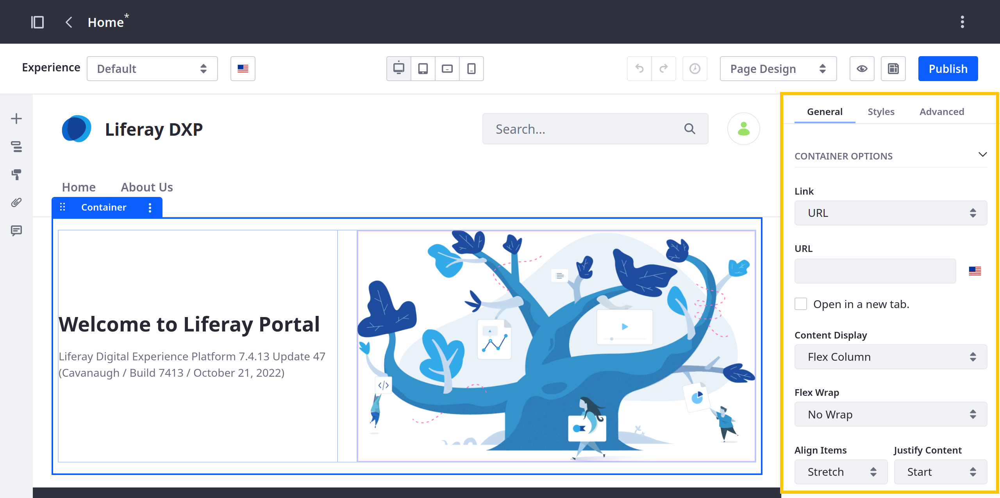

---
toc:
  - ./configuring-fragments/general-settings-reference.md
  - ./configuring-fragments/styles-reference.md
  - ./configuring-fragments/advanced-settings-reference.md
  - ./configuring-fragments/fragment-sub-elements-reference.md
  - ./configuring-fragments/localizing-fragment-configuration-fields.md
taxonomy-category-names:
- Sites
- Fragments
- Liferay Self-Hosted
- Liferay PaaS
- Liferay SaaS
uuid: 3abcc783-379c-4520-81b3-6095bb482a3b
---
# Configuring Fragments

You can configure fragments and their sub-elements. Available options can vary, though some are common to all. To view available configuration options, begin editing a page or template and open the *Browser* panel () in the sidebar menu. Then click the fragment or sub-element to configure. Available configuration options appear in three tabs: General, Styles, and Advanced.

Some configurations are scoped to the specific viewport where they're made, so you can configure fragments for specific devices to ensure page content is displayed in the most suitable way. See [Building a Responsive Site](../../../optimizing-sites/building-a-responsive-site.md) for more information.

You can localize some fragment configuration fields. See [Localizing Fragment Configuration Fields](./configuring-fragments/localizing-fragment-configuration-fields.md) for more information.

## General

The General tab includes both standard configuration options (e.g., visibility and frame) and options unique to each fragment. See [General Settings Reference](./configuring-fragments/general-settings-reference.md) for more information.

## Styles

The Styles tab includes standard options for configuring a fragment's style, including a fragment's dimensions, background, borders, and more. See [Styles Reference](./configuring-fragments/styles-reference.md) for more information on available style configurations.

## Advanced

The Advanced tab includes more advanced or technical configurations. This includes hiding fragments from search results, changing the HTML generated on a page, or adding custom CSS. See [Advanced Settings Reference](./configuring-fragments/advanced-settings-reference.md) for more information.

## Fragment Sub-Element Settings

Many fragments include sub-elements with their own configuration options. Available options depend on the sub-element's type and are organized into tabs: Mapping, Image Source, and Link. See [Fragment Sub-Elements Reference](./configuring-fragments/fragment-sub-elements-reference.md) for more information.

### Mapping

In the Mapping tab, you can map page elements to available assets by selecting the desired item (e.g., web content article, document, blog) and specifying which of its fields to display in the element (e.g., title, author, name).

### Image Source

In the Image Source tab, you can select an element's image, view its resolution, and provide its alt text.

### Link

In the Link tab, you can either manually add a URL to a page element, or select from an available content field. You can also specify the desired target (e.g., self, parent).

::::{grid} 2
:gutter: 3 3 3 3

:::{grid-item-card} General Settings Reference
:link: ./configuring-fragments/general-settings-reference.md
:::

:::{grid-item-card} Styles Reference
:link: ./configuring-fragments/styles-reference.md
:::

:::{grid-item-card} Fragment Sub-Elements Reference
:link: ./configuring-fragments/fragment-sub-elements-reference.md
:::

:::{grid-item-card} Localizing Fragment Configuration Fields
:link: ./configuring-fragments/localizing-fragment-configuration-fields.md
:::
::::
