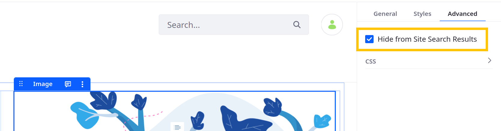
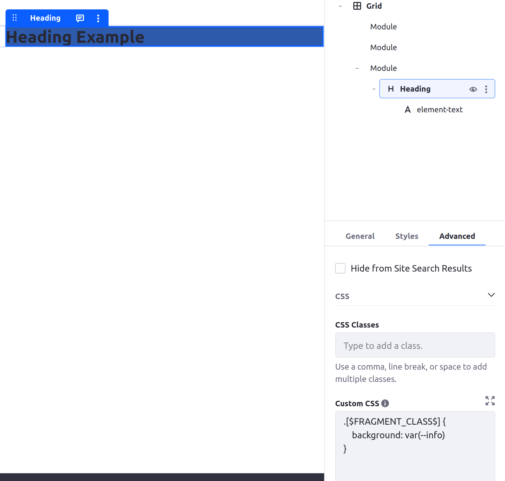
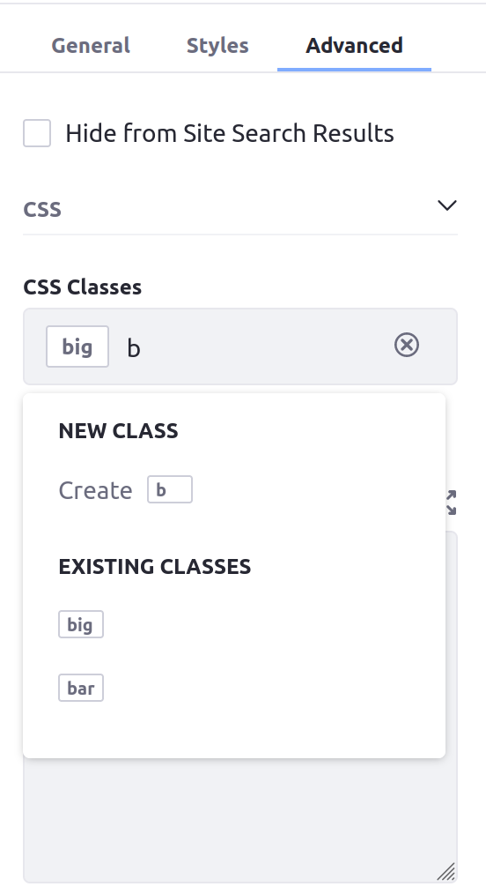
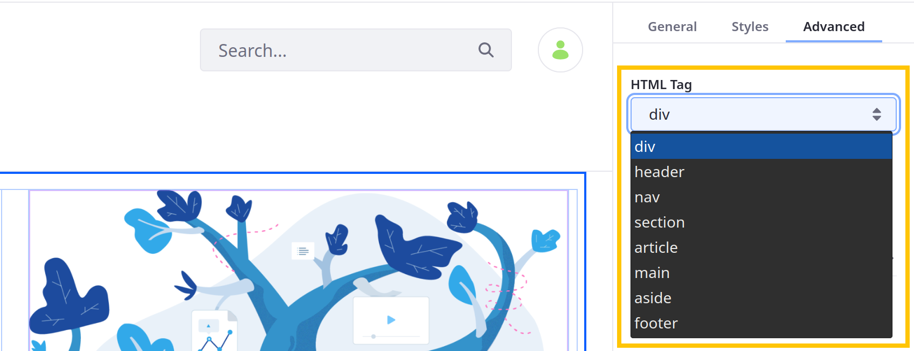
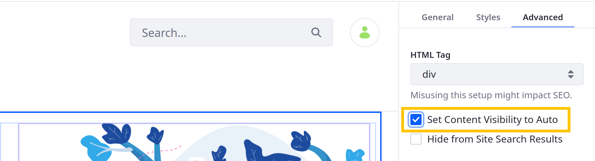

---
taxonomy-category-names:
- Sites
- Fragments
- Liferay Self-Hosted
- Liferay PaaS
- Liferay SaaS
uuid: 8dab7deb-e689-434a-8e1b-fcd86ccf396f
---
# Advanced Settings Reference

{bdg-secondary}`Available 7.4 U37+/GA37+`

All Liferay's default fragments include advanced settings except for the Collection Display fragment. Advanced settings can add custom CSS to a fragment, configure whether its contents are searchable, and more.

```{note}
Configuring a framgent's advanced settings requires the Update - Advanced Options permission for the page.
```

To access a fragment's advanced settings,

1. Begin editing a page or template that supports fragments.

1. Open the *Browser* side panel (), go to the *Page Elements* tab, and select the desired fragment.

   Alternatively, click the desired fragment in the page or template.

1. Click the *Advanced* tab in the Page Elements side menu.


## Standard Advanced Settings

All default fragments with advanced settings have the following options.

### Hide from Site Search Results

Specify whether to hide the fragment's content from search results in your site. Hiding fragment content can reduce irrelevant and redundant search results. If the selected fragment contains child fragments, they inherit its configuration.



### Custom CSS

{bdg-secondary}`Available 7.4 U34+/GA34+`

Add CSS to fragments using the *Custom CSS* text box. By default, this text box contains this placeholder:

```css
.[$FRAGMENT_CLASS$] {

}
```

`[$FRAGMENT_CLASS$]` is a CSS class token that represents the unique name of the fragment you are configuring. This CSS code is applied only to the current fragment. For example, you can set the fragment's background to red normally and blue when the user hovers their cursor over it:

```css
.[$FRAGMENT_CLASS$] {
    background: red;
}

.[$FRAGMENT_CLASS$]:hover {
    background: blue
}
```

When the page renders, `[$FRAGMENT_CLASS$]` is replaced with the fragment's class name (e.g., `lfr-layout-structure-item-01d752e4-32e3-ed4a-9cd6-fcaf483d0c34`).

```{tip}
Click the *Expand* icon (  ) to open a modal window and give yourself more room when editing the fragment's CSS.
```

You can also use variables in your custom CSS that come from the [style book](../../../../site-appearance/style-books/using-a-style-book-to-standardize-site-appearance.md) you are currently using. This example uses the Info color from a style book (defined as dark blue) to set a fragment's background color:

```css
.[$FRAGMENT_CLASS$] {
    background: var(--info);
}
```



### CSS Classes

Use the *CSS Classes* field to add classes for use in [Custom CSS](#custom-css). When adding multiple classes, separate each with a space, comma, or line break. You can use these classes for other fragments on the same page. Suggestions for existing classes appear while you type.



```{note}
Only CSS classes that you have added yourself appear as suggestions in the CSS Classes text box. Pre-existing classes or variables (such as `[$FRAGMENT_CLASS$]`) do not appear, and they do not need to be added to this field.
```

## Advanced Container Settings

Container fragments include [standard ones](#standard-advanced-settings) and advanced settings.

### HTML Tag

Choose the HTML tag generated for the container fragment: `div`, `header`, `nav`, `section`, `article`, `main`, `aside`, or `footer`. These tags help web scrapers, browsers, and site renderers find and retrieve page content more easily. The selected tag only applies to the selected container itself and does not apply to nested fragments or content.



### Set Content Visibility to Auto

By default, Liferay automatically renders all containers in a page. However, setting the container's [`content-visibility`](https://drafts.csswg.org/css-contain/#propdef-content-visibility) property to `auto` causes elements to render only when needed. This can improve the page's load performance.



## Related Topics

* [General Settings Reference](./general-settings-reference.md)
* [Using Fragments](../../using-fragments.md)
* [Creating a Style Book](../../../../site-appearance/style-books/using-a-style-book-to-standardize-site-appearance.md)
* [Frontend Token Definitions](../../../../site-appearance/style-books/developer-guide/frontend-token-definitions.md)
