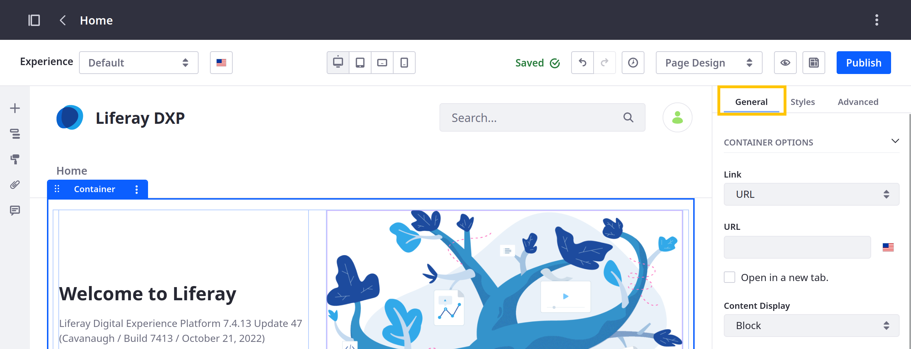

# General Settings Reference

All fragments have general settings. Some of these options are standard (e.g., visibility and frame), while others are unique to each fragment. The following reference only includes fragments with general settings.

Follow these steps to access a fragment's general settings:

1. Begin editing a page or template that supports fragments.

1. Open the *Browser* panel (  ) in the sidebar menu and select the desired fragment.

   Alternatively, click the desired fragment in the page or template.

1. Click the *General* tab in the page elements side panel.



## Standard General Settings

### Hide Fragment

| Field         | Description                                                                                                                                                                                                  |
| :------------ | :----------------------------------------------------------------------------------------------------------------------------------------------------------------------------------------------------------- |
| Hide fragment | Check the box to hide the fragment for different viewports. See [Configuring Fragment Visibility](../configuring-fragment-visibility.md) to learn more about how this setting interacts with page viewports. |

### Frame

| Field                 | Description                                                                                                                                                                                               |
| :-------------------- | :-------------------------------------------------------------------------------------------------------------------------------------------------------------------------------------------------------- |
| Width/Height          | Determine the default height and width of the fragment's frame.                                                                                                                                           |
| Min Width/Max Width   | Determine the min and max width for the frame when displayed in different viewports.                                                                                                                      |
| Min Height/Max Height | Determine the min and max height for the frame when displayed in different viewports.                                                                                                                     |
| Overflow              | Determine whether to allow fragment content to overflow its frame. By default, fragment content is restricted to its frame. If overflow is allowed, you can determine how it is displayed (e.g., scroll). |

## Container Options

| Field                                                                   | Description                                                                                                                                                                       |
| :---------------------------------------------------------------------- | :-------------------------------------------------------------------------------------------------------------------------------------------------------------------------------- |
| Link                                                                    | Determine if the container links to a URL, Page, or Mapped URL; this setting determines which of the following fields are available.                                              |
| URL (for URL)                                                           | Enter a localizable URL for the container. To set a URL for other languages, first switch the language for the page or template via the editing bar. Then, enter the desired URL. |
| Page (for Page)                                                         | Select a Liferay page for the container.                                                                                                                                          |
| Item (for Mapped URL)                                                   | Select an item from documents and media, web content, blogs, or categories. The selected item provides fields for mapping.                                                        |
| Field (for Mapped URL)                                                  | Select the URL field you want to map to the container. Selecting a valid field automatically populates the *URL* field.                                                           |
| URL (for Mapped URL)                                                    | This field is auto-populated with the selected Field URL.                                                                                                                         |
| Open in a new tab                                                       | Determine whether the link is opened in a new tab.                                                                                                                                |
| Content Display                                                         | Determine whether the container's content is displayed in a block, flex row, or flex column; the flex options have additional configurations.                                     |
| Flex Wrap (for Flex Row or Flex Column) {bdg-secondary}`7.4 U19+/GA19+` | Configure wrapping for flex rows and columns: No Wrap, Wrap, or Wrap Reverse.                                                                                                     |
| Align Items (for Flex Column) {bdg-secondary}`7.4 U19+/GA19+`           | Determine how elements in the column are aligned: Start, Center, End, Stretch, or Baseline.                                                                                       |
| Justify Content (for Flex Row) {bdg-secondary}`7.4 U19+/GA19+`          | Determine how elements in the row are justified: Start, Center, End, Between, or Around.                                                                                          |
| Container Width                                                         | Determine whether the Container uses a Fluid or Fixed Width.                                                                                                                      |

## Grid Options

| Field                                  | Description                                                                                                              |
| :------------------------------------- | :----------------------------------------------------------------------------------------------------------------------- |
| Number of Modules                      | Determine the Grid's number of drop zone modules: 1, 2, 3, 4, 5, 6, or 12.                                               |
| Show Gutter                            | Add or remove padding between the drop zone modules.                                                                     |
| Layout                                 | Determine how many drop zone modules are on each row: 1, 2, 3, or 6. Available options depends on the number of modules. |
| Vertical Alignment                     | Determine the vertical alignment of the module's content: Top, Middle, or Bottom.                                        |

## Button Options

| Field | Description                                                                                    |
| :---- | :--------------------------------------------------------------------------------------------- |
| Type  | Determine the button's type: Link or Action                                                    |
| Style | Determine the button's style: Primary, Secondary, Link, Outline Primary, or Outline Secondary. |
| Size  | Determine the button's size: Small, Normal, or Large.                                          |

## Card Options

| Field      | Description                                       |
| :--------- | :------------------------------------------------ |
| Image Size | Determine the image's size: Fit or Original Size. |

<!--CLARIFY: how does this setting relate to the Image Source settings?-->

## Drop-down Options

| Field                        | Description                                                                                     |
| :--------------------------- | :---------------------------------------------------------------------------------------------- |
| Type                         | Determine the button's style: Primary, Secondary, Link, Outline Primary, or Outline Secondary.  |
| Size                         | Determine the button's size: Small, Normal, or Large.                                           |
| Panel Type                   | Determine the size of the dropdown menu panel: Regular, Full Width, or Mega Menu.               |
| Display on Hover             | Check the box to determine if the menu panel is displayed when a cursor hovers over the button. |
| Keep Panel Open in Edit Mode | Check the box to determine if the panel remains open while editing.                             |

See [Creating Dropdown Menus with Fragments](../../using-fragments/creating-dropdown-menus-with-fragments.md) for more information.

## External Video Options

| Field        | Description                                                                                      |
| :----------- | :----------------------------------------------------------------------------------------------- |
| Video        | Enter a URL to the desired video or select an external video shortcut from documents and media.  |
| Width/Height | Determine the embedded video's dimensions.                                                       |
| Align        | Determine the video's alignment: Left, Center, or Right.                                         |

## Heading Options

| Field         | Description                          |
| :------------ | :----------------------------------- |
| Heading Level | Determine the header's style: H1-H6. |

## Image Options

| Field      | Description                                       |
| :--------- | :------------------------------------------------ |
| Image Size | Determine the image's size: Fit or Original Size. |

<!--CLARIFY: how does this setting relate to the Image Source settings?-->

## Separator Options

| Field           | Description                                                     |
| :-------------- | :-------------------------------------------------------------- |
| Bottom Spacing  | Determine how much padding is added after the separator: 1-5.   |
| Separator Color | Select a color for the separator.                               |
| Clear           | Click *Clear* to remove the selected color.                     |

For Liferay DXP 7.3 and above, these settings are listed under the [Styles](./styles-reference.md) tab.
## Slider Options

| Field            | Description                                             |
| :--------------- | :------------------------------------------------------ |
| Number of Slides | Determine how many slides are included in the fragment. |

```{tip}
There is no limit to the number of slides you can add to a slider. However, high numbers of slides can negatively impact performance.
```

## Spacer Options

| Field  | Description                                 |
| :----- | :------------------------------------------ |
| Height | Determine the thickness of the spacer: 1-5. |

## Tabs Options

| Field                | Description                                                                                             |
| :------------------- | :------------------------------------------------------------------------------------------------------ |
| Number of Tabs       | Determine how many tabs are included in the fragment.                                                   |
| Persist Selected Tab | Determine if the selected tab will be persisted when users reload the page or navigate through the site.|

```{tip}
There is no limit to the number of tabs you can add to a tabs fragment. However, a high number of tabs can negatively impact performance.
```

## Video URL Options

| Field         | Description                                                         |
| :------------ | :------------------------------------------------------------------ |
| URL           | Enter a valid video URL.                                            |
| Autoplay      | Determine if the video plays automatically when the page is loaded. |
| Loop          | Determine if the video restarts once it's finished.                 |
| Mute          | Determine if the video is muted by default.                         |
| Hide Controls | Determine if users can access video controls.                       |
| Width/Height  | Determine the embedded video's dimensions.                          |
| Align         | Determine the video's alignment: Left, Center, or Right.            |

## Content Display Options

| Field    | Description                                                                                                               |
| :------- | :------------------------------------------------------------------------------------------------------------------------ |
| Item     | Select an item to display from web content, documents and media, blogs, categories, knowledge base articles, or products. |
| Template | Select a template to determine how the item is displayed. Available templates depend on the selected content type.        |

## Content Flags Options

| Field   | Description                                                                                                                                         |
| :------ | :-------------------------------------------------------------------------------------------------------------------------------------------------- |
| Item    | Select the item you want to associate with the flag from web content, documents and media, blogs, categories, products, or knowledge base articles. |
| Message | Enter a message to display in the UI with the content flag.                                                                                         |

## Collection Filter Options

| Field                                 | Description                                                                                                                                                                                                                                                                                                   |
| :------------------------------------ | :------------------------------------------------------------------------------------------------------------------------------------------------------------------------------------------------------------------------------------------------------------------------------------------------------------ |
| Target Collection                     | Select a collection to use with the filter.                                                                                                                                                                                                                                                                   |
| Filter                                | Determine the filter's type: Keywords, Category, or Tags. When using category, end users can select from predefined filter categories. When using keywords, they can manually enter their own filter values. When using tags, they can enter their own tag values.                                            |
| Source (for Category)                 | Select the Vocabulary or Category used for filtering the target collection.                                                                                                                                                                                                                                   |
| Single Selection (for Category)       | Determine whether end users can apply only one or more filters to the collection.                                                                                                                                                                                                                             |
| Include Search Field (for Category)   | Determine whether to include a field for end users to search available filter values.                                                                                                                                                                                                                         |
| Show Help Text (for Tags)             | Display or hide the fragment's help text.                                                                                                                                                                                                                                                                     |
| Help Text (for Tags)                  | Set a localizable help text for the fragment. To set help text for another language, first switch the language for the page or template via the editing bar. Then, enter the desired text. See [Localizing Fragment Configuration Fields](./localizing-fragment-configuration-fields.md) for more information.|
| Show Label                            | Check to show a label for the filter in the UI.                                                                                                                                                                                                                                                               |
| Label Text                            | Enter localizable text for the label. To set label text for another language, first switch the language for the page or template via the editing bar. Then, enter the desired text. See [Localizing Fragment Configuration Fields](./localizing-fragment-configuration-fields.md) for more information.       |

## Applied Filters Options

| Field                        | Description                                                                                                          |
| :--------------------------- | :------------------------------------------------------------------------------------------------------------------- |
| Target Collection            | Select a collection to use with the fragment. This fragment displays all filters applied to the selected collection. |
| Include Clear Filters Option | Determine whether to include the clear filters option to end users.                                                  |

```{note}
This fragment is only displayed when a filter is applied to the target collection.
```

## Content Ratings Options

| Field | Description                                                                                                                                             |
| :---- | :------------------------------------------------------------------------------------------------------------------------------------------------------ |
| Item  | Select the item you want to associate with the fragment from web content, documents and media, blogs, categories, knowledge base articles, or products. |

## Collection Display Options

| Field                                         | Description                                                                                                                                                                                                                                                                       |
| :-------------------------------------------- | :-------------------------------------------------------------------------------------------------------------------------------------------------------------------------------------------------------------------------------------------------------------------------------- |
| Collection                                    | Select a collection or collection provider to display in the fragment. Once selected, you can click Actions (  ) to access additional options. Available actions depend on the selected collection or collection provider. |
| Style Display                                 | Select from available styles to determine how items are listed. Available styles depend on the selected collection or collection provider.                                                                                                                                        |
| Layout (for Grid)                             | Determine how many columns the collection list has: 1, 2, 3, 4, 5, 6, or 12.                                                                                                                                                                                                      |
| Vertical Alignment (for Grid)                 | Determine the vertical alignment of the content: Top, Middle, or Bottom.                                                                                                                                                                                                          |
| Flex Wrap (for Flex Row or Flex Column)       | Configure wrapping for flex rows and columns: No Wrap, Wrap, or Wrap Reverse.                                                                                                                                                                                                     |
| Align Items (for Flex Row or Flex Column)     | Determine how elements in the column are aligned: Start, Center, End, Stretch, or Baseline.                                                                                                                                                                                       |
| Justify Content (for Flex Row or Flex Column) | Determine how elements in the row are justified: Start, Center, End, Between, or Around.                                                                                                                                                                                          |
| List Item Style (for Templates)               | Select from available styles to determine how each entry is displayed. Available styles depend on the selected collection asset type.                                                                                                                                             |
| Show Empty Collection Alert                   | Check to display an informative message in view mode when no results match the applied filters or the collection is empty.                                                                                                                                                        |
| Empty Collection Alert                        | Enter text for the informative message in case no results match the applied filters or the collection is empty.                                                                                                                                                                   |
| Pagination                                    | Determine whether to use pagination for the collection. When enabled, you can select from two style options: Numeric or Simple.                                                                                                                                                   |
| Display All Pages                             | Determine whether to display all items in the selected collection or collection provider.                                                                                                                                                                                         |
| Maximum Number of Pages to Display            | Determine the maximum number of pages shown in the pagination menu. This option only appears if the Display All Pages checkbox is not selected.                                                                                                                                   |
| Maximum Number of Items per Page              | Determine the number of items included in each fragment per page. This value cannot exceed 200.                                                                                                                                                                                   |

## Form Fragment Options

{bdg-secondary}`Available Liferay 7.4 U45+/GA45+`

Form fragments include unique configuration options. To access them, you must map the fragment to an object field.

### Form Container

| Field                                                                | Description                                                                                                                                               |
| :------------------------------------------------------------------- | :-------------------------------------------------------------------------------------------------------------------------------------------------------- |
| Content Type                                                         | Select a custom object. This maps the form container and its fragments to the selected object. You can only map a form container to one object at a time. |
| Success Interaction                                                  | Determine whether the form submission success message is embedded in the current page or redirects users to a Liferay page or external URL.               |
| Embedded Message (for Show Embedded Message)                         | Enter a localizable success message.                                                                                                                      |
| Preview Embedded Message (for Show Embedded Message)                 | Preview the embedded success message.                                                                                                                     |
| Show Notification when Form Is Submitted (for Show Embedded Message) | Check to display the form submission success notification message.                                                                                        |
| Success Notification Text (for Show Embedded Message)                | Enter a localizable success notification message.                                                                                                         |
| Preview Success Notification (for Show Embedded Message)             | Preview the success notification message.                                                                                                                 |
| Page (for Go to Page)                                                | Determine to which page in the site the user is redirected after submiting the form.                                                                      |
| External URL (for Go to External URL)                                | Navigates to an external URL after the user submit the form.                                                                                                                             |
| Content Display                                                      | Determine whether the container's content is displayed in a Block, Flex Row, or Flex Column; the flex options have additional configurations.             |
| Flex Wrap (for Flex Row or Flex Column)                              | Configure wrapping for flex rows and columns: No Wrap, Wrap, or Wrap Reverse.                                                                             |
| Align Items (for Flex Row or Flex Column)                            | Determine how elements in the column are aligned: Start, Center, End, Stretch, or Baseline.                                                               |
| Justify Content (for Flex Row or Flex Column)                        | Determine how elements in the row are justified: Start, Center, End, Between, or Around.                                                                  |
| Container Width                                                      | Determine whether the container uses a Fluid or Fixed Width.                                                                                              |

### Text and Long Text Fields

| Field                 | Description                                                                                                                                                                                                                                                                                                                                                  |
| :-------------------- | :----------------------------------------------------------------------------------------------------------------------------------------------------------------------------------------------------------------------------------------------------------------------------------------------------------------------------------------------------------- |
| Show Characters Count | Displays the number of characters entered and a warning when the maximum character count is exceeded. The maximum character count can be configured in the object's field configuration. See [Field Types UI Reference](../../../../../building-applications/objects/creating-and-managing-objects/fields/adding-fields-to-objects.md) for more information. |

### Categories

| Field           | Description                                                                                                                                                                                                                                                                                                                                                                                                                                                                                                 |
| :-------------- | :---------------------------------------------------------------------------------------------------------------------------------------------------------------------------------------------------------------------------------------------------------------------------------------------------------------------------------------------------------------------------------------------------------------------------------------------------------------------------------------------------------- |
| Vocabulary Type | Displays categories based on the visibility of the vocabulary. See [Vocabulary Visibility](../../../../../content-authoring-and-management/tags-and-categories/organizing-content-with-categories-and-tags.md#vocabulary-visibility) for more information. To access this setting, `Enable Categorization` must be enabled on the object. See [Creating Objects](../../../../../building-applications/objects/creating-and-managing-objects/creating-objects.md#editing-object-drafts) for more information.|

### Other Form Fragment Configurations

| Field                    | Description                                                                                                            |
| :----------------------- | :--------------------------------------------------------------------------------------------------------------------- |
| Field                    | Map the fragment to an object field.                                                                                   |
| Mark as Required         | Mark the fragment field as required for form submission. Mandatory object fields are marked as required automatically. |
| Show Label               | Display or hide the fragment's label.                                                                                  |
| Label                    | Set a localizable label for the fragment. By default, each fragment uses its object field's label.                     |
| Show Help Text           | Display or hide the fragment's help text.                                                                              |
| Help Text                | Set a localizable help text for the fragment.                                                                          |
| Placeholder              | For the Numeric Input and Text Input fragments, enter an example value.                                                |
| Button Text              | For the File Upload fragment, set a localizable button text for attaching files.                                       |
| Show Supported File Info | For the File Upload fragment, display or hide the list of supported extensions and file size limit.                    |

## Related Topics

* [Configuring Fragments](../configuring-fragments.md)
* [Fragment Styles Reference](./styles-reference.md)
* [Fragment Sub-Elements Reference](./fragment-sub-elements-reference.md)
