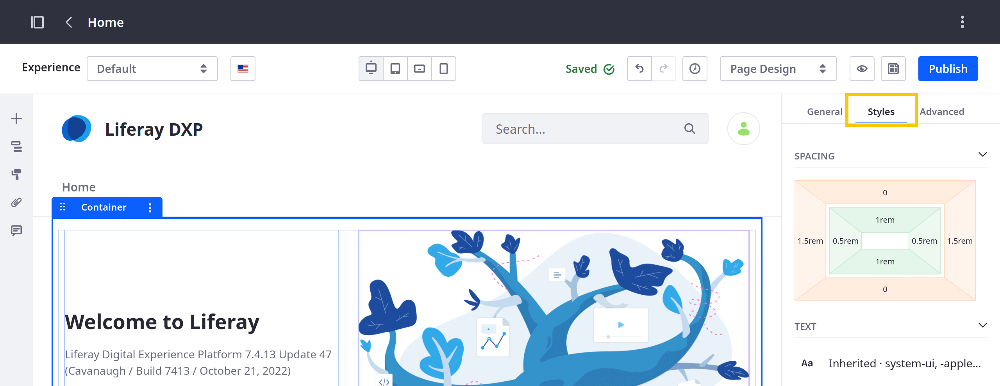
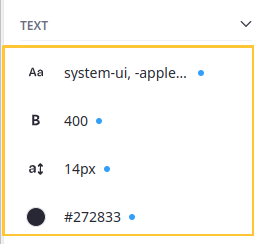
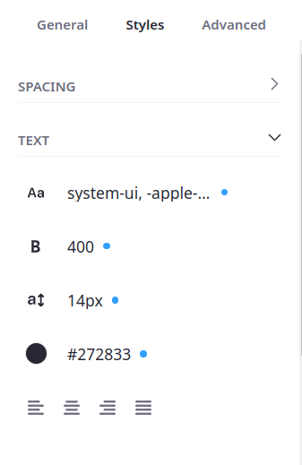
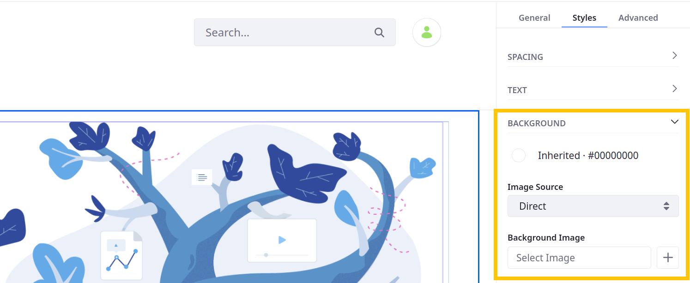
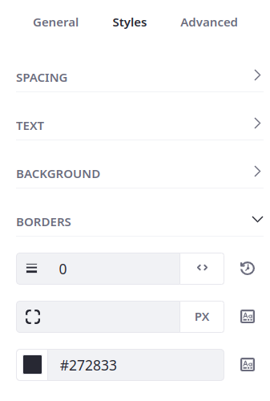
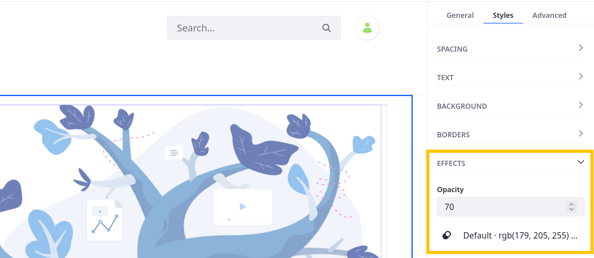

---
taxonomy-category-names:
- Sites
- Fragments
- Liferay Self-Hosted
- Liferay PaaS
- Liferay SaaS
uuid: b033d85b-20dd-49ae-a1fb-9b651afe621a
---
# Styles Reference

All fragments have a Styles settings section except for the Collection Display fragment. Use the style settings to configure your fragments' look and feel. Many of these options correspond to CSS classes and have defined tokens supported by style books. See [General Settings Reference](./general-settings-reference.md) and [Fragment Sub-Elements Reference](./fragment-sub-elements-reference.md) for additional fragment configuration options.

```{note}
By default, style configurations apply to the entire fragment, so all elements in the fragment inherit these changes if their CSS allows it; otherwise, the inner elements are ignored. You can configure custom fragments to apply style changes only to some inner elements. See [Applying Styles to Fragments](../../../../developer-guide/developing-page-fragments/applying-styles-to-fragments.md) for more information.
```

To access a fragment's Styles menu,

1. Begin editing a page or template that supports fragments.

1. Open the *Browser* panel () in the sidebar menu and select the desired fragment.

   Alternatively, click the desired fragment in the page or template.

1. Click the *Styles* tab in the Page Elements side menu.



Many styles have defined tokens supported by style books. The value of tokens can be inherited from style books, which is indicated by a blue dot or _value from stylebook_ icon () next to the displayed value. See [Creating a Style Book](../../../../site-appearance/style-books/using-a-style-book-to-standardize-site-appearance.md) and [Frontend Token Definitions](../../../../site-appearance/style-books/developer-guide/frontend-token-definitions.md) for more information.



```{note}
For Liferay 7.4 U31+/GA31+, you can configure fragment styles for individual viewports by clicking the device buttons at the top of the screen or setting up [adaptive media](../../../../../content-authoring-and-management/documents-and-media/publishing-and-sharing/using-adaptive-media.md) for background images. For earlier versions, you can only configure text and spacing styles for different devices.
```

## Spacing

{bdg-secondary}`For Liferay 7.4 U47+/GA47+`

Click the button for the spacing dimension to configure. The inner buttons determine the fragment's padding, while the outer buttons determine its margins. In this context, *padding* refers to the space between a fragment's frame and its content, while *margin* refers to the space between the fragment's frame and the end of its surrounding context.


Clicking the padding or margin buttons lets you select from existing tokens or enter a custom value. The predefined tokens come from the numbered Spacer fields in the style book's [Spacing](../../../../site-appearance/style-books/using-a-style-book-to-standardize-site-appearance.md#spacing) category. If you enter a custom value, select its unit (e.g., `px`, `rem`). To restore the field to its initial value, click the *Reset* button (  ).

```{note}
For 7.4 U46/GA46 and earlier versions, if your style book uses a unit other than pixel to define spacing values (e.g., `rem`), they are converted to pixels during fragment configuration.
```

## Text

Format the fragment's text.

| Field | Description |
| :--- | :--- |
| Font Family (  ) | Specifies the font for an element. |
| Font Weight (  ) | Sets how thick or thin characters in text should be displayed. |
| Font Size (  ) | Sets the size of a font. |
| Text Color (  ) | Choose a color for the text. The available color palette can be configured by the fragment developer. See [Fragment Configuration Types Reference](../../../../developer-guide/developing-page-fragments-reference/fragment-configuration-types-reference.md) for more information. |
| Text Align (     ) | Specifies the horizontal alignment of text in an element. Choose from *Left*, *Center*, *Right*, or *Justify*. |



## Background

Configure the fragment's background.

| Field | Description |
| :--- | :--- |
| Background Color (  ) | Choose a background color from the palette. The available color palette can be configured by the fragment developer. See [Fragment Configuration Types Reference](../../../../developer-guide/developing-page-fragments-reference/fragment-configuration-types-reference.md) for more information. |
| Image Source | If set to *Direct*, users can upload a background image. If set to *Mapping*, users can choose from Documents and Media, Web Content, Blogs, or Categories. |
| Background Image (*Direct*) | Select an image  from your library or enter an image URL. |
| Item (*Mapping*) | Map the background to a specific item from Documents and Media, Web Content, Blogs, or Categories. Once selected, click the *Actions* button () to edit the item and its permissions, or view its usages. |
| Field (*Mapping*) | Determine which of the item's fields is used for the background image. |



```{note}
When mapping the background to an item's field, you can only select from fields in its structure. For example, if you've selected a Web Content item, you can only select from image fields in its structure and not from images in it's content field.
```

## Borders

Determine the width, radius, and color of the fragment's border.

| Field | Description |
| :--- | :--- |
| Border Width (  ) | Sets the width of an element's four borders. Click the *Units* button (  ) to select border width unit (e.g., `px`, `rem`). Click the *Reset* button (  ) to revert the field to its initial value. |
| Border Radius (  ) | Defines the radius of the element's corners and allows you to add rounded corners. |
| Border Color (  ) | Sets the color of an element's four borders. The available color palette can be configured by the fragment developer. See [Fragment Configuration Types Reference](../../../../developer-guide/developing-page-fragments-reference/fragment-configuration-types-reference.md) for more information. |



## Effects

Set the fragment's opacity and determine whether it has a shadow.

| Field | Description |
| :--- | :--- |
| Opacity | Sets the transparency level; 100 is default and 0 is transparent. |
| Shadow (  ) | Adds a shadow around the box. Choose from a small, medium, or large shadow. |



## Liferay 7.4 U20 and Older

For 7.4 U20/GA20 and earlier versions, spacing configurations are divided into the Margin and Padding sections.

### Margin

Configure the space between a fragment's frame and the end of its surrounding context (e.g., between the frame and the edge of the page, or between the frame and the edge of its Container or Grid).

| Field | Description |
| :--- | :--- |
| Margin Top | Sets the top margin of an element. |
| Margin Bottom | Sets the bottom margin of an element. |
| Margin Left | Sets the left margin of an element. |
| Margin Right | Sets the right margin of an element. |

### Padding

Configure the space between a fragment's frame and its content.

| Field | Description |
| :--- | :--- |
| Padding Top | Sets the top padding (space) of an element. |
| Padding Bottom | Sets the bottom padding of an element. |
| Padding Left | Sets the left padding of an element. |
| Padding Right | Sets the right padding of an element. |

## Related Topics

* [Using Content Pages](../../../using-content-pages.md)
* [Using Fragments](../../using-fragments.md)
* [Creating a Style Book](../../../../site-appearance/style-books/using-a-style-book-to-standardize-site-appearance.md)
* [Frontend Token Definitions](../../../../site-appearance/style-books/developer-guide/frontend-token-definitions.md)
