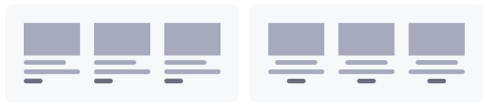

---
taxonomy-category-names:
- Sites
- Fragments
- Liferay Self-Hosted
- Liferay PaaS
- Liferay SaaS
uuid: 1e13195e-4d93-4d50-bc15-910ece4d4e8d
---
# Default Fragments Reference

Liferay provides many out-of-the-box fragments, so you can start building your solution immediately. To view available fragments, begin editing a content page or page template. While editing, open the *Fragments and Widgets* tab () in the editing sidebar menu.

Fragments are organized into the following sets:

- [Default Fragments Reference](#default-fragments-reference)
  - [Layout Elements](#layout-elements)
  - [Basic Components](#basic-components)
  - [Form Components](#form-components)
  - [Content Display](#content-display)
  - [Account](#account)
  - [Cart](#cart)
  - [Featured Content](#featured-content)
    - [Banners](#banners)
    - [Features](#features)
    - [Highlights](#highlights)
  - [Footers](#footers)
  - [Navigation Bars](#navigation-bars)
  - [Menu Display](#menu-display)

!!! note
    Available configuration options vary by fragment and fragment sub-element. See [Configuring Fragments](./configuring-fragments.md) for more information.

## Layout Elements

{bdg-secondary}`For Liferay 7.3+`

Layout elements define drop zones for designing page and template layouts. By default, Liferay includes two layout elements: *Container* and *Grid*.

| Fragment                       | Description                                                                                               |
| :----------------------------- | :-------------------------------------------------------------------------------------------------------- |
| Container (previously *Panel*) | Adds a configurable drop zone.                                                                            |
| Grid (previously *Row*)        | Adds multiple drop zone modules. These modules can be configured and arranged vertically or horizontally. |

## Basic Components

These are simple design elements that add basic functionality to a page. Examples include buttons, headings, and tabs. With these components, you can build your page piece by piece. DXP includes the following basic components:

| Fragment                                | Description                                                                                                                                                                                                                                                                                                              |
| :-------------------------------------- | :----------------------------------------------------------------------------------------------------------------------------------------------------------------------------------------------------------------------------------------------------------------------------------------------------------------------- |
| Button                                  | Adds a [link element](./configuring-fragments/fragment-sub-elements-reference.md) that can be a Link or an Action type. You can apply five button styles: Primary, Secondary, Link, Outline Primary, and Outline Secondary.                                                                                              |
| Card                                    | Adds [image](./configuring-fragments/fragment-sub-elements-reference.md), [rich text](./configuring-fragments/fragment-sub-elements-reference.md), and [link](./configuring-fragments/fragment-sub-elements-reference.md) elements arranged as a display card.                                                           |
| Date                                    | Adds a field that you can map to custom date fields.                                                                                                                                                                                                                                                                     |
| Drop-down {bdg-secondary}`7.4+`         | Adds a [simple text element](./configuring-fragments/fragment-sub-elements-reference.md) and drop zone. You can drag-and-drop other fragments and widgets into the drop zone to create an advanced drop-down menu.                                                                                                       |
| External Video {bdg-secondary}`7.4+`    | [Embeds an external video in a page or template](../../../../content-authoring-and-management/documents-and-media/videos/embedding-videos-into-liferay-assets-and-pages.md). Supported video sources include YouTube, Facebook, Twitch, Vimeo, and videos stored in Documents and Media.                                 |
| HTML                                    | Adds an editable [HTML element](./configuring-fragments/fragment-sub-elements-reference.md). Double-clicking the element opens a modal window where you can edit its content using HTML syntax.                                                                                                                          |
| Heading                                 | Adds a [simple text element](./configuring-fragments/fragment-sub-elements-reference.md) that can be configured to use H1-H6 heading levels.                                                                                                                                                                             |
| Image                                   | Adds a configurable [image element](./configuring-fragments/fragment-sub-elements-reference.md). When configuring, determine whether to use the image's original size, or adjust it to fit its context.                                                                                                                  |
| Paragraph                               | Adds a [rich text element](./configuring-fragments/fragment-sub-elements-reference.md). When editing, highlight the fragment's text to access additional formatting options.                                                                                                                                             |
| Separator                               | Adds a horizontal line between page elements. You can configure its spacing and color.                                                                                                                                                                                                                                   |
| Slider                                  | Adds multiple [images](./configuring-fragments/fragment-sub-elements-reference.md) with [rich text](./configuring-fragments/fragment-sub-elements-reference.md) overlay that are grouped into slides. Users can manually cycle through each slide.                                                                       |
| Social                                  | Adds [image elements](./configuring-fragments/fragment-sub-elements-reference.md) with Facebook, Twitter, and LinkedIn icons, which you can link to pages on each platform.                                                                                                                                              |
| Spacer                                  | Adds a horizontal blank space between fragments on a page. You can configure its height.                                                                                                                                                                                                                                 |
| Tabs                                    | Adds multiple tabs with [simple text elements](./configuring-fragments/fragment-sub-elements-reference.md) and individual drop zones for adding widgets and other fragments.                                                                                                                                             |
| Video URL (previously *Video Fragment*) | [Embeds a video](../../../../content-authoring-and-management/documents-and-media/videos/embedding-videos-into-liferay-assets-and-pages.md) from YouTube or Documents and Media in a page or template. You can set the video to autoplay, loop, mute, or hide controls. You can also hide video controls from end users. |

## Form Components

{bdg-secondary}`For Liferay 7.4 U45+/GA45+`

Use form components fragments to build forms in content pages. These fragments only support custom objects. To enable and access them, you must have at least one published object. See [Using Fragments to Build Forms](../../../../liferay-development/objects/using-fragments-to-build-forms.md) for more information.

| Fragment         | Description                                                                                                                                                                                                                                                                                                                                                                        |
|:-----------------|:-----------------------------------------------------------------------------------------------------------------------------------------------------------------------------------------------------------------------------------------------------------------------------------------------------------------------------------------------------------------------------------|
| Form Container   | Adds a container for building forms in content pages. Once added, you must map the container to a custom object. The container automatically generates form fragments for each field in the object. You can add or remove fragments from the container and set a custom success message for form submissions. You can only place other form components in a mapped form container. |
| CAPTCHA          | Adds CAPTCHA confirmation to a form container. Once added, the form container requires human verification for submissions.                                                                                                                                                                                                                                                         |
| Checkbox         | Adds a checkbox to the form container that you can map to boolean fields.                                                                                                                                                                                                                                                                                                          |
| Date             | Adds a field that you can map to custom date fields.                                                                                                                                                                                                                                                                                                                               |
| File Upload      | Adds a file upload button that you can map to [attachment fields](../../../../liferay-development/objects/creating-and-managing-objects/fields/attachment-fields.md#attachment-fields). The mapped attachment field determines how files are uploaded. By default, this fragment displays supported file extensions.                                                             |
| Multiselect List | Adds a field that you can map to multiselect picklists.                                                                                                                                                                                                                                                                                                                            |
| Numeric Input    | Adds a field that you can map to custom numeric fields (i.e., integer, long integer, decimal, and precision decimal). You can set a placeholder value and help text.                                                                                                                                                                                                               |
| Rich Text Input  | Adds a field that you can map to rich text fields.                                                                                                                                                                                                                                                                                                                                 |
| Select from List | Adds a drop-down menu that you can map to custom picklist and relationship fields. If the mapped field includes more than 10 options, the user can search in the drop-down menu for querying options.                                                                                                                                                                              |
| Submit Button    | Adds a button for submitting the form entry. Every form container must include a submit button.                                                                                                                                                                                                                                                                                    |
| Text Input       | Adds a field that you can map to text fields (i.e., text, long text).                                                                                                                                                                                                                                                                                                              |
| Textarea         | Adds a field that you can map to long text fields.                                                                                                                                                                                                                                                                                                                                 |
| Tags             | Adds a field to add tags from the current site or global site to object entries.                                                                                                                                                                                                                                                                                                   |
| Categories       | Adds a field to add categories from the current site or global site to object entries.                                                                                                                                                                                                                                                                                             |

## Content Display

{bdg-secondary}`For Liferay 7.3+`

Use content display fragments to display site content individually or as part of a collection. You can also add page elements for rating or flagging page content. DXP includes the following content display fragments:

| Fragment                           | Description                                                                                                                                                                                                                                                                                                                                                                                                       |
|:-----------------------------------|:------------------------------------------------------------------------------------------------------------------------------------------------------------------------------------------------------------------------------------------------------------------------------------------------------------------------------------------------------------------------------------------------------------------|
| Collection Display                 | Displays manually and dynamically defined collections, as well as collections defined by a collection provider. You can configure whether the collection appears in a grid, or with a list template (i.e., bordered, bulleted, inline, numbered, and unstyled). See [Displaying Collections](../../../displaying-content/collections-and-collection-pages/displaying-collections.md) for more information. |
| Content Display                    | Displays a single content item from documents and media, web content, blogs, or categories. Available configuration options depend on the selected content type.                                                                                                                                                                                                                                                  |
| Applied Filters (Available 7.4+)   | Adds an element for displaying and managing filters applied to a collection display.                                                                                                                                                                                                                                                                                                                              |
| Content Flags                      | Adds an element for flagging a content item.                                                                                                                                                                                                                                                                                                                                                                      |
| Collection Filter (Available 7.4+) | Adds an element for filtering a collection display using a vocabulary or category.                                                                                                                                                                                                                                                                                                                                |
| Content Ratings                    | Adds an element for rating a content item.                                                                                                                                                                                                                                                                                                                                                                        |

    !!! note
        Collection Filter fragments used in Collection Display fragments only work if mapped to object collection providers or blueprint collection providers.

<!--| Knowledge Base Article Navigation (Available 7.4 U_+/GA_+) | I moved this comment because it was breaking the admonition. It was on top of it originally. |-->

## Account

{bdg-secondary}`Liferay DXP 7.4 U72+/GA72+`

Use the account selector fragment to switch easily between your accounts when browsing products and creating orders. See [Using the Account Selector Fragment](https://learn.liferay.com/w/commerce/creating-store-content/liferay-commerce-fragments/using-the-account-selector-fragment) for more information.

## Cart

{bdg-secondary}`Liferay DXP 7.4 U69+/GA69+`

Use the mini cart fragment to obtain a detailed overview of your cart. You can use it to adjust the product quantity, remove items, start the checkout process, or easily search for and add products to your cart. See [Using the Mini Cart Fragment](https://learn.liferay.com/w/commerce/creating-store-content/liferay-commerce-fragments/using-the-mini-cart-fragment) for more information.

## Featured Content

Featured content fragments are complex page elements composed of multiple components. To preview a fragment's layout, switch to *Card View* () in the Fragments and Widgets panel. Liferay includes the following featured content fragments.

!!! note
    For Liferay DXP/Portal 7.3, you can preview layouts by hovering over each fragment's *Information* icon ().

### Banners

Use banner fragments to add text and link elements to a content page for creating CTA (Call to Action) banners. DXP includes the following layouts.

### Features

Use the features fragment to add text, images, and link elements to a content page for promoting key features. Liferay provides the following layout.

### Highlights

Use the highlights fragment to add image, text, and link elements to a content page for highlighting. Liferay provides the following layouts.

## Footers

{bdg-secondary}`Liferay 7.3+`

Use footer fragments to add a custom footer to [master page templates](../../defining-headers-and-footers/master-page-templates.md). Each footer includes a navigation menu, sign-in link, image element, and copyright text. Liferay provides the following layouts for footer fragments:

## Navigation Bars

{bdg-secondary}`Liferay 7.3+`

Use navigation bar fragments to add a custom header to [master page templates](../../defining-headers-and-footers/master-page-templates.md). Each navigation bar includes a navigation menu, sign-in link, and image element for your logo. Liferay provides the following layouts for navigation bar fragments:

## Menu Display

{bdg-secondary}`Liferay 7.4+`

Using the menu display fragment, you can add menus to your content pages. Once deployed, you can select from any predefined [navigation menu](../../../site-navigation/using-the-navigation-menus-application.md). To learn more about how to configure the menu display fragment for your site navigation, see Configuring the Menu Display Widget in [Configuring Menu Displays](../../../site-navigation/configuring-menu-displays.md).

You can also create a custom menu display fragment with specific markup and desired behavior by using [the navigation menu selector configuration](../../../developer-guide/reference/fragments/fragment-configuration-types-reference.md#navigation-menu-selector-configuration).

<!--## Product-->

<!-- {bdg-secondary}`Liferay 7.4 U_+/GA_+` -->

<!--
| Since this was a recent implementation, Commerce team will explain how to properly use these fragments. This will be documented in the Commerce section, and we'll link it to this article.
-->

## Related Topics

- [Using Content Pages](../../using-content-pages.md)
- [Content Page Editor UI Reference](../../using-content-pages/content-page-editor-ui-reference.md)
- [Using Fragments](../using-fragments.md)
