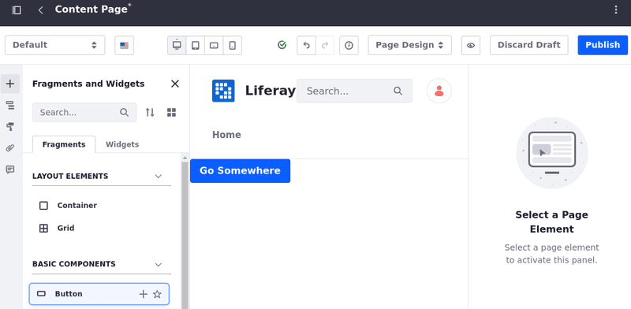
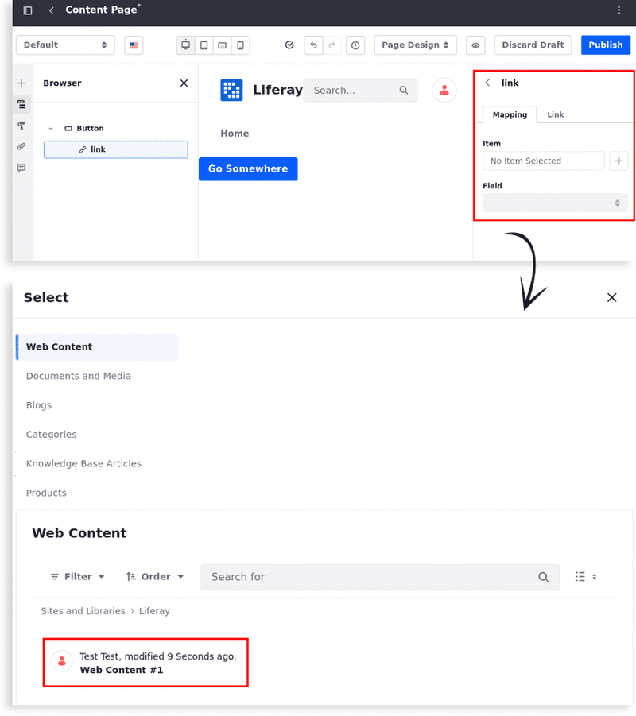
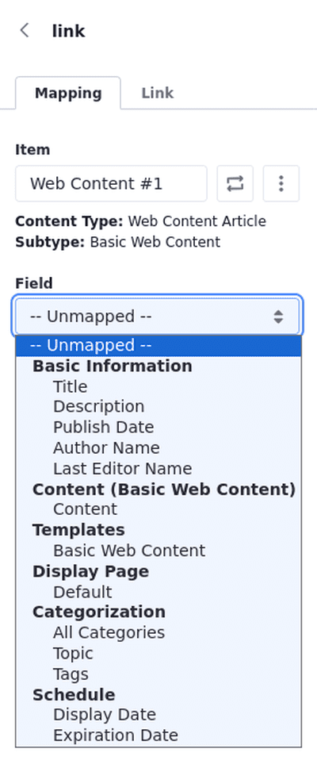
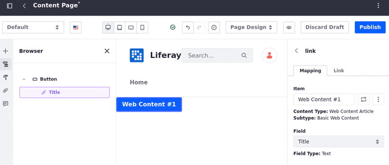
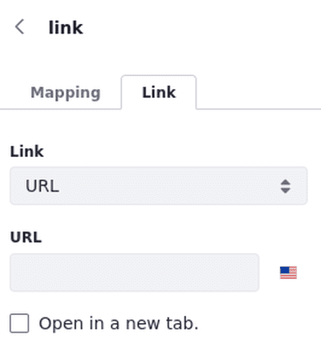
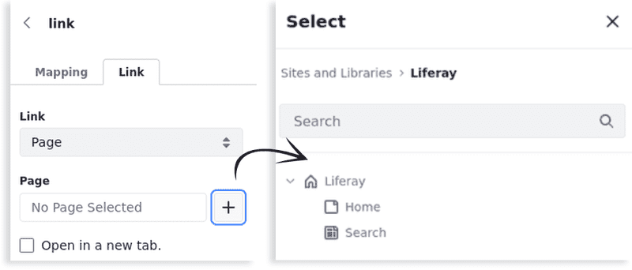

---
taxonomy-category-names:
- Sites
- Fragments
- Liferay Self-Hosted
- Liferay PaaS
- Liferay SaaS
uuid: ff39efb2-22c9-4f1e-b292-8f3dc33dd89a
---

# Mapping and Linking Fragment Elements

You can map and link fragments together as reusable components for your digital experiences (e.g., form submissions and navigation actions).

!!! note
    Not all fragments support mapping and linking options. See [General Settings Reference](./configuring-fragments/general-settings-reference.md) to learn more.

## Mapping Fragment Elements

1. Open the *Site Menu* (), expand *Site Builder*, and go to *Pages*.

1. [Create a new page](../../adding-pages/adding-a-page-to-a-site.md) or [start editing](../../using-content-pages/adding-elements-to-content-pages.md) one.

1. Use a fragment on the page or drag and drop a new one from the Fragments and Widgets toolbar.

   This example uses the Button fragment under Basic Components.

   

1. Double-click the button fragment to access its link element.

1. On the right, select the *Mapping* tab, click `+`, and select an item. This maps it to the button's content.

   

1. Once you select an item, click the *Field* drop-down to access available options and select one of them.

   In this exercise, the button's content is mapped to a web content article's title.

   

Your fragment is mapped to a field from an item.

Next, link the fragment to a URL, a page, or a mapped URL.

## Linking Fragment Elements

Link fragment elements to establish connections or interactions between components. This can include linking buttons to trigger actions such as form submissions or navigation to other pages or external URLs.

To link a fragment element, use the existing button fragment that was mapped to the web content article's title: 

1. Double-click the button fragment to access its link element.

1. On the right, select the *Link* tab and choose a *Link* type from the drop-down menu: URL, Page, or Mapped URL.

   The URL type accepts localized URLs that can point to external websites.

   

   The Page type links directly to a page within the site instance.

   

   The Mapped URL type can point to assets with mappable fields or dynamically generated links managed within the CMS.

   

1. (Optional) Decide whether to open the link in a new tab.

## Related Topics

- [Managing Fragments](./managing-fragments.md)
- [Using Multiple Display Page Templates to Create Multi-Step Applications](../../../displaying-content/using-display-page-templates/using-multiple-display-page-templates-to-create-multi-step-applications.md)
- [Mapping Calendar Event Fields to Display Page Templates](../../../../collaboration-and-social/calendar/mapping-calendar-event-fields-to-display-page-templates.md)
- [Mapping Web Content Templates to Fragments](../../../../content-authoring-and-management/web-content/web-content-templates/mapping-web-content-templates-to-fragments.md)
