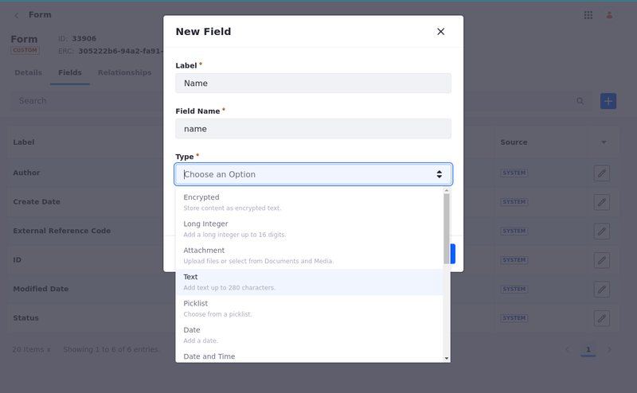
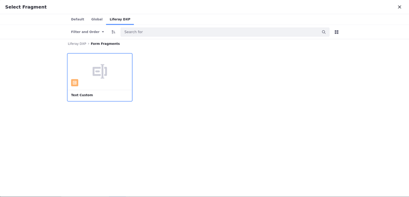
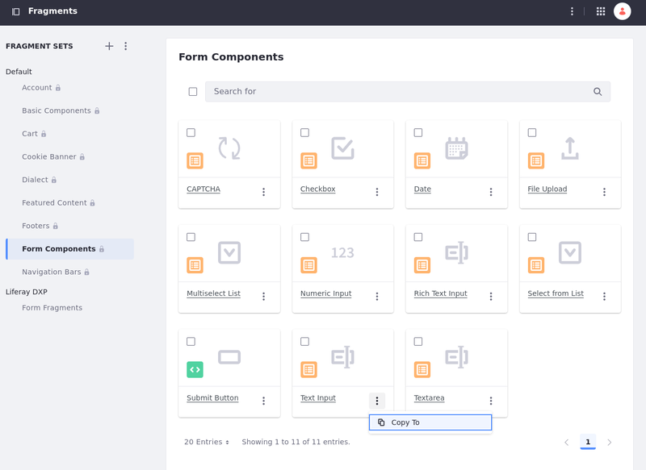

# Personalizing Custom Forms Using Form Fragments

Among the out-of-the-box solutions provided with fragments, Liferay includes form fragments for building forms based on custom objects. Users can map their forms automatically using form fragments.

If Liferay's form fragments don't satisfy your use case, you can create custom form fragments and use them to alter the style of your form by [mapping your custom form fragment to a field type](#map-custom-form-fragments-to-form-fields).

The custom form fragments use HTML, CSS, and JavaScript code to create an element with customized style and functionalities. This way, you can customize your forms using an existing design system and/or components library. See [Creating Form Fragments](../../../developer-guide/developing-page-fragments/creating-form-fragments.md) for more information.

```{important}
Form fragments can only be used with custom objects. Therefore, Liferay hides the Form Components fragment set until you have at least one published object. Once published, users with access to the object can view and use the Form Components fragments. See [Creating Objects](../../../../building-applications/objects/creating-and-managing-objects/creating-objects.md) for more information.
```

## Map Custom Form Fragments to Form Fields

To alter the style and functions of a form field, you can map a [custom form fragment](../../../developer-guide/developing-page-fragments/creating-form-fragments.md) to a field type:

1. In your Fragments app, click on the *Options* icon () in the applications bar &rarr; select *Configuration*.

   

1. Select the *Form Fragment* (on the right column) to be applied to the Field Type (on the left column).

    

1. Choose the fragment set under your site's tab. The options with a compatible type of field appear. 

1. Select the custom form fragment you want to apply.

   

You can check if the custom fragment is applied to the field type by adding a form to a content or template page. See [Using Fragments to Build Forms](../../../../building-applications/objects/using-fragments-to-build-forms.md) to learn more about building forms using fragments.

If the mapping process is successful, the style of the custom form fragment (on the left) should be applied to the field type instead of the out-of-the-box fragment style (on the right).



## Related Topics

* [Configuring Fragments](./configuring-fragments.md)
* [Creating Form Fragments](../../../developer-guide/developing-page-fragments/creating-form-fragments.md)
* [Developing Page Fragments](../../../developer-guide/developing-page-fragments.md)
* [Form Components](./default-fragments-reference.md#form-components)
* [Form Fragment Options](./configuring-fragments/general-settings-reference.md#form-fragment-options)
* [Using Fragments to Build Forms](../../../../building-applications/objects/using-fragments-to-build-forms.md)
