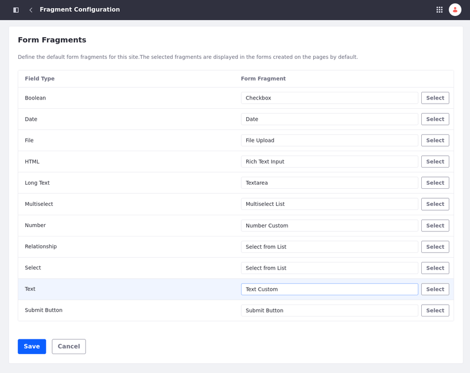

# Personalizing Custom Forms Using Form Fragments

Among the out-of-the-box solutions provided with fragments, Liferay includes form fragments for building forms based on custom objects.

With form fragments, users can map their forms automatically, customize the forms using the existing form fragments, alter the order of the fields, delete fields, add other fragments to the form, etc.

## Create Custom Form Fragments

If Liferay's form fragments don't satisfy your use case, you can create custom form fragments and use them to alter the style of your form by [mapping your custom form fragment to a field type](#map-custom-form-fragments-to-form-fields).

The custom form fragments use HTML, CSS, and JavaScript code to create an element with customized style and functionalities. This way, you can customize your forms using an existing design system and/or components library. See [Creating Form Fragments](../../../developer-guide/developing-page-fragments/creating-form-fragments.md) for more information.

```{important}
Form fragments can only be used with custom objects. Therefore, Liferay hides the Form Components fragment set until you have at least one published object. Once published, users with access to the object can view and use the Form Components fragments. See [Creating Objects](../../../../building-applications/objects/creating-and-managing-objects/creating-objects.md) for more information.
```

The custom form fragments used in the example are altered copies of the form component's Text Input and Numeric Input. See [Editing Fragment Elements](./editing-fragment-elements.md) to learn more about copying and editing a fragment.


To edit the fragment, navigate to your fragment set, click on the *Actions* icon(), and choose *Edit*.


In the edit screen you can alter the HTML (top-left corner), CSS (top-right corner), and JavaScript (bottom-left corner). You can also live preview your fragment (bottom-right corner).


To make the Numeric Input look a little different from the out-of-the-box fragment, you can add some CSS code to alter the style of your fragment.

```css
.input-container {
   display: flex;
   flex-direction: column;
   margin-bottom: 10px;
}

.label {
   color: #0053f0;
   font-weight: bold;
   border: none;
   font: 1.25rem sans-serif;
}

.input{
   padding: 5px;
   border: 1px solid #0053f0;
   border-radius: 5px;
   max-width: 300px;
   width: 100%;
   font: 1.25rem sans-serif;
   color: #0053f0;
}
```

## Map Custom Form Fragments to Form Fields

You can map a [custom form fragment](#create-custom-form-fragments) to a form field if you want to apply an existing design system and/or use a components library. To map a custom form fragment to a field type,

1. In your Fragments app, click on the *Options* icon () in the applications bar &rarr; select *Configuration*.

   

1. Select the *Form Fragment* (on the right column) to be applied to the Field Type (on the left column).

    

1. Choose the fragment set under your site's tab &rarr; the options with a compatible type of field appear. 

1. Select the custom form fragment you want to apply.

   


### Create a Form Using Form Fragments

To test if your alterations are working, create a form using a form component in a content or template page:
      
1. Start editing your content page or page template where you want to add the form. See [Adding Elements to Content Pages](../../using-content-pages/adding-elements-to-content-pages.md) for more information on how to edit a content page.

   ```{warning}
   Display page templates do not support form fragments. You must use a content page or a page template.
   ```

1. (Optional) Design a layout using fragments. See [Building Responsive Layouts with Fragments](../../../optimizing-sites/building-a-responsive-site/building-responsive-layouts-with-the-grid-fragment.md) for more information.

1. Add the *Form Container* fragment to the page and map it to the custom object.

   The container automatically generates a Submit button and fragments for all object fields. They appear in alphabetical order. Mandatory fields are marked accordingly.

   

1. The style of the custom form fragments should be different from the default style of an out-of-the-box form fragment. In this example,

   * the colors on the label and the custom input field are different.

   * the input field has a `max-width` while the default input field occupies the width of its parent completely.

   * As a `margin-bottom` was added, the overall height of the form is superior to the one in the default component.

   

## Related Topics

* [Configuring Fragments](./configuring-fragments.md)
* [Creating Form Fragments](../../../developer-guide/developing-page-fragments/creating-form-fragments.md)
* [Developing Page Fragments](../../../developer-guide/developing-page-fragments.md)
* [Form Components](./default-fragments-reference.md#form-components)
* [Form Fragment Options](./configuring-fragments/general-settings-reference.md#form-fragment-options)
* [Using Fragments to Build Forms](../../../../building-applications/objects/using-fragments-to-build-forms.md)
