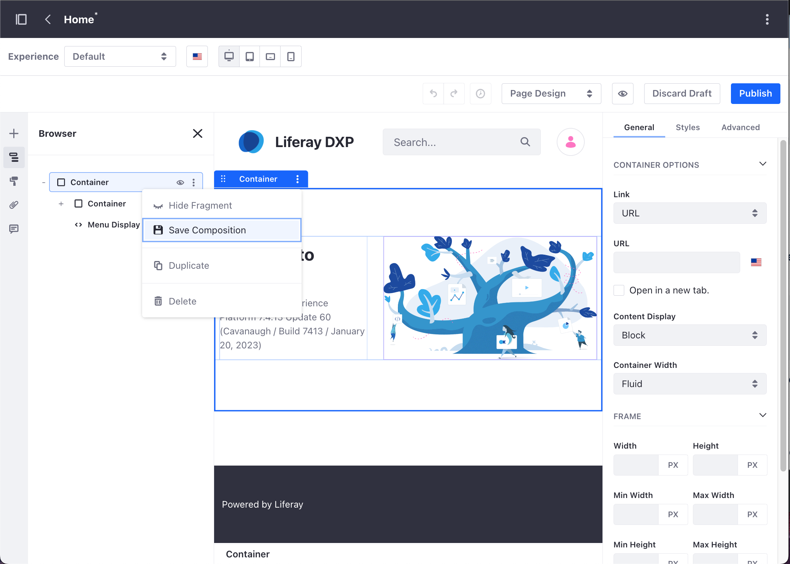
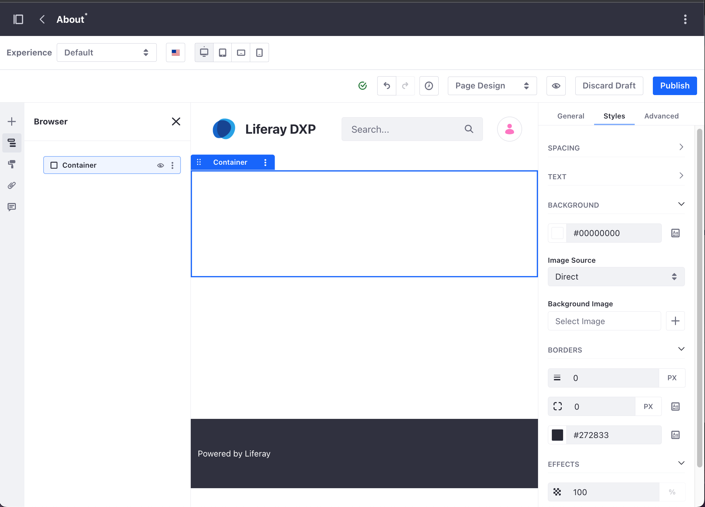
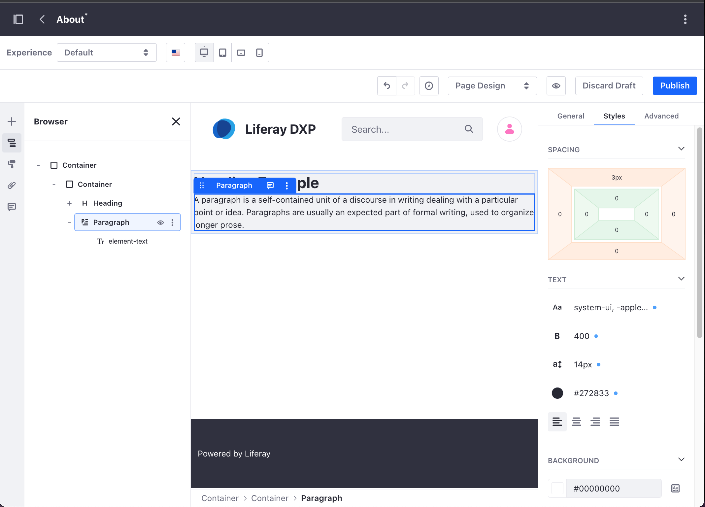
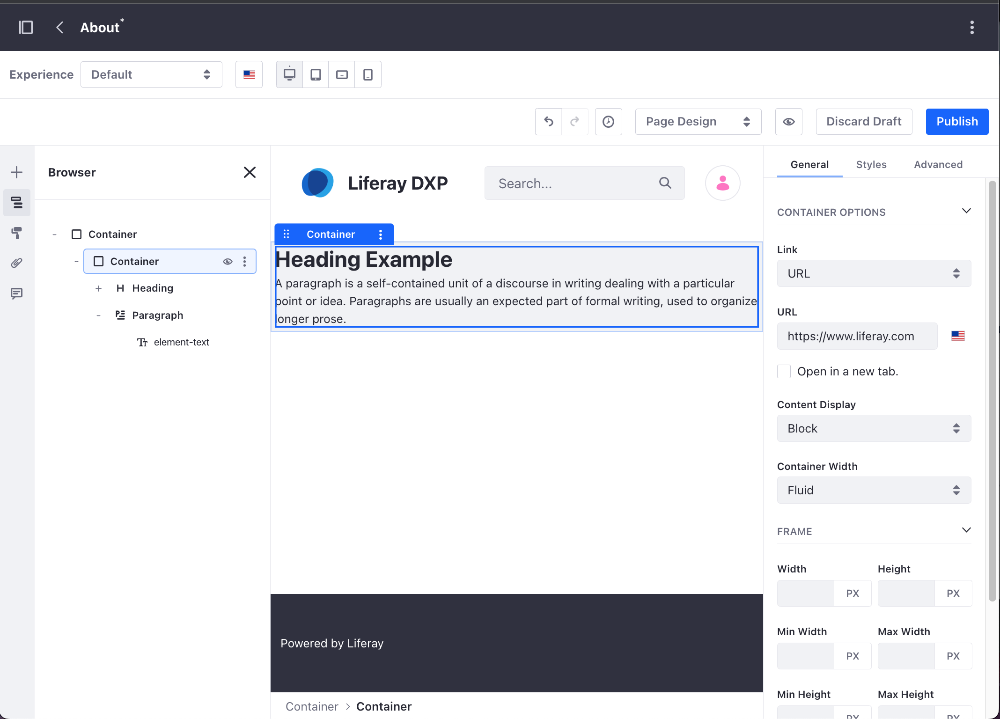
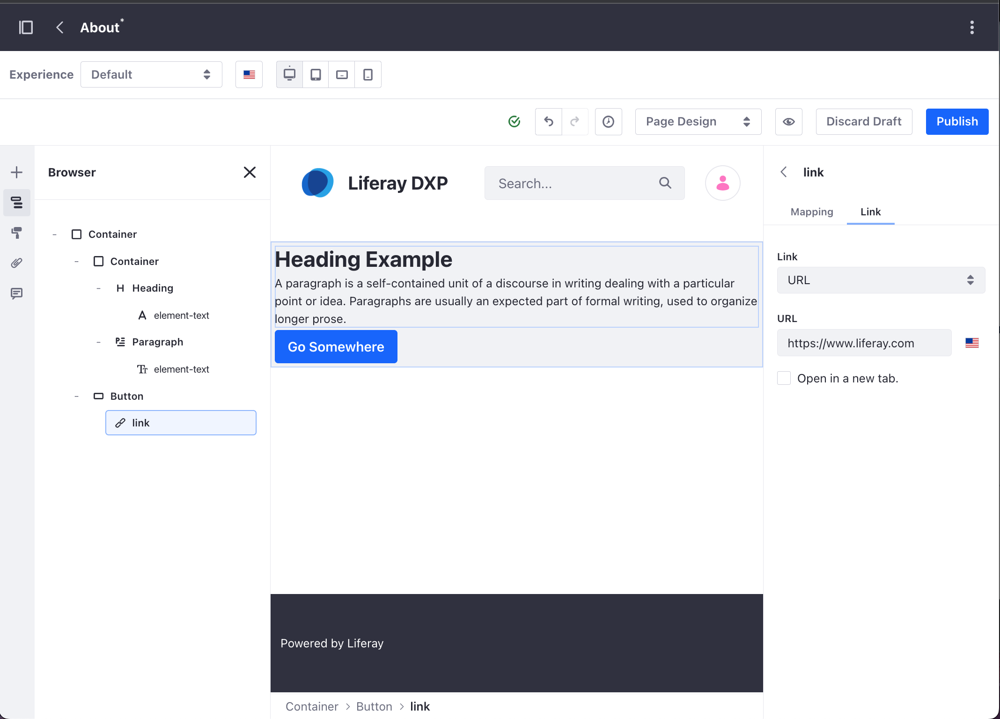
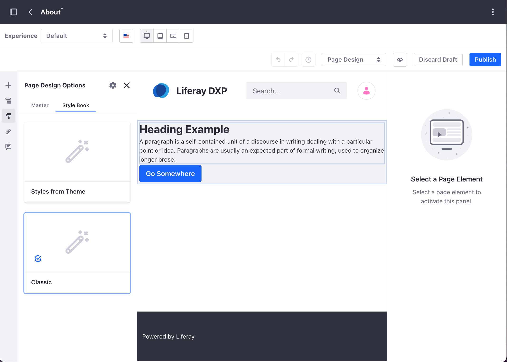
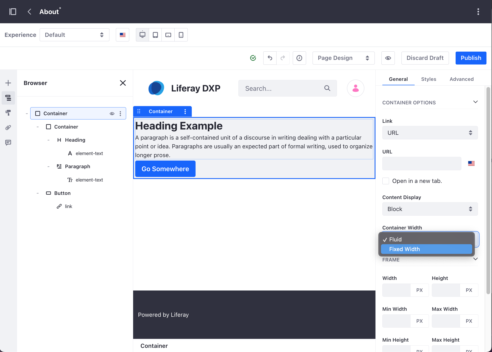
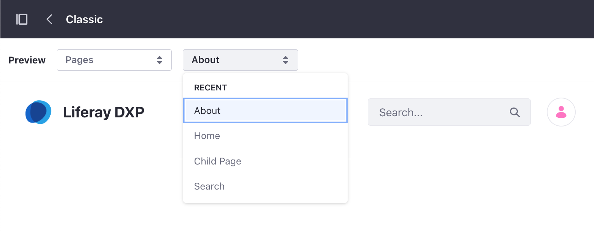
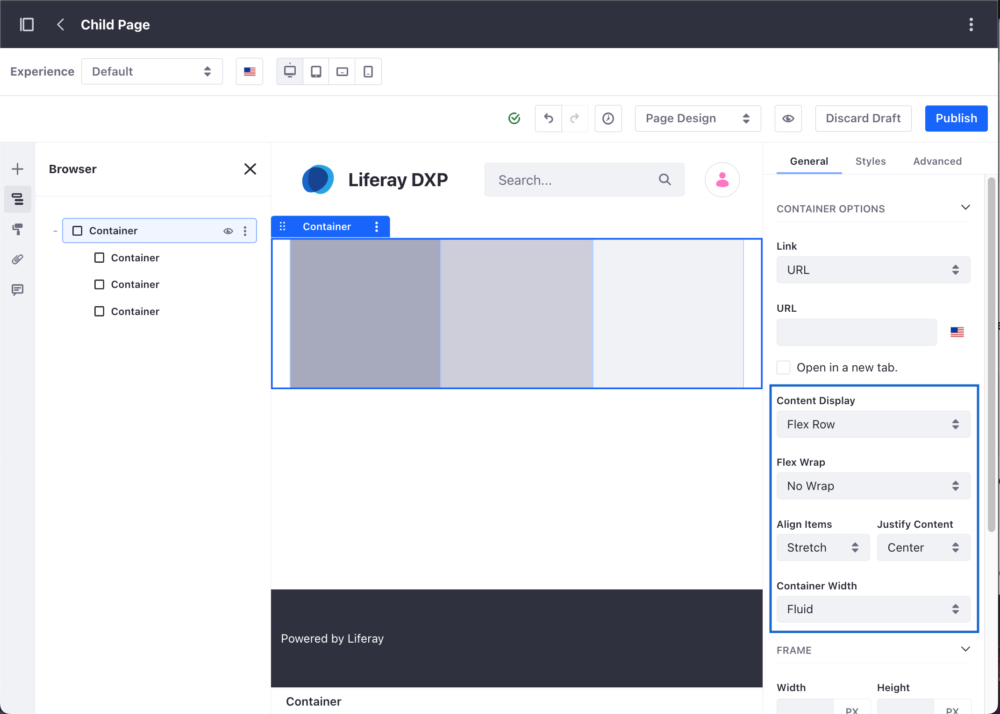

---
taxonomy-category-names:
- Sites
- Fragments
- Liferay Self-Hosted
- Liferay PaaS
- Liferay SaaS
uuid: e6e7bd72-a79e-420a-be70-04c947330763
---

# Saving Fragment Compositions

Layout and composition are the foundation of your page design. They make pages easier to read and navigate, resulting in a richer and more consistent user experience. Using the Container and Grid layout elements, you can define drop zones, create complex compositions, and then save these compositions as new fragments. These fragments can then be reused in other pages and templates that support fragments.

!!! tip
    When designing compositions, start with the Container Fragment. Add other elements into this Container for maximum flexibility and layout control.

Follow these steps to save a fragment composition:

1. Begin editing the page or template that includes the composition you want to save.

1. Click the desired *Container* or *Grid*.

   Alternatively, open the *Browser* panel () in the sidebar menu and select the desired *Container* or *Grid*.

1. Click *Options* () for the fragment you want and select *Save Composition*.

   

1. Enter a name for the fragment.

1. (Optional) Add a *thumbnail* and *description* for the new fragment.

1. Determine whether to save the composition's *inline content* (e.g., links, text, images)

1. Determine whether to save the composition's [*mapping configuration*](./configuring-fragments/fragment-sub-elements-reference.md#mapping-settings).

1. Select the desired Fragment Set for the new fragment.

   If no available Fragment Set exists, the composition is saved automatically to a new set called Saved Fragments.

   

1. Click *Save*.

The saved fragment composition appears in the *Fragments* panel under the selected Fragment Set. You can add it to a page or template like other fragments.

To view and manage saved compositions, open the *Site Menu* and go to *Design* &rarr; *Fragments*.

!!! note
    In Liferay DXP 7.1 and 7.2, open the *Product Menu*, and go to *Site* &rarr; *Site Builder* &rarr; *Page Fragments*.

From here, you can rename saved compositions, change their thumbnail image, or export them as a `.zip` file, move them between sets, or delete them. See [Managing Fragments](./managing-fragments.md) for more information.

## Example: Creating a Banner Composition

This step-by-step example shows you how to create a banner-style composition using nested container fragments. The example also illustrates how to save the composition and adjust its settings in the style book.

- [Step 1: Creating a New Content Page](#step-1-creating-a-new-content-page).
- [Step 2: Configuring the Container Fragment](#step-2-configuring-the-container-fragment).
- [Step 3: Saving the Fragment Composition](#step-3-saving-the-fragment-composition).
- [Step 4: Setting the Default Container Width in the Style Book](#step-4-setting-the-default-container-width-in-the-style-book).

### Step 1: Creating a New Content Page

1. Under the Site Menu, go to *Site Builder* &rarr; *Pages*.

1. Click *Add* () at the level where you want to add the new page and select *Add Page*.

1. Select the *Blank* template or one of the existing templates.

1. In the *Add Page* dialog, type your page's name.

### Step 2: Configuring the Container Fragment

1. From the content page sidebar, select *Fragments and Widgets* () and drag and drop the *Container* fragment over the default drop-zone.

   

1. Click the *Container* fragment and, in the *Configuration* panel, click the *Styles* tab.

1. In the Spacing panel, set the four *Padding* options to `5`.

1. In the Background panel, use the *Value from Style Book* button to select a *Gray 200*.

   

1. Select *Fragments and Widgets* () and drop a new *Container* fragment over the existing one. This creates a nested container composition that appears when you click on the *Browser* () button.

1. From the Fragments and Widgets () panel, under Basic Components, drag and drop a *Heading* fragment inside the inner container in the composition.

   

1. Drag and drop a *Paragraph* fragment right below the heading. Select the paragraph in the composition and under the *Styles* section, choose a *Margin Top* of `3`.

   

1. From the Selection () panel, click the inner container. Under the *General* tab, type the URL where you want to redirect users when they click on this area.

   

1. From the Fragments and Widgets () panel, under Basic Components, drag and drop a *Button* fragment in the composition, right below the paragraph.

1. Select the *Button* fragment and, under the Styles section, set a *Margin Top* of `3`. Under the *General* section, click the *Type* drop-down menu and choose *Link*.

1. In the Browser () panel, click the *link* for the button. Under the link section, type the URL you want to redirect users when they click the button.

   

!!! note
    You don't need to publish the content page. In-progress work on a content page is saved automatically as a draft.

### Step 3: Saving the Fragment Composition

Follow the above steps to save the composition as a new fragment.

### Step 4: Setting the Default Container Width in the Style Book

By default, the container fragment uses a *Fluid* width configuration. You can change the default setting to *Fixed Width*, and make this property available for other content pages based on the same style book. In this example with two nested containers, you may want to configure the outer container to adapt to the page width while limiting the maximum width of the container with the text. To learn more about style books in Liferay DXP, read [Using a Style Book to Standardize Site Appearance](../../../site-appearance/style-books/using-a-style-book-to-standardize-site-appearance.md).

!!! warning
    To avoid breaking your site layout configuration, use a test environment when working with style books. Do not update a style book configuration for testing purposes on a production site.

1. Open the *Browser* (), then click the inner container fragment.

1. In the General tab, set the *Container Width* property to *Fixed Width*.

   

1. Click the *Page Design Options* () and, under the Style Book section, verify the active Style Book.

   

1. Under the Site Menu, go to *Design* &rarr; *Style Books*.

   

1. Click *Actions* () for the style book corresponding to your content page and select *Edit*.

1. On the style book editor, select your content page from the *Page Preview* drop-down menu.

   

1. Select the *Layout* option on the right-hand side drop-down menu, and set a maximum width value (in pixels) for the fixed width elements in the *Extra Large* option.

   

1. Click *Publish* to update your style book with the new configuration.

## Creating Advanced Compositions with the Container Fragment

{bdg-secondary}`Liferay DXP/Portal 7.4+`

When you configure one or more containers inside another container fragment, you can define advanced display options using a *Flex* display.

1. Under the Site Menu, go to *Site Builder* &rarr; *Pages*.

1. [Create a new content page](../../adding-pages/adding-a-page-to-a-site.md) or open an existing page with a container-based composition. You can use [the banner composition example](#example-creating-a-banner-composition) to create a basic composition using the container fragment.

1. Open the *Browser* () and select the container fragment that groups the elements where you want to apply the advanced composition. For example, if you have a container with fragments in it, select the outer container.

1. Under the Styles section, click the *Content Display* drop-down menu and select one of the available *Flex* options.

1. Set the *Align Items* and *Justify Content* settings to your preference.

   

## Related Topics

- [Using Fragments](../using-fragments.md)
- [Managing Fragments](./managing-fragments.md)
- [Content Page Editor UI Reference](../../using-content-pages/content-page-editor-ui-reference.md)
- [Building Responsive Layouts with the Grid Fragment](../../../optimizing-sites/building-a-responsive-site/building-responsive-layouts-with-the-grid-fragment.md)
