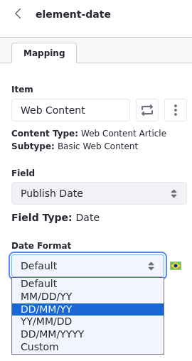
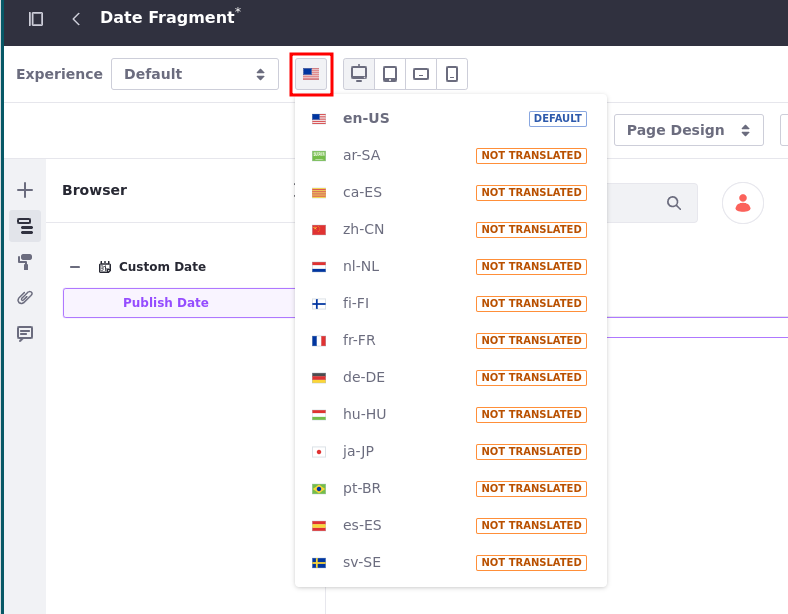

# Using Date Fragments

Customizing date formats to represent local formats can be a challenge in many contexts. With date fragments, you can choose an out-of-the-box date format or input your custom date format following [Oracle's date format rules](https://docs.oracle.com/javase/8/docs/api/java/text/SimpleDateFormat.html).

To use a date fragment, you must add the `data-lfr-editable-id` and `data-lfr-editable-type="date-time"` attributes to the fragment. `data-lfr-editable-id` must be a unique ID, like this example:

```html
<div data-lfr-editable-type="date-time" data-lfr-editable-id="date-time">
    02/03/11 00:00 AM
</div>
```

## Using a Date Fragment in a Page

1. [Create](../../../creating-pages.md) or begin editing a page.

1. Add a *Date* fragment or your own custom fragment.

1. Click on the fragment twice &rarr; select an *Item* and date *Field* to map it to the fragment.

    

1. Select a *Date Format* for your fragment.

## Date Formats

You can choose the most common date formats out-of-the-box or customize your date format following [Oracle's date format rules](https://docs.oracle.com/javase/8/docs/api/java/text/SimpleDateFormat.html).

There are four out-of-the-box options available:

| Date Format | How it looks |
| :--- | :--- |
| MM/DD/YY | 08/07/23  |
| DD/MM/YY | 07/08/23  |
| YY/MM/DD | 23/08/07  |
| DD/MM/YYYY | 07/08/2023  |

If you choose to customize your date format, you can include different date and time patterns (e.g. era designator, time zone, and day name in the week).

Here are some examples:

| Date Format | How it looks |
| :--- | :--- |
| MMMM dd, YYYY. hh:mm a | August 07, 2023. 11:57 AM  |
| MM.dd.YY | 08.07.23  |
| hh 'o''clock' a, zzzz | 11 o'clock AM, Greenwhich Mean Time |
| KK:mm a, z| 11:57 AM, GMT  |
| EEE, d MMM yyyy HH:mm:ss Z | Mon, 7 Aug 2023 11:57:00 +0000 |

## Localizing a Date Format

1. Click on the flag at the top of the page you are editing (next to *Experience*) &rarr; select a language.

    

1. Configure the *Date Format*.

When you change the language, the date format changes too.