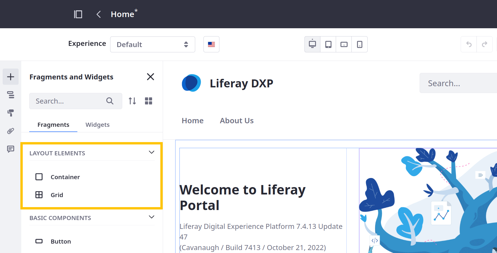
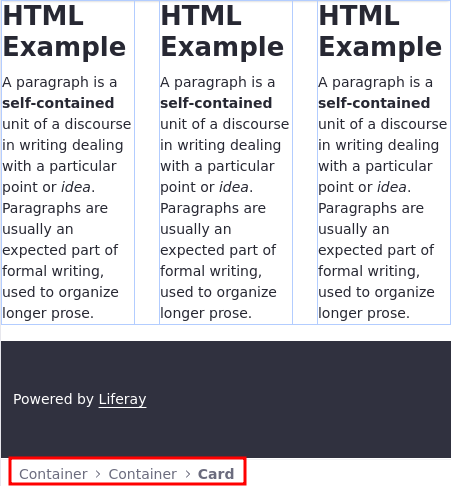
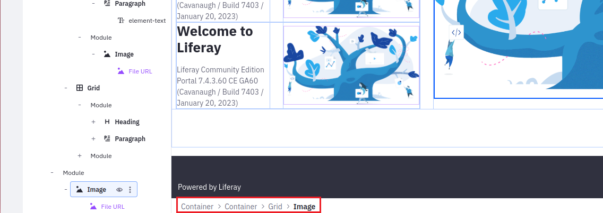
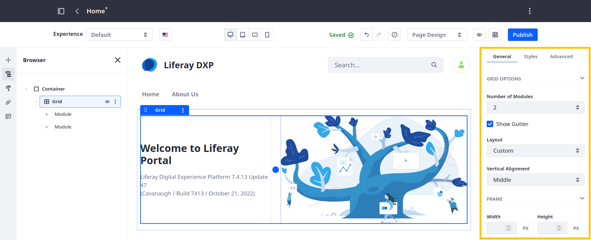

---
taxonomy-category-names:
- Sites
- Fragments
- Liferay Self-Hosted
- Liferay PaaS
- Liferay SaaS
uuid: ea588e15-3ace-4843-a66b-8d3f61f86f27
---
# Using Layout Elements

{bdg-secondary}`For Liferay 7.4 U22+/GA22+`

Layout elements define drop zones for designing page or template layouts. By default, Liferay includes two layout elements: [Containers](#containers) and [Grids](#grids). Once added, you can drag and drop widgets or other fragments into these drop zones, including additional containers or grids to create even more complex layouts. After designing a layout, you can save layout compositions to reuse them in other pages and templates. See [Saving Fragment Compositions](./saving-fragment-compositions.md) for more information.



When you create a new page or template that supports fragments, a default drop zone appears. You can add any fragment to this area, but using the container fragment as the first element in your composition has important advantages:

* Greater layout control over page design, including flex display properties for [advanced compositions](./saving-fragment-compositions.md#creating-advanced-compositions-with-the-container-fragment) (Liferay DXP 7.4+)
* [Save and reuse](./saving-fragment-compositions.md) compositions quickly in other pages and templates
* Add a URL or page redirect to a fragment composition
* Leverage [style books](../../../site-appearance/style-books/using-a-style-book-to-standardize-site-appearance.md) to standardize your site appearance

Once you've added a container, you can use the grid fragment to customize content layout for different viewports. See [Building Responsive Layouts with the Grid Fragment](../../../optimizing-sites/building-a-responsive-site/building-responsive-layouts-with-the-grid-fragment.md) to learn more.

```{tip}
When dragging and dropping an element into a container or grid, Liferay highlights the drop zone to indicate where you're placing it. Once added, you can drag and drop elements in the Browser side panel (  ) to rearrange them.
```

Finally, when you have a variety of nested elements on a page, a breadcrumb appears to assist you with traversing elements in a nested hierarchy.



```{tip}
You can also select an element and use the shortcut `Shift + Enter` to select its parent.
```

## Containers

> Previously called *Panels*

The container fragment adds a configurable drop zone to a content page. In addition to standard configuration options, you can configure the container's HTML tag, display structure, and more. See [Configuring Fragments](./configuring-fragments.md) for more information.



## Grids

> Previously called *Rows*

The grid fragment adds multiple drop zone modules to a page or template. These modules can be arranged horizontally and vertically. In addition to standard configuration options, you can determine the number of modules for each grid, the number of modules per row, and the vertical alignment of each module's content. You can adjust the width of each module manually and add or remove padding between them. See [Configuring Fragments](./configuring-fragments.md) for more information.



## Related Topics

[Default Fragments Reference](./default-fragments-reference.md)

[Saving Fragment Compositions](./saving-fragment-compositions.md)

[Configuring Fragments](./configuring-fragments.md)
