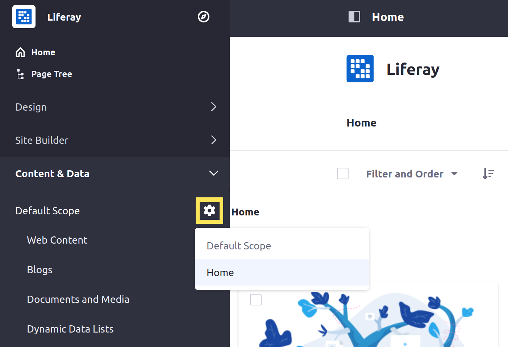

---
taxonomy-category-names:
- Sites
- Widgets
- Liferay Self-Hosted
- Liferay PaaS
- Liferay SaaS
uuid: b9aa51ac-0913-4b11-9169-01464403ec4c
---
# Setting Widget Scopes

By default, Liferay's page widgets are *scoped* by site. This means all widget instances in a site share the same data and display the same content. For example, adding the Message Boards widget to two pages in the same site creates two copies of the same widget, because they use the same data. Adding the Message Boards widget to two different sites creates two different Message Boards with different data.

You can, however, scope widget instances to the page instead of to the site. Then you can add the Message Boards widget to multiple site pages, and each instance has its own categories and threads.

Liferay provides three scope options for page widgets:

| Scope   | Description                                                                                                                                                                        |
|:--------|:-----------------------------------------------------------------------------------------------------------------------------------------------------------------------------------|
| Default | Scope widget data to the current site.                                                                                                                                             |
| Global  | Scope widget data to the Global site. For this scope, you can only manage the widget's content from the Global site.                                                               |
| Page    | Scope widget data to an individual page. You must create the scope when configuring a page widget. Once created, other widgets can use it, including widgets from different pages. |

Follow these steps to configure a widget's scope:

1. Begin editing a page.

1. Hover over the desired widget, click its *Options* button (), and select *Configuration*.

1. Go to the *Scope* tab and use the drop-down menu to select a scope.

   This menu includes the current site (e.g., Liferay DXP. The current site refers to the default scope), the Global site, the current page, and any other page scopes available in the site.

   If you haven't created a scope for the current page, its name is followed by `(Create New)` (e.g., Home (Create New)).

   

1. Click *Save*.

Once you create a new widget scope, a Scope Configuration button () appears under Content & Data in the Site Menu (). You can use it to select the default scope or available page scopes. Your selection changes the content that appears when you manage each type.



```{note}
You can only delete a scope by deleting its associated page.
```

## Related Topics

* [Exporting/Importing Widget Data](./exporting-importing-widget-data.md)
* [Scoping Your Message Boards](../../../../../collaboration-and-social/message-boards/scoping-your-message-boards.md)
