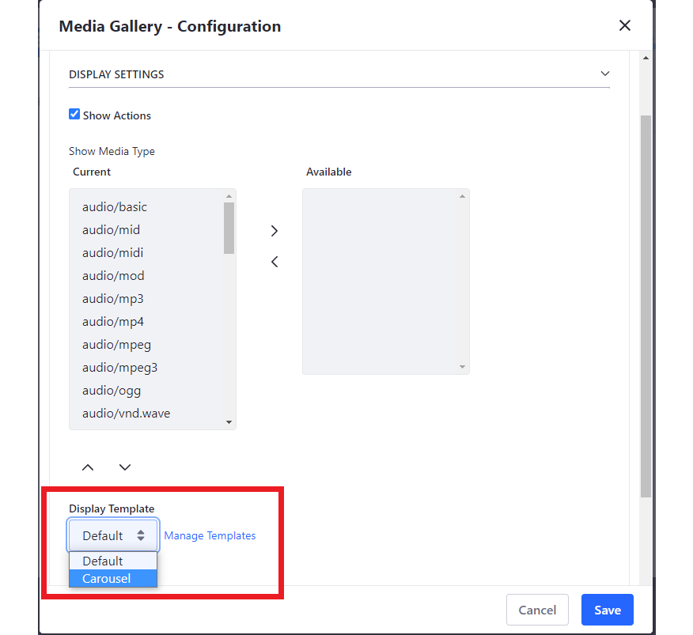
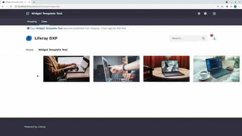

---
taxonomy-category-names:
- Sites
- Widgets
- Liferay Self-Hosted
- Liferay PaaS
- Liferay SaaS
uuid: 0c693fc3-55b5-4767-9a9c-e13529a85aae
---

# Using a Widget Template Example

Widget Templates are great tools for customizing how widgets look and feel on your site.

This example shows changing the default configuration of the Media Gallery widget to use a Carousel widget template.

!!! note
    The Media Gallery widget is [deprecated](../../../../../installation-and-upgrades/upgrading-liferay/reference/maintenance-mode-and-deprecations-in-7-4.md) as of Liferay 2024.Q4+ and is scheduled for removal in a future release.

## Configuring the Media Gallery Widget

If you don't already have images in your Documents and Media, add some images to Documents and Media.

1. Go to *Content and Data*, click on [*Documents and Media*](../../../../../content-authoring-and-management/documents-and-media/uploading-and-managing/uploading-files.md) &rarr; *Add* () to select files to upload.

   

Now, add the *Media Gallery* widget to a page.

1. Open the *Site Menu* () and go to Site Builder &rarr; Pages.

1. Start editing a page or create one.

1. In the Fragments and Widgets sidebar, look for the *Media Gallery* widget. Drag and drop it into the page.

1. Navigate to the widget menu () &rarr; *Configuration* &rarr; *Display Template*. Change the display template to *Carousel*.

   

Publish the page. The widget now uses a carousel display template.

## Related Topics

- [Embedding Widgets in Web Content Templates](../../../../../content-authoring-and-management/web-content/web-content-templates/embedding-widgets-in-web-content-templates.md)
- [Styling Widgets with Widget Templates](../../../../../site-building/displaying-content/additional-content-display-options/styling-widgets-with-widget-templates.md)
