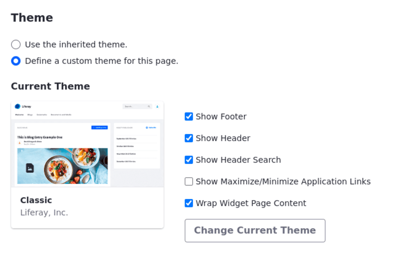
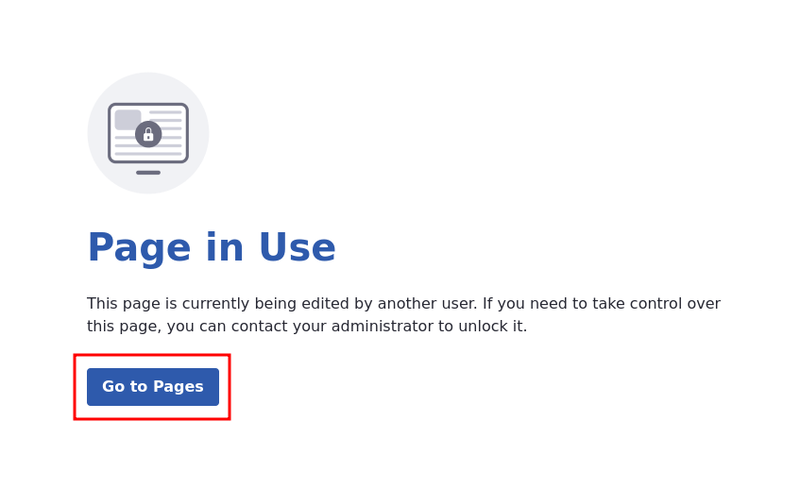
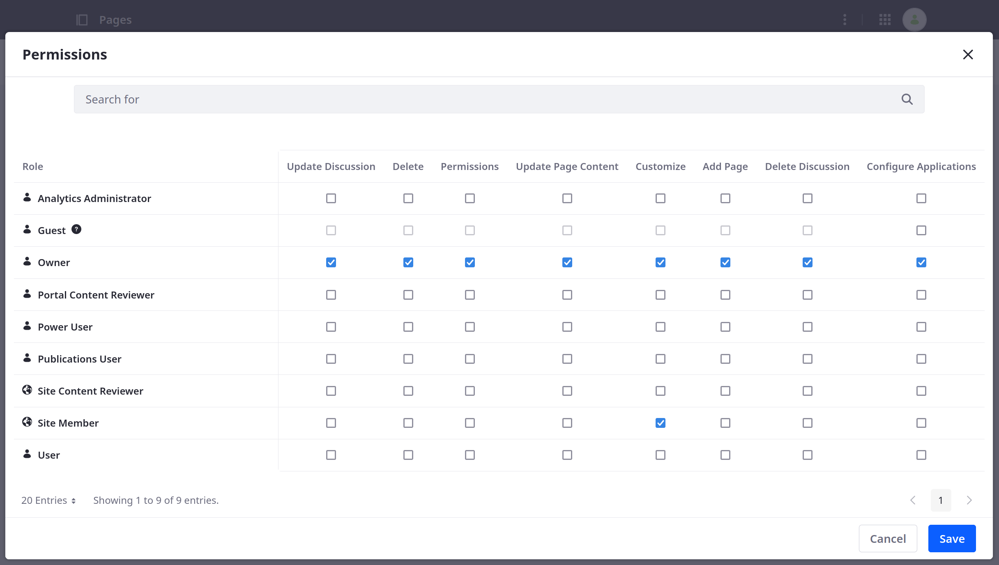

---
toc:
  - ./page-settings/configuring-page-sets.md
  - ./page-settings/configuring-individual-pages.md
  - ./page-settings/configuring-your-pages-friendly-url.md
  - ./page-settings/configuring-locked-pages.md
  - ./page-settings/setting-default-permissions.md
  - ./page-settings/updating-page-permissions.md
taxonomy-category-names:
- Sites
- Pages and Composition
- Liferay Self-Hosted
- Liferay PaaS
- Liferay SaaS
uuid: 24fc2c8c-9c5f-4658-b671-65e3f0697998
---

# Page Settings

In Liferay, effective page management is crucial for maintaining an organized and user-friendly site.

Learn how to set up and adjust the layout and settings for [page sets](./page-settings/configuring-page-sets.md) and [individual pages](./page-settings/configuring-individual-pages.md), including layout, visibility, and additional options tailored to your needs.

Set up and manage [user-friendly URLs](./page-settings/configuring-your-pages-friendly-url.md) for better navigation and SEO. This includes creating, updating, and handling URL history.

Understand how to manage page restrictions and permissions to control who can access specific content.

Manage [locked pages](./page-settings/configuring-locked-pages.md), which prevent multiple users from editing the same page simultaneously. You can also configure automatic unlocking options and manually unlock pages if necessary.

Define [default permissions](./page-settings/setting-default-permissions.md) for new pages to ensure they align with your site's access control policies. Also, [adjust permissions for existing pages](./page-settings/updating-page-permissions.md) as your site evolves, ensuring proper access control throughout.

