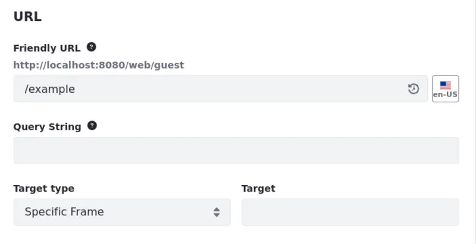
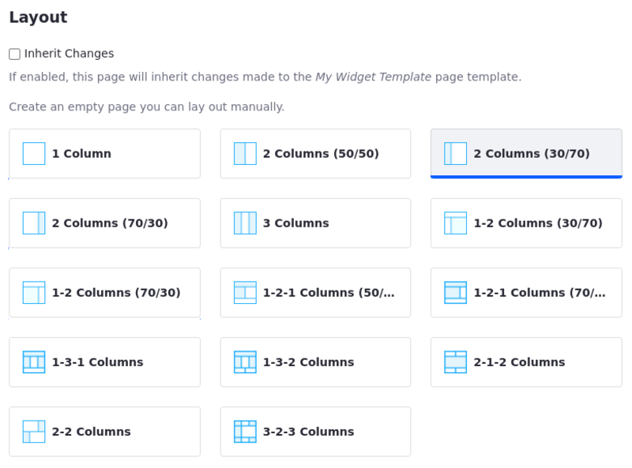
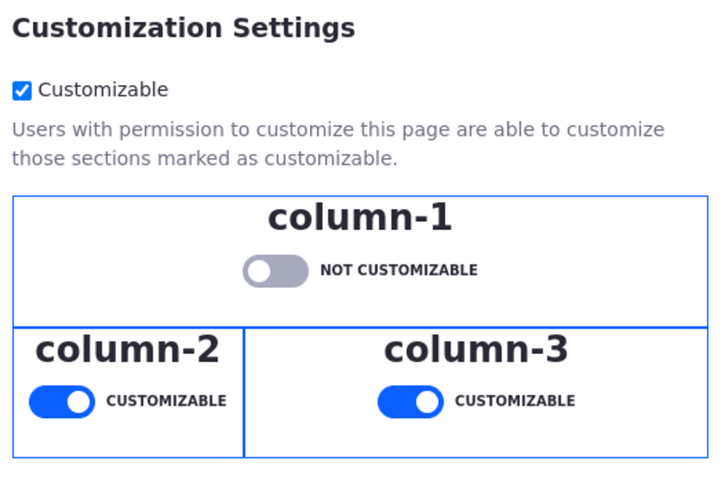
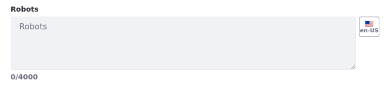
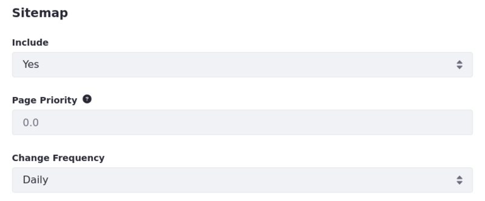

---
taxonomy-category-names:
- Sites
- Pages and Composition
- Liferay Self-Hosted
- Liferay PaaS
- Liferay SaaS
uuid: f271b7fd-93dd-4692-acce-35d1d8ed2973
---

# Configuring Individual Pages

You can configure individual pages to meet your needs. All changes made in this way are scoped to the selected page.

To configure a specific page, open the *Site Menu* () and go to *Site Builder* &rarr; *Pages*. Then click *Actions* () for the page you want to customize and select *Configure*.


Alternatively, you can access general page settings by clicking *Actions* () &rarr; *Configuration* () at the top right of the Application Bar.

These settings are organized into the following tabs:

- [General](#general)
- [Design](#design)
- [SEO](#seo)
- [Open Graph](#open-graph)
- [Custom Meta Tags](#custom-meta-tags)

!!! note
    Many of these settings can be localized to provide translations based on a user's locale. See [Initial Instance Localization](../../../installation-and-upgrades/setting-up-liferay/initial-instance-localization.md) and [Modifying Localizable Site Fields](../../site-settings/site-localization.md#modifying-localizable-site-fields) for more information.

## General

Here you can configure the basic information of a page, including its name, friendly URL, layout, and more.

### Basic Info

Use the name field to set a page's title used for site navigation and displayed in a browser's title bar. You can hide a page from menu display when it is configured to display the page hierarchy. When enabled, a hidden page still appears in other navigation menus if added to them. See [Managing Page Hierarchies](../../site-navigation/managing-page-hierarchies.md) for more information.


!!! note
    Child pages inherit the parent page’s visibility. Also, hidden pages are not displayed on the default navigation menu, but can be displayed on any other created navigation menu.

### URL

Use the Friendly URL field to set a new URL for a page, or click the *Restore* icon () to see and restore a previously used URL. See [Configuring Your Page's Friendly URL](./configuring-your-pages-friendly-url.md) for more information.

!!! warning
    Make sure your URLs don't have a trailing slash. For example, instead of `https://example.com/product/item1/`, use `https://example.com/product/item1`.

Use *Query String* to set default parameters for a page when no other parameters are specified. Query strings offer significant advantages within web content templates. Additionally, you can control page link behavior by using the Target Type field, which has attributes like opening the link in a new tab or within a specific frame.



!!! tip
    While a page's name and friendly URL are initially defined together at page creation, they are configured independently afterwards. It is best practice to update them together so that they match.

### Page Layout

Layout templates dictate where widgets can be placed on a widget page. For basic widget pages created using either a global template or custom page template, the user can determine whether the page *Inherits Changes* made to the chosen template. If the page does not inherit changes, select a custom layout to define row and column containers for its widgets.


### Categorization

Use *Topics* and *Tags* to categorize a page's content so users can more easily find it. For more information on using tags and categories, see [Organizing Content with Tags and Categories](../../../content-authoring-and-management/tags-and-categories.md).



### Customization Settings

Determine whether a widget page's columns are *Customizable* for users. If customization is enabled, specify the columns users can customize. See [Enabling User Personalization of Widget Pages](../using-widget-pages/enabling-user-personalization-of-widget-pages.md) for more information.



## Design

Here you can configure the theme of your page and customize its design, CSS and JavaScript. You can also access this editor in a [page set’s configuration page](../../creating-pages/page-settings/configuring-page-sets.md).

### Theme

Here you can use the page set's theme settings or define a custom theme for your page. When you choose to customize the page's theme, you can toggle various theme settings.


### Basic Settings

Here you can quickly and easily change some areas of your page's design system and styling.

**Favicon**: Change the default favicon applied from the theme.

**Master**: Change the master page template. See [Master Page Templates](../../creating-pages/defining-headers-and-footers/master-page-templates.md) for more information.

**Style Books**: Change the default style book applied from the theme. See [Using a Style Book to Standardize Site Appearance](../../../site-building/site-appearance/style-books/using-a-style-book-to-standardize-site-appearance.md) for more information.

**Icon**: Choose an icon to display along with page's name in the site's navigation menus.


!!! note
    Content pages also include Master and Style Book settings in the Edit sidebar menu under Page Design Options ().

### Customization

You can also access a CSS and JavaScript editors where you can add custom code to the page.

**Theme CSS Client Extension:** Add [theme CSS client extensions](../../../liferay-development/customizing-liferays-look-and-feel.md#theme-css-client-extensions) to fully replace the default CSS contained in the theme.

**CSS Client Extensions:** Add [CSS client extensions](../../../liferay-development/customizing-liferays-look-and-feel.md#css-client-extensions) to extend the page's CSS with client extensions. They are loaded after the theme CSS and after master extensions.

**Custom CSS:** Custom CSS can be applied and is loaded after the theme.

**JavaScript Client Extension and Custom JavaScript:** [JavaScript client extensions](../../../liferay-development/customizing-liferays-look-and-feel.md#javascript-client-extensions) can be added to have JavaScript run when the page using this master page template is visited. Custom JavaScript code can also be added and is executed at the bottom of the page.


!!! tip
    If your site's theme uses JavaScript, it's best to add custom JavaScript code to the theme rather than an individual page or page set. This ensures your site's JavaScript code remains in one place. If your theme does not use JavaScript, place all of your site's JavaScript code here.

### Advanced Settings

Access additional settings to customize a page’s content and features.

**Custom Fields**: View and configure the Custom Fields you've defined for site pages. See [Custom Fields](../../../system-administration/configuring-liferay/adding-custom-fields.md) for more information.

**Embedded Widgets**: Access widgets you've embedded in a page using [Web Content Templates](../../../content-authoring-and-management/web-content/web-content-templates/embedding-widgets-in-web-content-templates.md), [Page Fragments](../../developer-guide/developing-page-fragments.md), or [Themes](../../../liferay-development/customizing-liferays-look-and-feel/themes.md).

**Mobile Device Rules**: Determine whether a page uses its page set's [rules for mobile devices](../../../site-building/optimizing-sites/building-a-responsive-site/creating-mobile-device-rules.md) or is uniquely configured. These rules determine how a page's content renders for different types of mobile devices.

!!! note
    The *Custom Fields* and *Embedded Widget* sections only appear once you've created custom fields and embedded widgets in a page.

## SEO

Search Engine Optimization (SEO) refers to the methods used to improve your page's ranking in Search Engine Results Pages (SERP). The SEO tab provides easy access to settings you can use to optimize your page's content. See [Configuring SEO and Open Graph](../../displaying-content/using-display-page-templates/configuring-seo-and-open-graph.md) for more information about the following settings.

### HTML Title

Use the HTML title field to define a page's `<title>` tag. This title is used by search engines to rank your page and serves as the page's heading in search engine results, though without replacing a page's [name](#name-and-friendly-url). The recommended length for an HTML title is under 60 characters.

### Description

Use the description field to define a page's `<description>` tag. This description is used by search engines to rank your page and also appears in search result previews of your page. The recommended length for a description is under 155 characters.

### Custom Canonical URL

{bdg-secondary}`Liferay DXP 2024.Q2+/Portal 7.4 GA120+`

Canonical pages identify the preferred version of a web page among multiple versions that have similar or identical content. By selecting a canonical page, you ensure that search engines understand which version of a page is the primary one to index and rank in search results. It also helps prevent dilution of search rankings due to duplicate content and helps users find the most relevant content.

Check the *Use Custom Canonical URL* field to customize and localize the canonical URL.

!!! note
    Custom canonical URL are excluded from the [sitemap](#sitemap).

### Keywords

List words that people are likely to use when searching for your page's content. These keywords contribute to your page's ranking. Separate the keywords into different lines or split them into a comma-separated list.

!!! tip
    Use keywords often throughout your page's content, including titles, headings, descriptions, paragraphs, and image alt text.


### Preview

Preview how a page appears in Search Engine Results Pages (SERP) based on your configuration of its HTML title, description, and custom URL.


### Robots

The Robots field configures the `<meta name="robots">` tag for a page. This tag controls how search engines crawl and index the page. You can specify values such as `noindex` to prevent the page from being indexed, or `nofollow` to prevent search engines from following links on the page. Learn more about the robots meta tag in [Robots meta tag, data-nosnippet, and X-Robots-Tag specifications](https://developers.google.com/search/docs/crawling-indexing/robots-meta-tag).

Here's how the robots field appears in the HTML code when you specify those values:

```html
<meta name="robots" content="noindex, nofollow">
```

You can also localize this field using the Language Flag.



### Sitemap

Determine whether to include a display page in your `sitemap.xml` file, as well as set its Priority and Change Frequency fields. They inform search engines whether to crawl and index the display page, how it should be prioritized relative to other site pages, and how frequently it is updated.

{bdg-secondary}`Liferay DXP 2024.Q2+/Portal 7.4 GA120+` Enable/disable indexing child pages on XML maps by checking/unchecking the Include Child Page URLs in the XML Sitemap box. Read [Configuring XML Sitemaps](../../site-settings/managing-site-urls/configuring-xml-sitemaps.md) to learn more.

### Page Priority

Set a page's priority from 0.0 to 1.0. This informs tools crawling and indexing your site how a page should be prioritized relative to other pages in your site.

### Change Frequency

Use the drop-down menu to inform tools crawling and indexing your site how frequently a page is updated.



## Open Graph

{bdg-secondary}`Available: Liferay DXP/Portal 7.3+`

[Open Graph](https://ogp.me/) is an Internet protocol that standardizes previews of site content when shared in application contexts that support it, such as Twitter, Facebook, or LinkedIn. It does this by embedding structured data in page headers as `<meta>` tags, similar to [RDFa](https://en.wikipedia.org/wiki/RDFa).

In the *Open Graph* tab, you can use Open Graph `<meta>` tags to define a page's metadata and create engaging representations of your content. Values defined here override default values defined at the [site](../../site-settings/configuring-open-graph.md) level.

!!! note
    Open Graph `<meta>` tags are only included in page headers to unauthenticated users. They are not included when the user is logged in.

### Image

Use the image field to define the following Open Graph `<meta>` properties for a page:

```html
<meta property="og:image" content="http://example.com/ogp.jpg" />
<meta property="og:image:secure_url" content="https://secure.example.com/ogp.jpg" />
<meta property="og:image:type" content="image/jpeg" />
<meta property="og:image:width" content="400" />
<meta property="og:image:height" content="300" />
```

### Image Alt Description

Use the image alt description field to define the `og:image:alt` property for a page. You can also localize an image's alt description via the *Language Flag* button.

### Custom Title and Description

Use the custom title and description fields to define the `og:title` and `og:description` properties. These properties create custom text used for rich previews in place of a page's HTML title and description. You can also localize these values via their *Language Flag* buttons.

### Preview Open Graph Page Representation

Preview your page's Open Graph configuration. This section displays how your page's content appears when its URL is shared in contexts supporting the protocol. Though an image's ratio may change depending on where the URL is posted.


## Custom Meta Tags

Here you can add custom `<meta>` tags to the `<head>` of a page. These tags are only visible in a page's HTML source code and are used to describe a page's data and determine how that data appears in different contexts, such as search engine results and social media posts. Each tag is defined using property and content attributes.

!!! note
    Custom `<meta>` tags are only included in page headers for unauthenticated users. They are not included when the user is logged in.


## Related Topics

- [Adding a Page to a Site](../adding-pages/adding-a-page-to-a-site.md)
- [Using Content Pages](../using-content-pages.md)
- [Configuring Page Sets](./configuring-page-sets.md)
