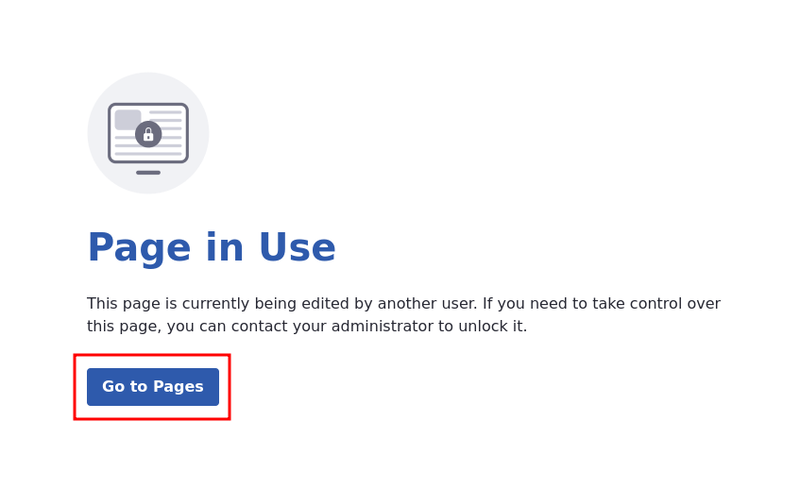
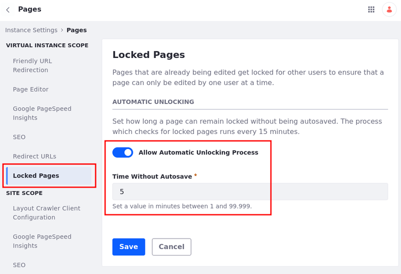
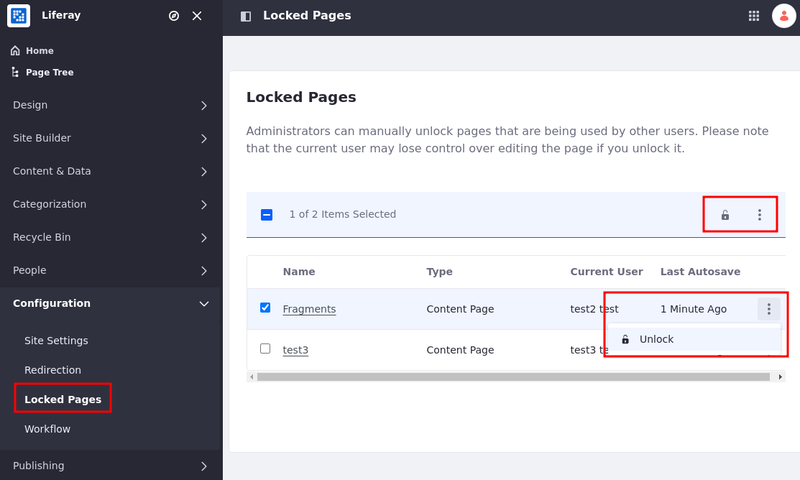

---
taxonomy-category-names:
- Sites
- Pages and Composition
- Liferay Self-Hosted
- Liferay PaaS
- Liferay SaaS
uuid: 71e441a1-8c7c-468f-a758-b4e1cb9d185d
---

# Configuring Locked Pages
{bdg-secondary}`Liferay DXP 2023.Q3+/Portal 7.4 GA92+`

Liferay locks pages during editing to avoid conflicts when multiple users try to edit the same page.

This feature works with [content](../using-content-pages.md), [master](../defining-headers-and-footers/master-page-templates.md), [utility](../adding-pages/using-utility-pages.md), and [collection pages](../../../content-authoring-and-management/collections-and-collection-pages.md), along with [page](../adding-pages/creating-a-page-template.md) and [display page](../../displaying-content/using-display-page-templates.md) templates.

## Locking the Page

Whenever a user starts editing a page and adds new content to it, the page locks, preventing other users from accessing it.

If users try to access a locked page, a Page in Use message appears instead. This page shows a Go Back or a Go To [Previous Page Name] depending on whether the previous page exists.

!!! note
    Users can only discard drafts of unlocked pages.

Not all events lock a page:

- You can still modify a page's [master page](../defining-headers-and-footers/managing-master-page-templates.md) or its [stylebook](../../site-appearance/style-books.md) without locking the page.
- You can propagate [Fragments](../page-fragments-and-widgets/using-fragments.md), even if a page is locked.
- You can [import a page's page template](../adding-pages/exporting-and-importing-page-templates.md), even if a page is locked.

!!! tip
    If you are working with [Publications](../../publishing-tools/publications.md), the page and its publications are locked and unlocked together.

## Unlocking a Page

Most of the time, you don't have to worry about unlocking a page, as the system unlocks it automatically.

For example, when a user changes a page from edit mode to view mode, when the user logs out, or when the user closes the tab with the page, Liferay unlocks the page.

If a user leaves a page open in Edit mode for a long time without making changes, the system automatically unlocks the page. The amount of time can be configured:

1. Open the *Global Menu* () and Navigate to *Control Panel* &rarr; *Instance Settings* under Configuration.

1. Under Content and Data, select *Pages*.

1. Under Virtual Instance Scope, select *Locked Pages*.

1. Toggle *Allow Automatic Unlocking Process*.

   If you want to disable the feature, turn it off.

1. Set a *Time Without Autosave* in minutes.

!!! warning
    The Time Without Autosave may not be accurate as the system checks for locked pages every 15 minutes.

Site Administrators or Super Administrators can unlock pages manually.

1. Open the *Site Menu* () and go to *Configuration* &rarr; *Locked Pages*.

1. Click *Actions* () next to the locked page you want to unlock &rarr; *Unlock*.

   You can select multiple pages and bulk-unlock them by clicking on the Lock () icon or the Actions button next to it &rarr; Unlock.

The page is unlocked. All the autosaved alterations are kept, and you can now edit the page.

!!! tip
    In this list you can also see the type of the page, the user currently editing the page, and the time since the last autosave.

## Related Topics

- [Adding Elements to Content Pages](../using-content-pages/adding-elements-to-content-pages.md)
- [Adding Widgets to a Page](../using-widget-pages/adding-widgets-to-a-page.md)
