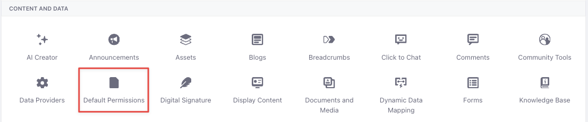
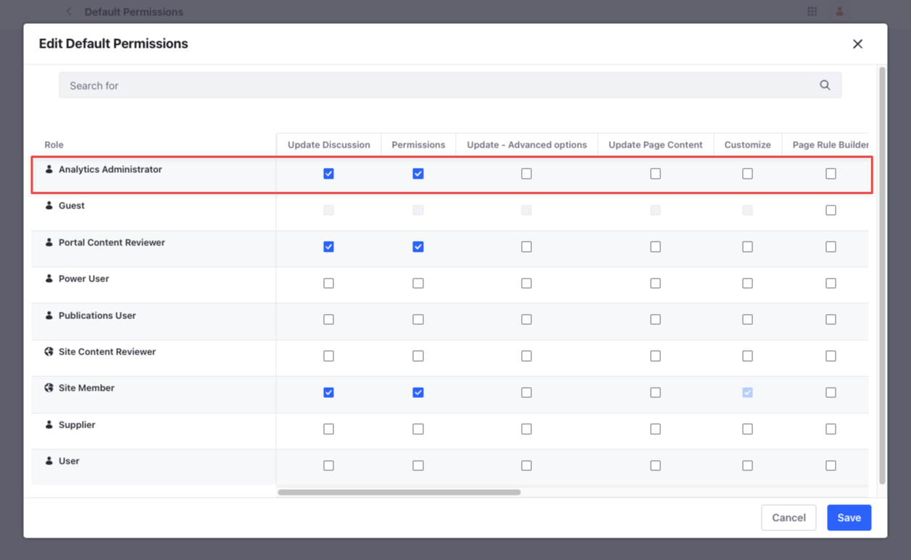
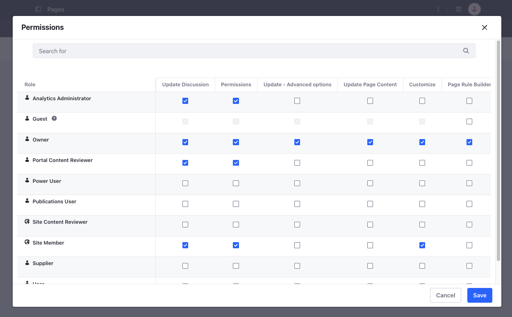
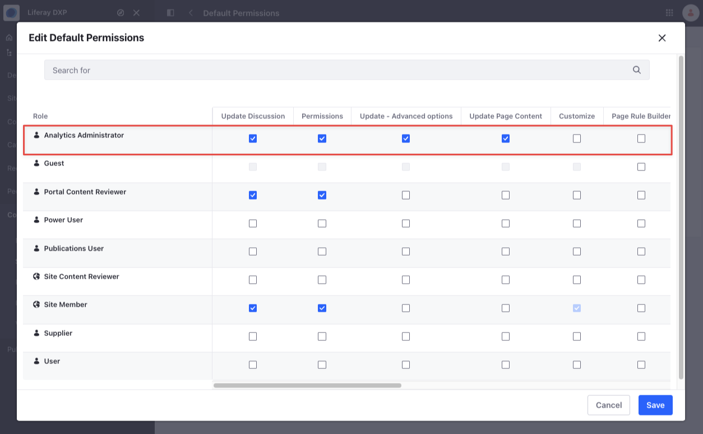
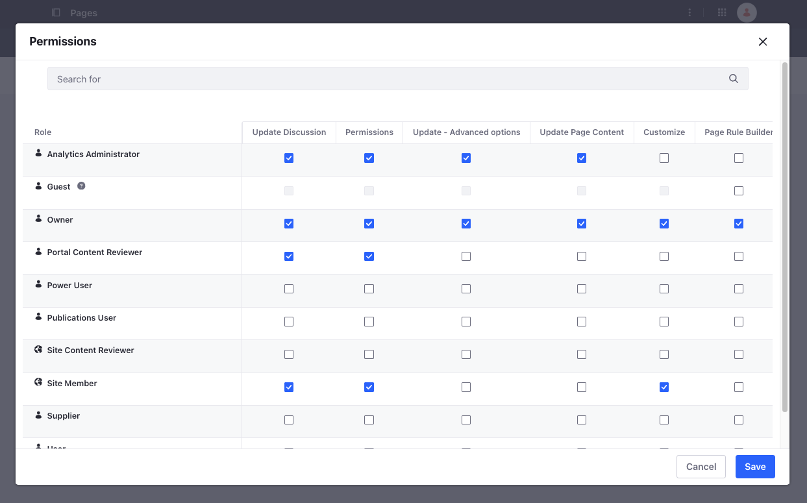

---
taxonomy-category-names:
- Sites
- Pages and Composition
- Liferay Self-Hosted
- Liferay PaaS
- Liferay SaaS
uuid: 70d28ba5-ecfe-492f-aeaf-e50fc8c69645
---

# Setting Default Permissions

{bdg-secondary}`Liferay DXP 2024.Q3+/Portal 7.4 GA132+`

With the new default permissions setting, you can define a set of default permissions for Liferay pages. This setting is available at the instance and site levels. To configure the same defaults for all sites in your instance, you can use the instance level configuration. If you want to set defaults for specific sites, you can do so at the site level.

To configure permissions at the instance level,

1. Open the *Global Menu* () and navigate to *Control Panel* *&rarr; *Instance Settings*.

1. Scroll down to Content and Data and select *Default Permissions*.

   

1. Click *Edit* next to the Page asset type.

1. A new modal opens with a list of permissions for various roles. Check the permissions required and click *Save*.

   

   !!! note
       The selected permissions don't get auto-saved. Ensure to click *Save* after selecting the required permissions.

1. Go to your site, open the *Site Menu* (), and go to *Site Builder* &rarr; *Pages*.

1. Click *New* and select *Page*.

1. Select the Basic template and enter a name.

1. Click *Add*. This opens the page in edit mode.

1. Click *Publish*.

1. Now, click *Actions* () next to the newly created page and select *Permissions*.

1. Verify that the permissions configured at the instance level appear here.

## Setting Default Permissions at the Site Level 

Default permissions at the site level take precedence over default permissions at the instance level. To do this,

1. Go to the appropriate site, open the *Site Menu* (), and go to *Configuration* &rarr; *Site Settings*.

1. Scroll down to Content and Data and select *Default Permissions*.

1. Click *Edit* next to the Page asset type.

1. A new modal opens with a list of permissions for various roles. Check the permissions required and click *Save*.

   

1. Open the *Site Menu* (), and go to *Site Builder* &rarr; *Pages*.

1. Click *New* and select *Page*.

1. Select the Basic template and enter a name.

1. Click *Add*. This opens the page in edit mode.

1. Click *Publish*.

1. Now, click *Actions* () next to the newly created page and select *Permissions*.

1. Verify that the permissions configured at the site level overrides the defaults configured at the instance level.

