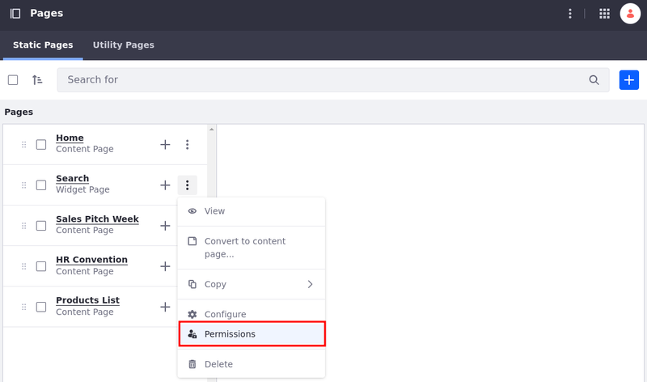
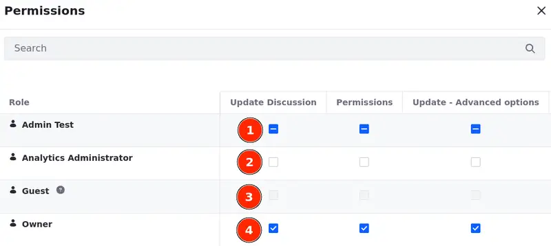

---
taxonomy-category-names:
- Sites
- Pages and Composition
- Liferay Self-Hosted
- Liferay PaaS
- Liferay SaaS
uuid: 8b9099c6-0666-4218-acc1-2a72b40ae63a
---

# Updating Page Permissions

By default, when users join a site, they can see all of its pages. However, you can configure permissions for individual pages to restrict access based on user [roles](../../../users-and-permissions/roles-and-permissions/understanding-roles-and-permissions.md).

!!! note
    Individual page permissions take priority over site-level configurations.

To update page permissions,

1. Open the *Site Menu* () and navigate to *Site Builder* &rarr; *Pages*.

1. Next to a page, click *Actions* () &rarr; *Permissions* (1).

   Alternatively, while [editing a page](../using-content-pages/adding-elements-to-content-pages.md), at the top right corner of the page click *Options* () &rarr; *Permissions* (2).

   {bdg-secondary}`Liferay DXP 2024.Q2+/Portal 7.4 GA126+` Or select the checkbox next to the page(s) (see [permissions in bulk](#setting-pages-permissions-in-bulk)) and click *Permissions* at the top options bar (3).

   

1. Select the permissions you need for your roles. See [Page Permissions Reference](#page-permissions-reference) to learn more about each permission.

   

1. Click *Save* to apply the changes.

## Copying a Page with Permissions

To copy a page with its permissions,

1. Open the *Site Menu* () and select *Site Builder* &rarr; *Pages*.

1. Click *Actions* () for the desired page and select *Copy* &rarr; *Page With Permissions*.

1. Enter a page name and click *Add*.

## Setting Pages Permissions in Bulk

{bdg-secondary}`Liferay DXP 2024.Q2+/Portal 7.4 GA126+`

!!! important
    Currently, this feature is behind a release feature flag (LPS-196847). Read [Release Feature Flags](../../../system-administration/configuring-liferay/feature-flags.md#release-feature-flags) for more information.

1. Open the *Site Menu* () and navigate to *Site Builder* &rarr; *Pages*.

1. Select the checkbox next to the pages you want to configure.

1. Click *Permissions* at the top options bar.

1. Update the permissions for each role. See [Page Permissions Reference](#page-permissions-reference) to learn more about each permission.

   There are four available icons when setting permissions in bulk.

   (1) () indicates that the permission is **set in some** of the selected pages, but not all of them.

   !!! tip
       Uncheck the permission to disable it on all selected pages. To enable the permission on all selected pages, uncheck and check it.

   (2) () indicates that the permission is **not set to any** of the selected pages.

   (3) () indicates that you **can't set** the permission for that role.

   (4) () indicates that the permission is **set in all** of the selected pages.

   

1. Click *Save* to apply the changes.

## Page Permissions Reference

Here's a list of permissions associated with pages. To learn more about DXP Roles and Permissions in general, see [Roles and Permissions](../../../users-and-permissions/roles-and-permissions.md).

| Permission                                                            | Description                                                                                                                                                                    |
|:----------------------------------------------------------------------|:-------------------------------------------------------------------------------------------------------------------------------------------------------------------------------|
| Update Discussion                                                     | Edit another user's comment on the page.                                                                                                                                       |
| Permissions                                                           | View and modify the page's permissions.                                                                                                                                        |
| Update - Advanced options                                             | Access the page element's Advanced tab when [updating](#update-permissions-reference) a page.                                                                                  |
| Update Page Content                                                   | Update the page's content, including text, images, and settings in the Mapping, Link, and Image Source tabs.                                                                   |
| Customize                                                             | Customize the page.                                                                                                                                                            |
| Page Rule Builder                                                     | Use the Page Rule Builder to define rules for the page. This feature is currently under a [feature flag](../../../system-administration/configuring-liferay/feature-flags.md). |
| Add Page                                                              | Add pages.                                                                                                                                                                     |
| View                                                                  | View pages.                                                                                                                                                                    |
| Delete                                                                | Move the page to the [Recycle Bin](../recycle-bin/recycle-bin-overview.md).                                                                                                    |
| {bdg-secondary}`Liferay DXP 2024.Q2+/Portal 7.4 GA126+` Preview Draft | Even without the Edit permission, users can preview Draft versions of the page.                                                                                                |
| Update Basic                                                          | Basic options for [updating](#update-permissions-reference) the page.                                                                                                          |
| Delete Discussion                                                     | Delete any comments on page.                                                                                                                                                   |
| Configure Applications                                                | Manage Fragments and Widgets.                                                                                                                                                  |
| Update                                                                | [Update](#update-permissions-reference) the page.                                                                                                                              |
| Update - Limited                                                      | Limited options for [updating](#update-permissions-reference) the page.                                                                                                        |
| Add Discussion                                                        | Comment on the page.                                                                                                                                                           |

### Update Permissions Reference

To manage the site's look and feel while maintaining control over branding and style, users require different sets of permissions depending on their roles in the process.

For example, designers require full control over layout and style editing, best achieved with Update permissions. Conversely, content creators typically only need to add content and map fields to page elements, which can be accomplished with Update Page Content permissions.

Liferay provides four update permissions for pages. Each grants users different sets of permissions:

**Update:** The most comprehensive of the four permissions.

Users can edit the page's layout and style completely. It's aimed at the designer role as they are the ones who must edit and style the whole page.

All features added to the page editor are enabled by default for this permission.

The other update permissions are irrelevant once this one is granted since it encompasses the others.

**Update - Limited:** Users have limited access to editing fragment styles.

Users can edit fragment styles only inside the brand/style book limits. It's aimed at the page builder role as they need to make some adjustments when building the pages.

| Page Element                                                 | Available Actions                                                  |
|:-------------------------------------------------------------|:-------------------------------------------------------------------|
| Fragments                                                    | Available: Drag and drop.                                          |
| General Tab - Container and Grid fragments                   | Available: Container, Frame, Overflow, and Hide Fragment options.  |
| General Tab - other fragments                                | Available: Overflow and Hide Fragment options.                     |
| Styles Tab                                                   | Not available: Decoupling from tokens.                             |
| Advanced Tab (`Update - Advanced Options` permission needed) | Available: Advanced configurations.  Not Available: Custom CSS. |

**Update - Basic:** Users can perform basic actions while updating the page.

Users can update the page layout and drag and drop new fragments, but it's not possible to change all options in the page element's Styles tab.

| Page Element                                                 | Available Actions                                                  |
|:-------------------------------------------------------------|:-------------------------------------------------------------------|
| Fragments                                                    | Available: Drag and drop.                                          |
| General Tab - Container and Grid fragments                   | Available: Container, Frame, Overflow, and Hide Fragment options.  |
| General Tab - other fragments                                | Available: Overflow and Hide Fragment options.                     |
| Styles Tab - Container and Grid fragments                    | Available: Edit Spacing options.                                   |
| Styles Tab - other fragments                                 | Not Available.                                                     |
| Advanced Tab (`Update - Advanced Options` permission needed) | Available: Advanced configurations.  Not Available: Custom CSS. |

**Update - Advanced Options:** Users can access the page element's Advanced tab.

## Related Topics

- [Understanding Roles and Permissions](../../../users-and-permissions/roles-and-permissions/understanding-roles-and-permissions.md)
- [Assigning Users to Roles](../../../users-and-permissions/roles-and-permissions/assigning-users-to-roles.md)
- [Configuring Page Sets](./configuring-page-sets.md)
