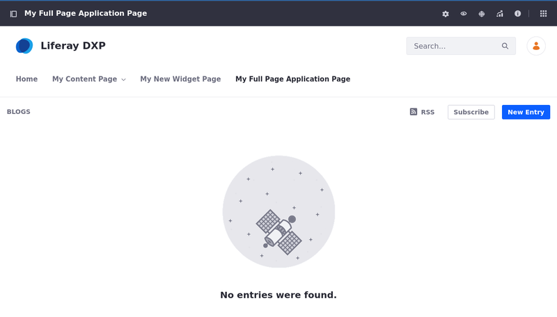
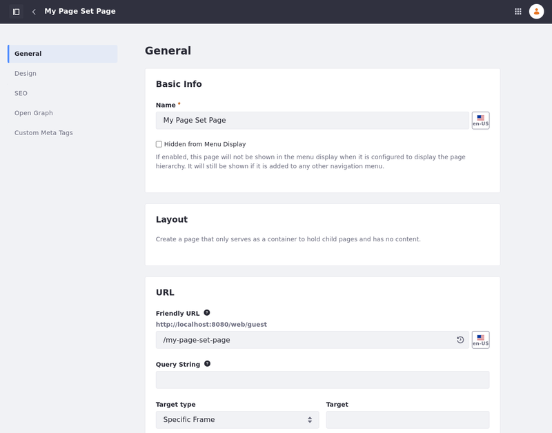

---
taxonomy-category-names:
- Sites
- Pages and Composition
- Liferay Self-Hosted
- Liferay PaaS
- Liferay SaaS
uuid: 688335ec-a749-4c33-a940-0b19dd493a9f
---
# Other Page Types

[Content pages](../using-content-pages.md) are the most commonly used page type, but there are uses for the other page types.

## Utility Pages

Utility pages are content pages you can apply to system-level pages, like 404 error pages. See [Types of Utility Pages](./types-of-utility-pages.md) for more information.

## Full Page Application

The Full Page application page type displays a single application that fills the entire page. See [Using the Full Page Application Page](../adding-pages/using-the-full-page-application-page-type.md) for more information.

## Page Set

The Page Set option creates a container for subpages that is not actually a page itself.

## Link to a Page

The Link to a Page of This Site option links to a page within the same site. This is often used to make a page available in multiple parts of a site's hierarchy.

## Panel

The Panel option creates a page containing several applications as selected by an administrator, but only one is displayed at a time. Users select the widget they want to display from a menu on the left side of the page. The selected application takes up the entire page on the right side.

## Embedded

The Embedded option uses an [iframe](../../displaying-content/additional-content-display-options/using-the-iframe-widget.md) widget to show content from another website. The website appears in context and within the navigation of your Liferay DXP instance.

## Link to URL

The Link to URL option adds a link to the provided URL. This can be an external page or a link across sites in the same Liferay Portal instance.

## Collection Pages

Collection pages are linked to a collection. These pages simplify the process of displaying and personalizing collections. See [Displaying Collections](../../../site-building/displaying-content/collections-and-collection-pages/about-collections-and-collection-pages.md#displaying-collections) for more information.