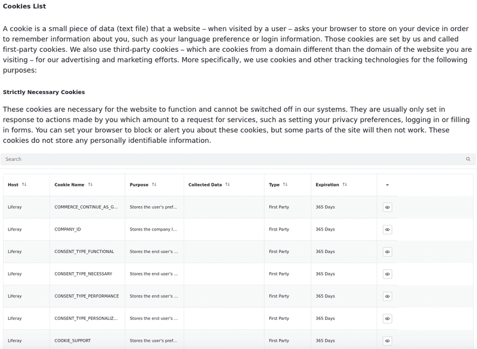
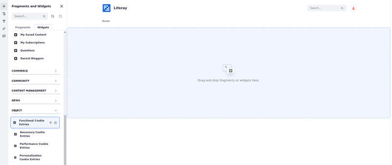

---
taxonomy-category-names:
- Sites
- Pages and Composition
- Liferay Self-Hosted
- Liferay PaaS
- Liferay SaaS
uuid: e0a94403-3c26-4bea-8d12-7642b1c050e7
---

# Types of Utility Pages

Utility pages are content pages managed at the site level. Since the default system-level pages are not customizable, you can use site-level utility pages to provide a unique experience. Several utility pages are available out-of-the-box. You can customize them or add your own.

## 404/500

The 404 and 500 utility pages correspond to the [HTTP error codes](https://www.w3schools.com/tags/ref_httpmessages.asp) they're named after. The 404 utility page displays a ***Page Not Found*** message with a link to go back to the previous page. The 500 utility page displays an ***Internal Server Error*** message. You can create more pages of these types but mark only one as default. Liferay displays the corresponding utility page when the specific HTTP error code (404/500) occurs. If no utility page is available, the default system-level page appears.

## Sign In

{bdg-secondary}`Liferay DXP 2024.Q2+/Portal 7.4 GA120+`
{bdg-link-primary}`[Beta Feature](../../../system-administration/configuring-liferay/feature-flags.md#beta-feature-flags)`

The Sign-In utility page contains the Sign-In widget found under Widgets &rarr; Tools. During portal startup, a default Sign-In utility page is created automatically. The same page is also available for sites that use the Welcome site template. This page also contains links to create an account and reset your password. Clicking these links opens the corresponding utility pages if a default utility page of that type is available. If not, the default system-level page is rendered.

You can customize the look and feel of the sign-in page as you would for a content page. You can also create multiple sign-in utility pages per site, but you can use only one as the default. To create a new utility page, see [Creating a New Utility Page](../adding-pages/using-utility-pages.md#creating-a-new-utility-page).

!!! note
    Changes to the sign-in utility page do not affect the sign-in portlet.

!!! important
    Starting from Liferay DXP 2024.Q3/GA125, the *Email From* and *Password Reset Notification* settings were removed from the sign in widget through a [beta feature flag](../../../system-administration/configuring-liferay/feature-flags.md#beta-feature-flags). They are now available at the instance level. To access these settings, open the *Global Menu* () and go to *Control Panel* &rarr; *Instance Settings* &rarr; *Email*. You can find the *Email Sender* and *Password Reset Notification* settings here.

## Create Account

{bdg-secondary}`Liferay DXP 2024.Q2+/Portal 7.4 GA120+`
{bdg-link-primary}`[Beta Feature](../../../system-administration/configuring-liferay/feature-flags.md#beta-feature-flags)`

The Create Account utility page contains the Create Account widget found under Widgets &rarr; Tools. During portal startup, a default create account page is created automatically. The same page is also available for sites that use the Welcome site template. This page also contains links to sign in and reset your password. Clicking on these links opens the corresponding utility pages if a default utility page of that type is available. If not, the default system-level page is rendered.

You can customize the look and feel of the Create Account page as you would for a content page. You can also create multiple Create Account utility pages per site, but you can use only one as the default.

## Forgot Password

{bdg-secondary}`Liferay DXP 2024.Q2+/Portal 7.4 GA120+`
{bdg-link-primary}`[Beta Feature](../../../system-administration/configuring-liferay/feature-flags.md#beta-feature-flags)`

The Forgot Password utility page contains the Forgot Password widget found under Widgets &rarr; Tools. During portal startup, a default Forgot Password page is created automatically. The same page is also available for sites that use the Welcome site template. This page also contains links to sign in and create an account. Clicking on these links opens the corresponding utility pages, provided a default utility page of that type is available. If not, the default system-level page is rendered.

You can customize the look and feel of the Forgot Password page as you would for a content page. You can also create multiple create account utility pages per site, but you can use only one as the default.

!!! important
    Starting from Liferay DXP 2024.Q3/GA125, if you have enabled OpenID Connect or Facebook Connect, their links don't appear on the sign-in, create account, or forgot password widgets when used on a utility page.

!!! important
    Currently, the sign-in, create account, and forgot password utility pages are behind a beta feature flag. See [Beta Feature Flags](../../../system-administration/configuring-liferay/feature-flags.md#beta-feature-flags) for more information.

## Cookie Policy

{bdg-secondary}`Liferay DXP 2024.Q2+/Portal 7.4 GA120+`
{bdg-link-primary}`[Release Feature](../../../system-administration/configuring-liferay/feature-flags.md#release-feature-flags)`

The Cookie Policy utility page displays a list of all cookies your application uses. It aids in attaining [GDPR compliance](../../../users-and-permissions/managing-user-data/enabling-gdpr-compliance-for-cookies.md) by showing the user data that's tracked to your sites' visitors. To access the Cookie Policy page, click *Visit our Privacy Policy* in the cookie banner.

It consists of four sections:

**Strictly Necessary Cookies:** These cookies are necessary for the website to function and cannot be disabled. They do not store information that could lead to identification of users.

**Functional Cookies (Preferences):** These cookies enable the website to provide enhanced functionality and personalization. They may be set by Liferay or by third-parties for integrated services. If disabled, some services may not function properly.

**Performance Cookies (Statistics):** These cookies provide data for [Analytics Cloud](https://learn.liferay.com/w/analytics-cloud/index). All information these cookies collect is aggregated and therefore anonymous.

**Personalization Cookies (Marketing):** These cookies may be set by Liferay's advertising partners. If they are turned off, users experience less targeted advertising.

If your site uses cookies not listed in this page, click *Add*  to add it to the appropriate section.

### Setting Up the Default Cookie Policy Page

Before the Cookie Policy page can be viewed by visitors to your site, you must first enable and configure it.

1. Enable the cookie banner in the settings. See [Enabling GDPR Compliance for Cookies](../../../users-and-permissions/managing-user-data/enabling-gdpr-compliance-for-cookies.md) for instructions.

1. Go to *Site Administration* &rarr; *Site Builder* &rarr; *Pages*.

1. Go to the Utility Pages tab and click *Cookie Policy*. This opens the page editor for the default page.

1. Configure the permissions for each of the cookie list display widgets. By default, only the admin user can view these widgets. See [Setting Widget Permissions](../page-fragments-and-widgets/using-widgets/configuring-widgets/setting-widget-permissions.md) for more information on setting permissions.

1. Go to *Control Panel* &rarr; *Users* &rarr; *Roles*.

1. For each role, grant users the **View** permission for *Functional Cookie Entry*, *Necessary Cookie Entry*, *Performance Cookie Entry*, and *Personalization Cookie Entry*. See [Defining Role Permissions](../../../users-and-permissions/roles-and-permissions/defining-role-permissions.md) for more information on setting permissions.

### Creating a Cookie Policy Page

1. Go to *Site Administration* &rarr; *Site Builder* &rarr; *Pages*.

1. Click *New* , then *Cookie Policy*.

1. When creating your custom Cookie Policy page, you can use the out-of-the-box widgets.

