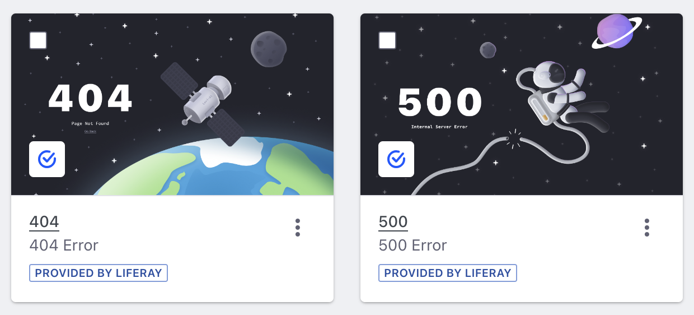
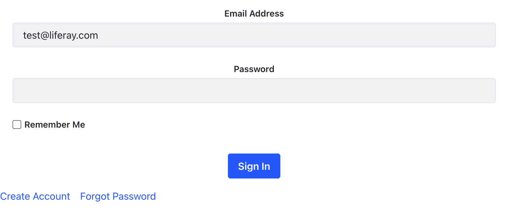
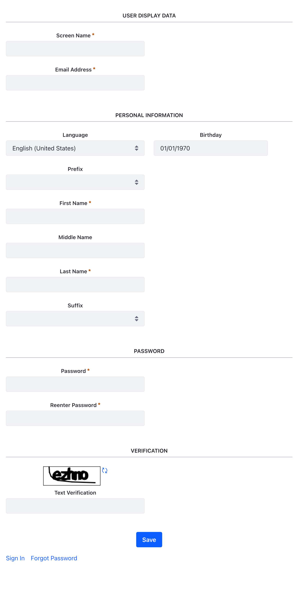
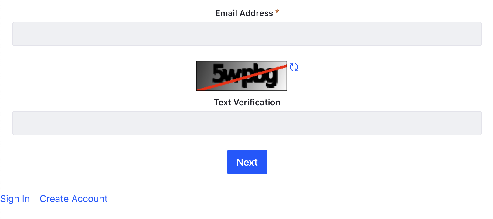

---
taxonomy-category-names:
- Sites
- Pages and Composition
- Liferay Self-Hosted
- Liferay PaaS
- Liferay SaaS
uuid: e0a94403-3c26-4bea-8d12-7642b1c050e7
---
# Types of Utility Pages

Utility pages are content pages that you can manage at the site level and use instead of system-level pages as the default system-level pages are not customizable. Several utility pages are available out-of-the-box and you can customize them or add your own.

## 404/500

The 404 utility page displays a ***Page Not Found*** message with a link to go back to the previous page. The 500 utility page displays an ***Internal Server Error*** message. You can create more pages of these types but mark only one as default. Liferay displays the corresponding utility page when the specific HTTP error code (404/500) occurs. If no utility page is available, the default system-level page appears.

## Sign In

{bdg-secondary}`Liferay DXP 2024.Q2+/Portal 7.4 GA120+`

The Sign In utility page contains the Sign In widget found under Widgets &rarr; Tools. During portal startup, a default sign-in utility page is automatically created. The same page is also available for sites that use the Welcome site template. This page also contains links to create an account and reset your password. Clicking on these links opens the corresponding utility pages for create account and forgot password if a default utility page of that type is available. If not, the default system-level page is rendered.

You can customize the look and feel of the sign-in page as you would for a content page. You can also create multiple sign-in utility pages per site, but you can use only one as the default. To create a new utility page, see [Creating a New Utility Page](../adding-pages/using-utility-pages.md#creating-a-new-utility-page). 

!!! note
    Changes to the sign-in utility page does not affect the sign-in portlet.

## Create Account

{bdg-secondary}`Liferay DXP 2024.Q2+/Portal 7.4 GA120+`

The Create Account utility page contains the Create Account widget found under Widgets &rarr; Tools. During portal startup, a default create account page is automatically created. The same page is also available for sites that use the Welcome site template. This page also contains links to sign in and reset your password. Clicking on these links opens the corresponding utility pages for sign in and forgot password if a default utility page of that type is available. If not, the default system-level page is rendered.

You can customize the look and feel of the create account page as you would for a content page. You can also create multiple create account utility pages per site, but you can use only one as the default.

## Forgot Password

{bdg-secondary}`Liferay DXP 2024.Q2+/Portal 7.4 GA120+`

The Forgot Password utility page contains the forgot password widget found under Widgets &rarr; Tools. During portal startup, a default forgot password page is automatically created. The same page is also available for sites that use the Welcome site template. This page also contains links to sign in and create an account. Clicking on these links opens the corresponding sign in or create account utility pages, provided a default utility page of that type is available. If not, the default system-level page is rendered.

You can customize the look and feel of the forgot password page as you would for a content page. You can also create multiple create account utility pages per site, but you can use only one as the default.

## Cookies List

{bdg-secondary}`Liferay DXP 2024.Q2+/Portal 7.4 GA120+`

The Cookies List utility page contains a list of all cookies used by Liferay. It aids in attaining [GDPR compliance](../../../users-and-permissions/managing-user-data/enabling-gdpr-compliance-for-cookies.md) by showing the user data that's tracked.

It consists of four sections:

**Strictly Necessary Cookies:** These cookies are necessary for the website to function and cannot be disabled. They do not store information that could lead to identification of users.

**Functional Cookies:** These cookies enable the website to provide enhanced functionality and personalization. They may be set by Liferay or by third-parties for integrated services. If disabled, some service may not function properly.

**Performance Cookies:** These cookies provide data for [Analytics Cloud](https://learn.liferay.com/w/analytics-cloud/index). All information these cookies collect is aggregated and therefore anonymous.

**Personalization Cookies:** These cookies may be set by Liferay's advertising partners. If they are turned off, users will experience less targeted advertising.

If your site uses cookies not listed in this page, click *Add*  to add it to the appropriate section.