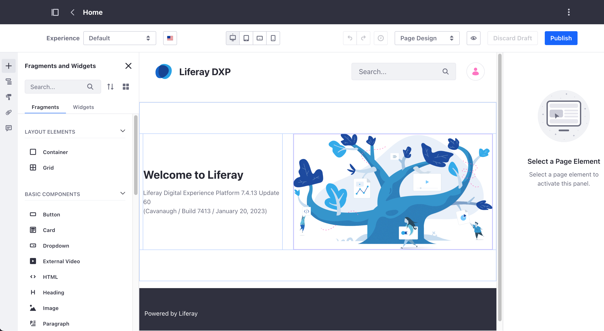

---
toc:
  - ./using-content-pages/adding-elements-to-content-pages.md
  - ./using-content-pages/managing-content-in-content-pages.md
  - ./using-content-pages/using-widgets-on-a-content-page.md
  - ./using-content-pages/using-page-comments.md
  - ./using-content-pages/content-page-editor-ui-reference.md
taxonomy-category-names:
- Sites
- Content Pages
- Liferay Self-Hosted
- Liferay PaaS
- Liferay SaaS
uuid: 6f904c1b-7c0a-409d-b8aa-8f22d75fd8f9
---

# Using Content Pages

Liferay's default page type is the content page. You can manage and edit page content and design with a convenient interface containing configurable drag-and-drop elements, or you can develop custom elements to create an optimal user experience.

You can also add [widgets](./using-content-pages/using-widgets-on-a-content-page.md) for dynamic functionality, such as blogs, wikis, and message boards. Content pages are built primarily using [page fragments](./page-fragments-and-widgets/using-fragments.md)---extensible, reusable elements with editable components like text, images, and links, which you can also map to available content. See [Default Fragments Reference](./page-fragments-and-widgets/using-fragments/default-fragments-reference.md) to learn more about DXP's out-of-the-box fragments, or [Developing Fragments](../developer-guide/developing-page-fragments.md) to learn how to create your own.

When editing content pages, changes are saved as a draft in the site builder. You can review, undo, or redo changes during your editing session, without affecting the live page. When ready, publish the changes immediately or enable a custom [workflow](../../process-automation/workflow/introduction-to-workflow.md) for review and approval. You can also collaborate by adding [comments](./using-content-pages/using-page-comments.md) to specific page elements.

With fragments and widgets, you can display web content, documents, and more. See [Managing Content in Content Pages](./using-content-pages/managing-content-in-content-pages.md) for more information.

Create personalized [experiences](../personalizing-site-experience/experience-personalization/content-page-personalization.md) and manage localized translations to engage your target audience. With the responsive layout editor, you can adapt page content to the desktop, tablets, or smartphone screen displaying your site.

Use [A/B Testing](../optimizing-sites/ab-testing/ab-testing.md) to test alternative versions of a content page to identify which version performs better.

See [Adding Elements to Content Pages](./using-content-pages/adding-elements-to-content-pages.md) to get started!
