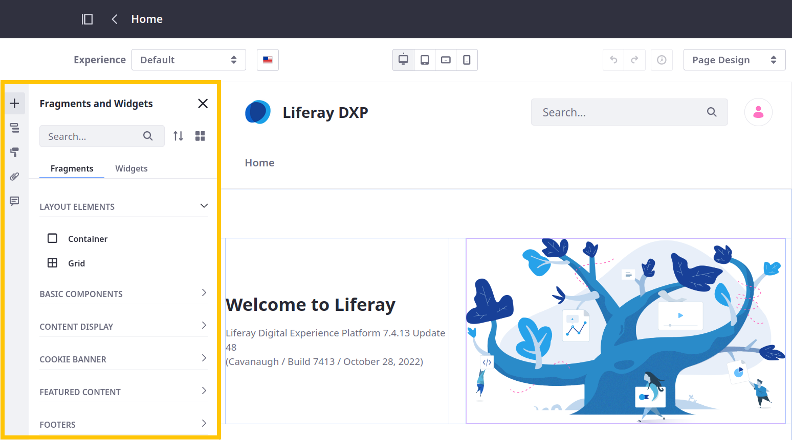
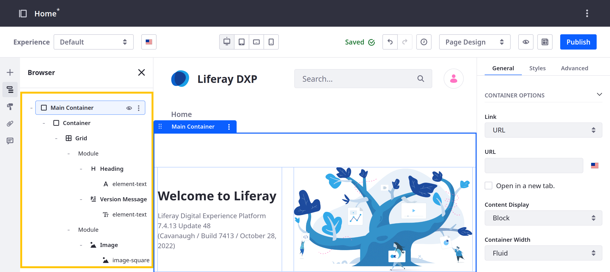
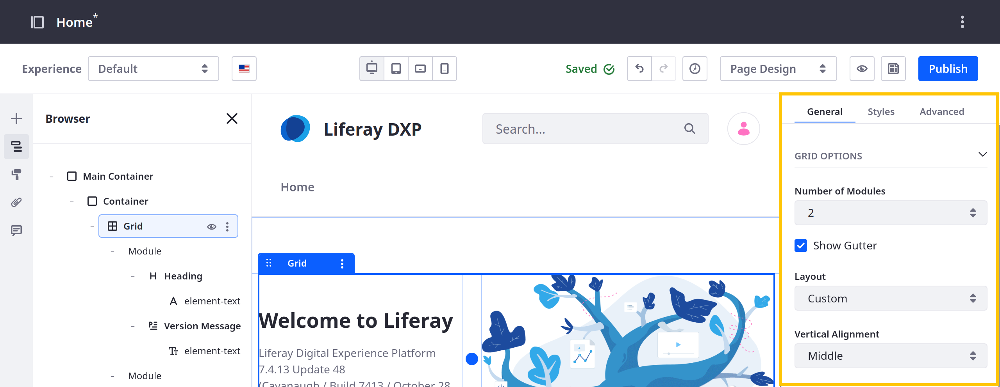

---
taxonomy-category-names:
- Sites
- Content Pages
- Liferay Self-Hosted
- Liferay PaaS
- Liferay SaaS
uuid: 9aab8116-9767-4d13-be15-d5457771e6e3
---

# Adding Elements to Content Pages

After [creating a content page](../adding-pages/adding-a-page-to-a-site.md), you can add widgets and fragments to build the page's content and structure.

1. Navigate to the content page and click *Edit* (). This opens the [content page editor](./content-page-editor-ui-reference.md).

1. Open the *Fragments and Widgets* () side panel and drag the desired elements onto the page.

   You can browse the fragments and widgets tabs or use the search field to find a specific element.

   

1. (Optional) After adding elements, open the *Browser* panel () to view and manage all elements added to the page.

   

   In Liferay 7.4 U37/GA37+, you can drag and drop elements in the browser panel to reorganize them or double click elements to rename them.

   !!! note
       {bdg-link-primary}`[Beta Feature](../../system-administration/configuring-liferay/feature-flags.md#beta-feature-flags)` In Liferay 2024.Q4+, you can select multiple elements by holding CTRL while clicking each element, or by holding SHIFT and clicking to select a range of elements. You can also cut, copy, and paste elements by clicking *Options* () and choosing the desired option or by using keyboard shortcuts. Read [Content Page Editor UI Reference](./content-page-editor-ui-reference.md#browser) to learn more.

1. Select and configure each page element in the configuration sidebar. See [Configuring Fragments](../page-fragments-and-widgets/using-fragments/configuring-fragments.md) for more information.

   

1. Click *Publish*.

   By default, publishing makes your changes live immediately. However, if a [workflow](../../../process-automation/workflow/introduction-to-workflow.md) directs the review and publishing process, clicking Publish initiates the defined procedure.

!!! note
    While editing the page, Liferay automatically saves your progress as a draft.

## Related Topics

- [Using Content Pages](../using-content-pages.md)
- [Configuring Fragments](../page-fragments-and-widgets/using-fragments/configuring-fragments.md)
- [Content Page Editor UI Reference](./content-page-editor-ui-reference.md)
