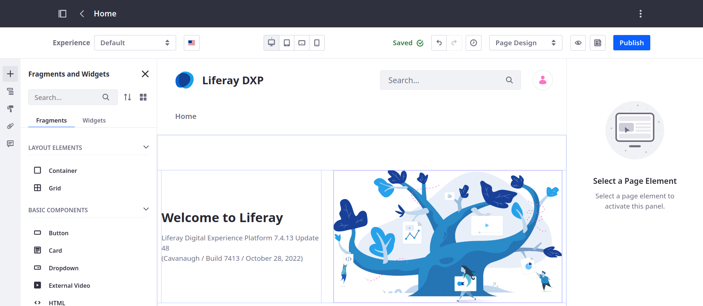
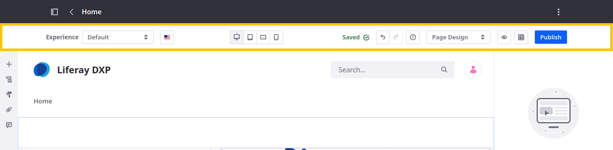
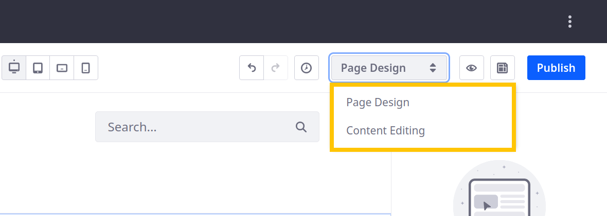
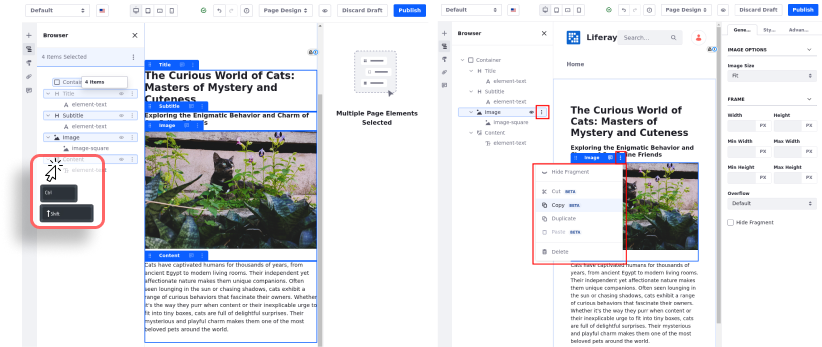

---
taxonomy-category-names:
- Sites
- Content Pages
- Liferay Self-Hosted
- Liferay PaaS
- Liferay SaaS
uuid: 7546c519-0350-4811-9577-635d4d1cddec
---
# Content Page Editor UI Reference

{bdg-secondary}`For Liferay 7.4 U37+/GA37+`

Using the content page editor, you can [add](./adding-elements-to-content-pages.md) and configure elements in a content page. To open the content page editor, go to a content page and click *Edit* (). This reveals the editing toolbar and sidebar, which contain tools and components for building content pages.

- [Editing Toolbar](#editing-toolbar)

- [Editing Sidebar](#editing-sidebar)



## Editing Toolbar

The content page toolbar contains tools for creating unique user experiences, setting localized translations, switching between edit modes, and more.



### Experiences

Using the Experience drop-down menu, you can create copies of the current page to customize for a specific audience. See [Content Page Personalization](../../personalizing-site-experience/experience-personalization/content-page-personalization.md) for more information.

### Translations

Click the language flag to access the translation drop-down menu. Here, you can view the status of active languages for a page, as well as switch between languages to view and edit translations directly. See [Configuring Site Languages](../../site-settings/site-localization.md) for more information.

If you use [experiences](../../personalizing-site-experience/experience-personalization/content-page-personalization.md) for content page personalization, you can configure the experience using the languages available for your site. See [Managing Experience Localization](../../personalizing-site-experience/experience-personalization/content-page-personalization.md#managing-experience-localization) for more information.

### Device Display

Click the device icons to access Liferay's responsive layout editor. Here you can configure your page for different screen sizes. Available display options include desktop (  ), tablet (  ), landscape phone (  ), and portrait phone (  ). While editing the tablet and phone layouts, you can adjust the screen size manually using the resize handlebar. See [Building Responsive Layouts](../../optimizing-sites/building-a-responsive-site/building-responsive-layouts-with-the-grid-fragment.md) for more information.

```{note}
The [fragments and widgets](#fragments-and-widgets) and [page design options](#page-design-options) panel are only available in the desktop layout.
```

### Edit History

Click *History* (  ) to view changes made during your current edit session. You can use this history to reserve or restore changes. Alternatively, you can click the Undo and Redo buttons.


### Edit Mode Selector

The editing options available in the content page sidebar depend on the editing mode you choose.

| Edit Mode | Description | Available Options |
| :--- | :--- | :--- |
| Page Design | You can design pages when you have permission to update the page and the page content. | <ul><li>[Browser](#browser)</li><li>[Page Content](#page-content)</li><li>[Comments](#comments)</li></ul> |
| Content Editing | You can edit content when you have permission to update the page but not the page content. | <ul><li>[Fragments and Widgets](#fragments-and-widgets)</li><li>[Browser](#browser)</li><li>[Page Design Options](#page-design-options)</li><li>[Page Content](#page-content)</li><li>[Comments](#comments)</li></ul> |



### Toggle Sidebars

Click *Toggle Sidebars* (  ) to hide the editing sidebars and preview your page. Click *Actions* (  ) in the application bar and select *Preview in a New Tab* to see the current page experience and language in a new tab.

### Convert to Page Template

Click *Actions* (  ) in the application bar and select *Convert to Page Template* () to create a [page template](../adding-pages/creating-a-page-template.md) based on the current page design.

### Publish

By default, publishing makes your changes live immediately. However, if [workflow process](../../../process-automation/workflow/introduction-to-workflow.md) is configured to direct the review and publishing process, clicking Publish initiates your defined procedure.

## Editing Sidebar

Depending on your selected editing mode, you can access these panels in the editing sidebar:

-  - [Fragments and Widgets](#fragments-and-widgets)

-  - [Browser](#browser) (previously *Selection*)

-  - [Page Design Options](#page-design-options)

-  - [Page Content](#page-content) (previously *Contents*)

-  - [Comments](#comments)


### Fragments and Widgets

In the Fragments and Widgets panel (  ), you can access both out-of-the-box and custom page elements.

**Fragments**: Fragments are extensible, reusable, drag-and-drop elements that serve as the primary building blocks for content pages. Examples include layout elements, videos, and banner images with text overlay. See [Using Fragments](../page-fragments-and-widgets/using-fragments.md) to learn more about the out-of-the-box fragments or [Developing Fragments](../../developer-guide/developing-page-fragments/developing-fragments-intro.md) to learn how to create your own.

**Widgets**: Widgets are [applications](../../../building-applications.md) that add dynamic functionality to a page. Examples include blogs, message boards, and calendars. See [Using Widgets on Content Pages](./using-widgets-on-a-content-page.md) for more information.

```{tip}
Beginning with Liferay 7.4 U37/GA37, click the Order button () to reorder sets of fragments and widgets. Click the Star button () to add a fragment or widget to your list of favorite elements.
```

### Browser

Use the Browser panel (  ) to view, organize, and manage all elements in the page. Elements are displayed in a hierarchy. For Liferay 7.4 U37/GA37+, you can drag and drop elements in the Browser panel to reorganize them or double click elements to rename them. Selecting an element opens its settings in the configuration side panel. Select a fragment's sub-elements to access additional settings. See [Configuring Fragments](../page-fragments-and-widgets/using-fragments/configuring-fragments.md) for more information.

```{note}
When editing a content page, header and footer elements are not included in the Browser panel. You can only edit these elements in [master page templates](../defining-headers-and-footers/master-page-templates.md).
```

### Page Design Options

Open the *Page Design Options panel* () to change the page's [master page template](../defining-headers-and-footers/managing-master-page-templates.md) or [style book](../../site-appearance/style-books/using-a-style-book-to-standardize-site-appearance.md). Click *Options* () to access additional page design options, including [frontend client extensions](../../../building-applications/client-extensions/frontend-client-extensions.md).

### Page Content

In the Page Content panel (  ), you can view and edit content directly added to the page. This can include inline text, images, web content articles, and more. While viewing content, you can search for content items and filter by type. If the page includes a [collection](../../../site-building/displaying-content/collections-and-collection-pages/about-collections-and-collection-pages.md), you can view its items and add new items. See [Managing Content in Content Pages](./managing-content-in-content-pages.md) for more information.

```{note}
Besides collections, mapped content is not listed in the Page Content panel. The panel only includes content added directly to the page.
```

### Comments

In the Comments panel (  ), you can comment on fragments and widgets to collaborate with page contributors. You can also view, edit, delete, or reply to open comments. If [mentions](../../../collaboration-and-social/notifications-and-requests/user-guide/mentioning-users.md) are enabled, you can tag users with page update permissions as part of your comment. To add a comment, open the Comments panel and select the desired page element.

### Browser

{bdg-secondary}`For Liferay 7.3`

In the Selection panel (), you can view a hierarchical outline of all page elements, as well as select, configure, or remove those elements. Similarly, clicking any element on the page while in the design mode opens the Selection panel and highlights the selected page element in the hierarchy. When an element is selected, you can access its general, styles, and link options, if it has any. See [Configuring Fragments](../page-fragments-and-widgets/using-fragments/configuring-fragments.md) for more information.



```{note}
A page's header and footer are not listed in the Selection panel hierarchy, because you can only modify them in the [master page template](../defining-headers-and-footers/master-page-templates.md).
```

### Contents

{bdg-secondary}`For Liferay 7.3`

In the Contents panel (), you can view, edit, and manage all web content on the page. This includes content displayed in widgets and mapped to content fields. See [Managing Content in Content Pages](./managing-content-in-content-pages.md) for more information.

## Related Topics

[Using Content Pages](../using-content-pages.md)

[Adding Elements to Content Pages](./adding-elements-to-content-pages.md)

[Using Fragments](../page-fragments-and-widgets/using-fragments/configuring-fragments.md)
