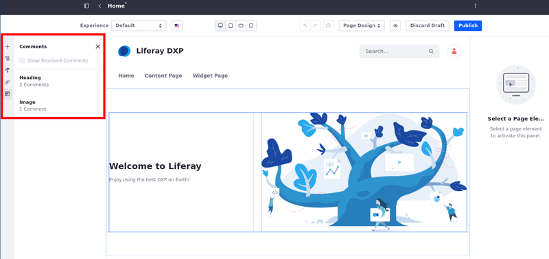
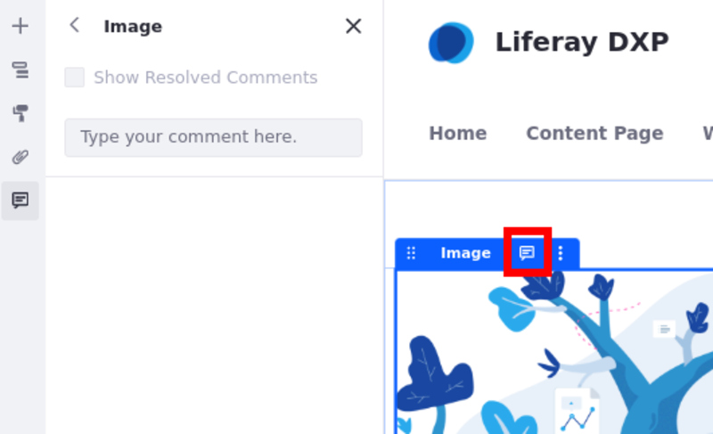
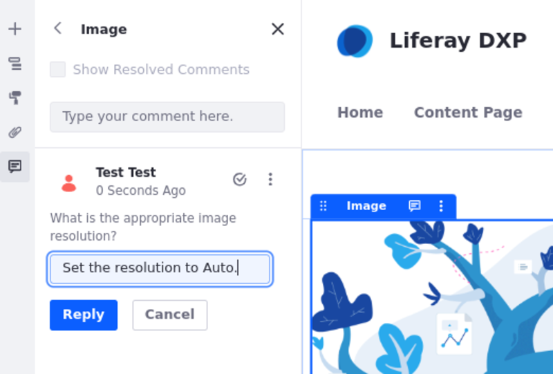
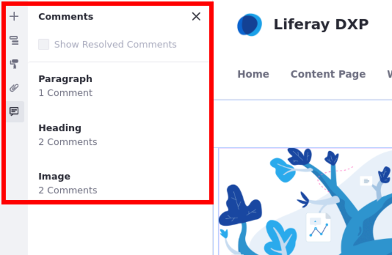
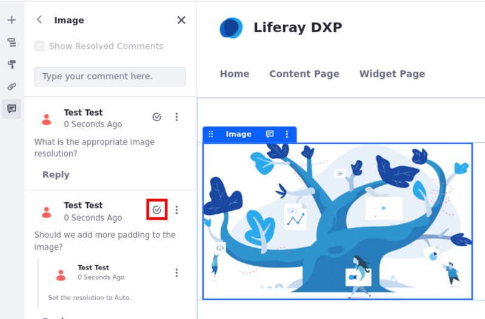
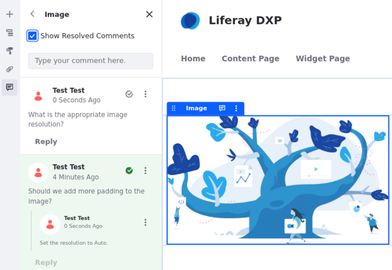

---
taxonomy-category-names:
- Sites
- Social Tools and User Engagement
- Liferay Self-Hosted
- Liferay PaaS
- Liferay SaaS
uuid: 919ea794-c5a8-486d-b1df-f91d13bc8e1a
---

# Using Page Comments

When building content pages, you and your team can collaborate using Liferay's page comments feature. Comments are enabled out of the box in Liferay DXP 7.3+.

## Adding Page Comments

1. Navigate to a content page that includes page elements (i.e., fragments or widgets) and click *Edit* () to begin editing the page.

1. Open the *Comments* panel () in the sidebar menu and select the desired fragment or widget.

   Alternatively, you can select the desired page element and click *Comments*. This opens the comments panel.

   

   !!! note
       Comments cannot be added to [fragment sub-elements](../page-fragments-and-widgets/using-fragments/configuring-fragments/fragment-sub-elements-reference.md), containers, or grids.

1. Enter your comment in the side panel and click *Comment*.

After a comment is added, you can edit or delete the comment via its *Actions* menu(). Users can also add replies to it.

!!! note
    Deleting a comment removes all replies to it.

## Reviewing Page Comments

Once comments are added to a page fragment or widget, you can review them in the comments side panel.

When collaborating, you can mark a comment as resolved by clicking *Resolve* (). By default, resolved comments and their replies are hidden. However, you can view resolved comments by checking the *Show Resolved Comments* option.

While viewing resolved comments, you can reopen a comment by clicking *Resolve*.

## Related Topics

- [Using Content Pages](../using-content-pages.md)
- [Adding Elements to Content Pages](./adding-elements-to-content-pages.md)
- [Content Page Editor UI Reference](./content-page-editor-ui-reference.md)
