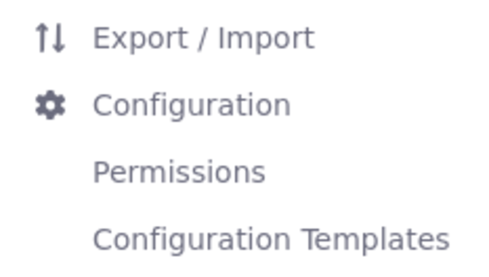

# Using Widgets on a Content Page
<!--TASK: Reconsider-->
The widgets section functions just like the [add menu on a widget page](../using-widget-pages/adding-widgets-to-a-page.md). The full list of available widgets appears, and you can add them to the page. The main difference is that only the main configuration options for widgets are available on content pages.

```{note}
While widgets are rendered according to [render-weight](https://resources.learn.liferay.com/reference/latest/en/dxp/definitions/liferay-portlet-app_7_4_0.dtd.html#render-weight) on widget pages, this is not true for content pages. Instead, they are rendered in the order they appear on the page (i.e. left to right, top to bottom).
```

## Adding Widgets on Content Pages

1. While [adding elements to the content page](./adding-elements-to-content-pages.md), open the [widgets panel](./content-page-editor-ui-reference.md) and browse the available widgets or search for widgets by name.

1. Drag the widget to the column and row of the layout where you want to place it.

A widget can be a wiki display or a dynamic publishing tool like the asset publisher. The content you display with widgets can be long-form text, an image gallery, or anything in between.

## Configuring Widgets on Content Pages

1. Hover over the widget.

1. Click *Actions* () and select *Configuration*. From here you have several options, depending on the widget.

   

1. Click *Save* to apply the changes.

## Configuring Widget Permissions on Content Pages

Since Liferay Portal 7.3 GA2, you can configure permissions for widgets from a content page. Follow these steps to configure widget permissions on a content page:

1. Hover over the widget.

1. Click *Actions* () and select *Permissions*.

1. Check/uncheck the permissions for the roles in the new window that appears.

1. Click *Save* to apply the changes.

```{note}
When you create a page based on a [page template](../adding-pages/creating-a-page-template.md), permissions are copied too. Permissions for a master page are set in the [master page](../defining-headers-and-footers/managing-master-page-templates.md), not in the pages.
```

## Export/Import Widgets on Content Pages

1. Hover over the widget.

1. Click *Actions* () and select *Export / Import*.

1. Select the export or import tab to begin configuring the respective process.

## Configuring Widget Configuration Templates on Content Pages

1. Hover over the widget.

1. Click *Actions* () and select *Configuration Templates*.

1. Click *Save Current Configuration as Template* to save the widget’s current settings.

1. Enter a name for your template and click *Save*.

## Content Page Limitations for Widgets

Although you can access basic configuration options and permissions for widgets on content pages, there are still some options that are only available on widget pages:

* *Nested applications*: Widgets within widgets are only supported on widget pages.

* *Look and Feel Configuration*: On widget pages you can access the look and feel configuration menu through the widget's actions (), offering fine-grained control over its CSS. This is not available for widgets on content pages, since the look and feel of your content is defined in the theme or by using fragments.

## Related Topics

[Using Content Pages](../using-content-pages.md)

[Adding Elements to Content Pages](./adding-elements-to-content-pages.md)

[Content Page Editor UI Reference](./content-page-editor-ui-reference.md)
