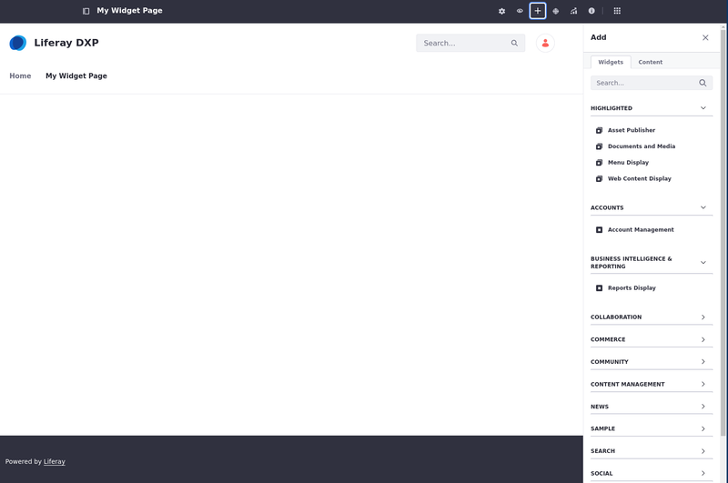
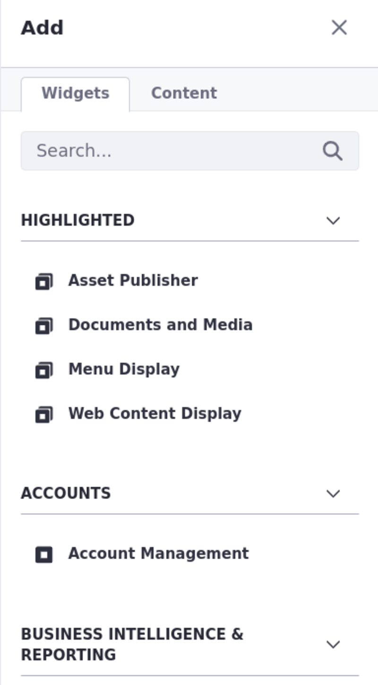

---
taxonomy-category-names:
- Sites
- Widget Pages
- Liferay Self-Hosted
- Liferay PaaS
- Liferay SaaS
uuid: 73b29e35-51d6-4fd0-822a-62a1fa316430
---
# Adding Widgets to a Page

Widgets are applications. They can be simple and only used to [display content](../../displaying-content.md), or they can be full-featured collaboration applications, like the [Message Boards widget](../../../collaboration-and-social/message-boards.md).

```{note}
Widgets are rendered according to [render-weight](https://resources.learn.liferay.com/reference/latest/en/dxp/definitions/liferay-portlet-app_7_4_0.dtd.html#render-weight) on widget pages.
```

Follow these steps to add a widget to a widget page:

1. Navigate to the widget page and click *Add* () in the application bar.

   

1. Open the *Widgets* panel and search or browse through the categories of available widgets to find the one you want.

   

1. Drag the widget to the column and row of the page layout where you want to place it.

```{tip}
In DXP 7.3+, you can click the eye icon at the top of any widget page to toggle the widget controls for all widgets. When disabled, the widget controls do not pop up when you hover your cursor over them.
```

## Related Topics

[Converting Widget Pages to Content Pages](./converting-widget-pages-to-content-pages.md)

[Enabling User Personalization of Widget Pages](./enabling-user-personalization-of-widget-pages.md)

[Analyze Content Metrics Using the Content Performance Tool](../../../content-authoring-and-management/page-performance-and-accessibility/analyze-content-metrics-using-content-performance-tool.md)
