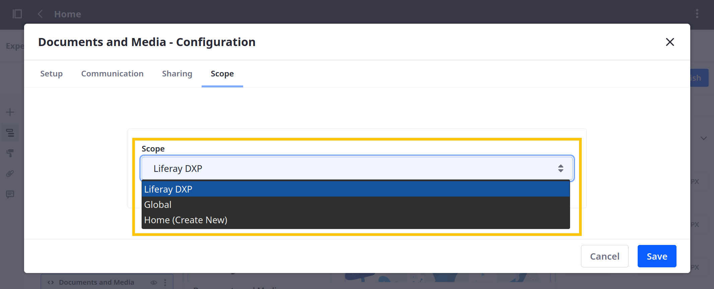
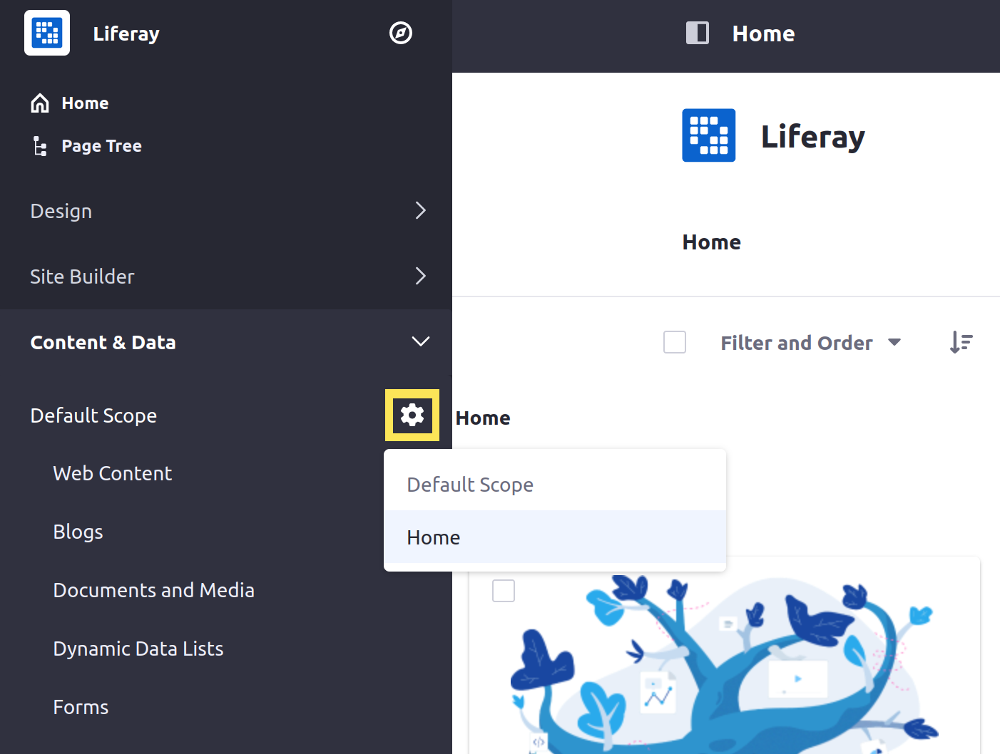

# Setting Widget Scopes

By default, Liferay's page widgets are *scoped* by site. This means all instances of a widget in a site share the same data and display the same content. For example, if you add the Message Boards widget to two pages in the same site, they use the same set of data. While if you add the Message Boards widget to pages in different sites, they use their respective site's data.

If desired, you can configure individual widget instances to use different scopes with different sets of data. For example, you can add the Message Boards widget to multiple site pages and scope each instance to its page. This way, each instance has its own categories and threads.

Liferay provides these scope options for page widgets:

| Scope | Description |
| :--- | :--- |
| Default | Scope widget data to the current site. |
| Global | Scope widget data to the Global site. For this scope, you can only manage the widget's content from the Global site. |
| Page | Scope widget data to an individual page. To use page scopes, you must create them individually when configuring a page widget. Once created, the page scope is available for all other widgets. |

Follow these steps to configure a widget's scope:

1. Begin editing a page.

1. Hover over the desired widget, click its *Options* button (  ), and select *Configuration*.

1. Go to the *Scope* tab and use the drop-down menu to select a scope.

   This menu includes the current site (e.g., Liferay DXP), the Global site, the current page, and any other page scopes available in the site.

   If you haven't created a scope for the current page, its name is followed by `(Create New)` (e.g., Home (Create New)).

   

1. Click *Save*.

Once you create a new widget scope, a *Scope Configuration* button () appears under *Content & Data* in the Site Menu (  ). You can use it to select the default scope or available page scopes. Your selection changes the content that appears when you manage each type.

## Additional Information

* [Exporting/Importing Widget Data](./exporting-importing-widget-data.md)
* [Scoping Your Message Boards](../../../../collaboration-and-social/message-boards/user-guide/scoping-your-message-boards.md)
