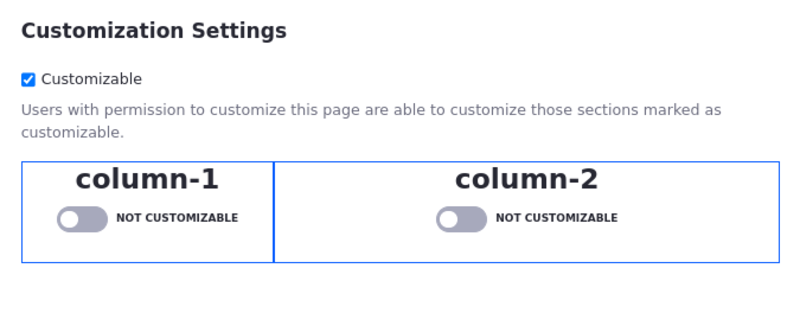
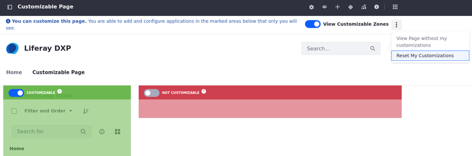

# Enabling User Personalization of Widget Pages

Administrators can designate some or all sections (rows and columns of the page layout) of a widget page as customizable for site members.

Page customizations made in those customizable areas only appear for the user who made the customizations.

## Enabling Page Customizations

1. Open the *Site Menu* (  ) and navigate to *Site Builder* &rarr; *Pages*.

1. Open *Actions* (  ) next to the desired widget page and select *Configure*.

1. Select the *General* tab at the top of the page and go to the *Customization Settings* panel.

1. Check the *Customizable* checkbox.

    

1. Toggle the *Not Customizable* option to *Customizable* for each section you want to make customizable.

## Customizing Pages

With customization activated for a page, site members can add apps to the customizable sections of the page from the Add menu in the top right. Site members can make two kinds of customizations to customizable regions:

- Add or remove apps
- Configure applications

```{note}
Site members can't change a non-instanceable app's configuration inside a customizable region since those apps are tied to the site where they've been added.
```

Site members have access to these contextual options from the page's Options menu (  ) in the Control Menu:

**View Page without my customizations**: Displays the default page and hides the Add menu.

**Reset My Customizations**: Restores the customized page back to the default page, discarding any customizations.

**View My Customized Page**: Displays the page with the user's customizations and makes the Add menu available so users can add widgets to the page.



Administrators of customizable pages have the same two views as site members: the default page view and the customized page view. Changes they make to the non-customizable sections of the default page affect all users just like other pages, while changes they make to the customized sections affect only themselves and do not overwrite users' customizations.

## Granting Roles Permission to Customize Pages

By default, site members can make page customizations but non-site members and guests can't. Administrators can update permissions for an existing role or [create a new role](../../../users-and-permissions/roles-and-permissions/creating-and-managing-roles.md) and assign it to other users to enable them to customize pages. Follow these steps to grant role permissions to customize pages:

1. Open the *Global Menu* (  ), and navigate to *Control Panel* &rarr; *Users* &rarr; *Roles*.

1. Open *Actions* (  ) next to the desired role and select *Edit*.

1. Click the *Define Permissions* tab for the role and go to *Site and Asset Library Administration* &rarr; *Site Builder* &rarr; *Pages* under Summary.

1. Scroll down to the Page section under the Resource Permissions heading and check the *Customize* permission.

    Users can customize the look and feel of apps and import or export app settings with the Customize permission.

1. Scroll down and click *Save* to apply the changes.