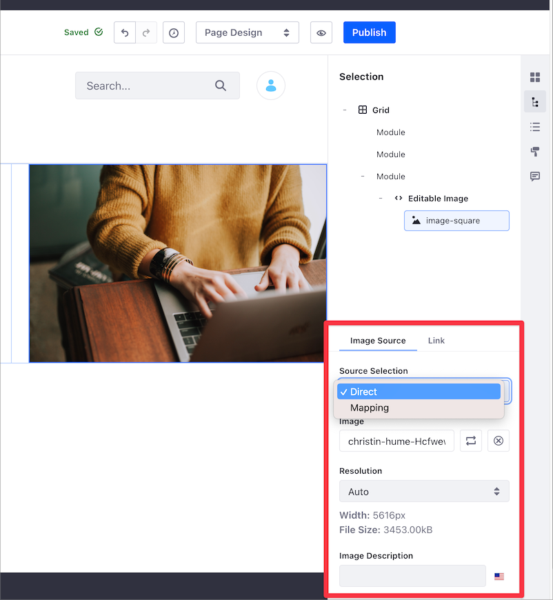

---
toc:
  - ./fragment-specific-tags-and-attributes-reference/fragment-specific-tags-and-attributes-reference-for-liferay-73-and-earlier-versions.md
taxonomy-category-names:
- Development and Tooling
- Fragments
- Liferay Self-Hosted
- Liferay PaaS
- Liferay SaaS
uuid: ba3f3663-f72e-4f18-b220-d9b2e127ef5e
---

# Fragment Specific Tags and Attributes Reference

Along with standard HTML, CSS, and JavaScript, you can use Liferay-specific tags and attributes to define editable sections, embed widgets, and more.

Editable elements can be modified before publication, which means that you can create simple, reusable fragments that have identical formatting, but contain elements that are adaptable to the specific context.

These Liferay-specific tags and attributes are available:

- [Editable Text](#making-text-editable)
- [Editable Images](#making-images-editable)
- [Editable Links](#creating-editable-links)
- [Editable HTML](#creating-editable-html)
- [Embedded Widgets](#including-widgets-within-a-fragment)
- [Localizable Fragment Fields](#localizing-fragment-configurations)
- [Date Fragments](#using-date-fragments)
- [Map Object Actions to Buttons](#making-buttons-action-ready)
- [JavaScript Variables](#using-javascript-variables)

!!! warning
    You can use `data-lfr-editable*` attributes to define elements as editable. Editable elements have a `data-lfr-editable-id` attribute, and it must be unique. Do not change the ID after the page fragment is added to a page; doing so causes you to lose changes made to the fragment.

!!! tip
    When you start typing the name of a tag, the [HTML editor](../../developing-page-fragments/using-the-fragments-editor.md) provides auto-completion for `lfr` tags like editable elements and embeddable widgets.

This reference lists the available editable tags and attributes along with examples of how to use them in your fragments.

## Editable Elements

Create editable sections, dynamic and reusable fragments for building a site, or bring a fragment to life by including a widget embedded to a portlet using editable elements.

Provide text, images, links, and HTML code to these editable elements which become the default values for their fields. You may want to display the editable content in the final version of the page, or you may want filler content that should be replaced before publishing the page.

!!! warning
    FreeMarker code in editable fields is executed only once when the fragment is added to the page (to set its default value).

    Avoid using it if you need the value re-evaluated. For example, if you localize a value using `${languageUtil.get(locale,'word')}`, the word is only localized when you add the fragment to the page. The code does not run again even if you change your portal's language.

Editable elements have many uses. Imagine you need a title, a small text box, an image, and a link to provide a product description. Create a fragment containing editable filler text, space for an editable image, the appropriate formatting, and an editable link.

You can then add the fragment to multiple pages and define the image, text, and link for each product you must describe.


!!! warning
    Nesting editable elements inside other editable elements in a fragment is not supported.

## Making Text Editable

You can make fragment text editable by including the `data-lfr-editable-type="text"` attribute in the image element. The `data-lfr-editable-id` must be a unique ID, like this example:

```html
<p data-lfr-editable-id="text1" data-lfr-editable-type="text">
   Placeholder
</p>
```

!!! note
    All block elements and inline elements are supported for editable text.

If you need formatting options like text or color styles, use `rich-text`:

```html
<p data-lfr-editable-id="text1" data-lfr-editable-type="rich-text">
   Placeholder
</p>
```

!!! note
    All block element tags are supported for editable Rich text. If you want to make text inside an HTML element editable, you must use the `rich-text` type. The `text` type strips HTML formatting out of the text before rendering.

## Making Images Editable

Images use the same `data-lfr-editable-type` attribute as text, but with the `image` type. The `data-lfr-editable-id` must be a unique ID:

```html

```

After adding the `data-lfr-editable-type` tag with the `image` type to a fragment, you can then click on the editable image in the content page editor sidebar and configure its source and properties when the fragment is added to a page.



Most images can be handled like this, but to add an editable background image, you must set the `data-lfr-background-image-id` property. This ID is added to the fragment's main `div` and should match the editable image ID.

```html
<div data-lfr-background-image-id="background-img-unique-id">
   <h1 data-lfr-editable-id="h1-unique-id" data-lfr-editable-type="text">
      Placeholder
   </h1>
   <p data-lfr-editable-id="p-unique-id" data-lfr-editable-type="text">
      Placeholder
   </p>
</div>
```

Content mapping connects editable fields in your fragment with fields from an asset type like web content or blogs. For example, you can map an image field to display a preview image for a web content article. For more information on mapping fields, see [Fragment Mapping Settings](../../../creating-pages/page-fragments-and-widgets/using-fragments/configuring-fragments/fragment-sub-elements-reference.md#mapping-settings).

## Creating Editable Links

You can make general link elements editable by setting the `data-lfr-editable-type` to `link`. The `data-lfr-editable-id` must be a unique ID.

You can create editable link elements in different ways. Here are some examples:

```html
<a
   href="#placeholder"
   target="_blank"
   data-lfr-editable-id="link1"
   data-lfr-editable-type="link"
>
   Go to placeholder
</a>
```

Use `mailto:` URI scheme to associate the link with an email:

```html
<a
   href="mailto:email@liferay.com"
   target="_blank"
   data-lfr-editable-id="link-to-email"
   data-lfr-editable-type="link"
>
   Send a Message
</a>
```

Use `tel:` URI scheme to associate the link with a telephone number:

```html
<a
   href="tel:555-2368"
   target="_blank"
   data-lfr-editable-id="link-to-phone"
   data-lfr-editable-type="link"
>
   Who You Gonna Call?
</a>
```

You can edit the type of link, target URL, and link mapping from the content page editor sidebar.


For more information on editable links, see [Editable Links](../../../creating-pages/page-fragments-and-widgets/using-fragments/configuring-fragments/fragment-sub-elements-reference.md#link-settings).

## Creating Editable HTML

You can make general HTML elements editable as well by setting the `data-lfr-editable-type` attribute to `html`:

```html
<article data-lfr-editable-id="text1" data-lfr-editable-type="html">
   <h1>Placeholder</h1>
</article>
```

## Including Widgets Within A Fragment

Each widget has a registered name and corresponding `lfr-widget-[name]` tag, which you must use to embed it in a fragment. For example, the Menu Display widget is registered as `nav`, so its tag is `<lfr-widget-nav />`. You can embed it in a block like this:

```html
<div class="nav-widget">
   <lfr-widget-nav>
   </lfr-widget-nav>
</div>
```

These are the widgets that can be embedded and their accompanying tags:

| Widget Name                | Tag                              |
|----------------------------|----------------------------------|
| DDL Display                | `<lfr-widget-dynamic-data-list>` |
| Form                       | `<lfr-widget-form>`              |
| Asset Publisher            | `<lfr-widget-asset-list>`        |
| Breadcrumb                 | `<lfr-widget-breadcrumb>`        |
| Category Filter            | `<lfr-widget-categories-nav>`    |
| Flash                      | `<lfr-widget-flash>`             |
| Media Gallery              | `<lfr-widget-media-gallery>`     |
| Menu Display               | `<lfr-widget-nav>`               |
| Polls Display              | `<lfr-widget-polls>`             |
| Related Assets             | `<lfr-widget-related-assets>`    |
| Site Map                   | `<lfr-widget-site-map>`          |
| Tag Cloud                  | `<lfr-widget-tag-cloud>`         |
| Tag Filter                 | `<lfr-widget-tags-nav>`          |
| Web Content Display        | `<lfr-widget-web-content>`       |
| RSS Publisher              | `<lfr-widget-rss>`               |
| Iframe                     | `<lfr-widget-iframe>`            |

## Enabling Embedding for Your Widget

{bdg-secondary}`Liferay DXP/Portal 7.4+ +U60`

If you have a custom widget that you want to embed in a fragment, you can configure that widget to be embeddable. To embed your widget, it must be an OSGi Component. Inside the `@Component` annotation for the portlet class you want to embed, add this property:

```properties
com.liferay.fragment.processor.PortletRegistry
```

Also, set the `@Activate` and the `@Deactivate` life cycle methods to register and unregister an alias for the portlet using the `PortletRegistry`:

```java
public class MySamplePortlet extends MVCPortlet {

	@Activate
	protected void activate() {
		_portletRegistry.registerAlias(
			_ALIAS,
			MySamplePortletKeys.SAMPLE);
	}

	@Deactivate
	protected void deactivate() {
		_portletRegistry.unregisterAlias(_ALIAS);
	}

	private static final String _ALIAS = "sample";

	@Reference
	private PortletRegistry _portletRegistry;
}
```

When you deploy your widget, it's available to add. The name you specify in the property must be appended to the `lfr-widget` tag like this:

```markup
<lfr-widget-app-name>
</lfr-widget-app-name>
```

!!! note
    According to the W3C HTML standards, custom elements can't be self-closing. Therefore, even though you can't add anything between the opening and closing `<lfr-widget...>` tags, you can't use the self-closing notation for the tag.

## Localizing Fragment Configurations

You can localize fragment configuration for a page's target language. For example, on a button fragment you can define one button type when the page language is en-US, and a different button type when the page language is es-ES. To localize a fragment configuration field, use the `localizable` attribute.

!!! note
    The `localizable` attribute is not available for fragment configuration fields where the `configurationRole` property is set to `style`.

In the following code excerpt, the button fragment configuration sets the `localizable` attribute to `true` for the `fields` section under `fieldSets`. The `localizable` attribute is set at the field level. In the example, there is only one `buttonType` field. If you have a fragment with multiple fields, you can set the `localizable` attribute for each one:

```json
"fieldSets": [
  {
    "fields": [
      {
        "dataType": "string",
        "defaultValue": "primary",
        "label": "type",
        "name": "buttonType",
        "type": "select",
        "localizable": true,
        "typeOptions": {
          "validValues": [
            {
              "value": "primary"
            },
            {
              "value": "secondary"
            },
            {
              "value": "link"
            },
            {
              "value": "outline-primary"
            },
            {
              "value": "outline-secondary"
            }
          ]
        }
      }
    ]
  }
]
```

You can use this sample code to change the button type depending on the page's target language. In the following example, the *Contact Us*/*Contacto* button fragment sets the `localizable` attribute to `true` for the `buttonType` field. The example uses this attribute to configure the *Primary* button type when the page uses the en-US language (A) and the *Outline Primary* type when the page uses es-ES (B).


!!! tip
    The flag icon under the fragment's General settings indicates the configuration field as localizable.

Fragments with the `localizable` attribute that do not specify a custom configuration for a language use the default page language's configuration.

## Using Date Fragments

Conforming date formats to a locality can be a challenge in many contexts. You can customize and localize date formats using date fragments by including the `data-lfr-editable-id="date-time"` and `data-lfr-editable-type="date-time"` attributes in the fragment. `data-lfr-editable-id` must be a unique ID, like this example:

```html
<div data-lfr-editable-type="date-time" data-lfr-editable-id="date-time">
   02/03/11 00:00 AM
</div>
```

## Date Formats

You can choose the most common date formats out-of-the-box or customize your date format following [`SimpleDateFormat`](https://devdocs.io/openjdk~8/java/text/simpledateformat).

There are four out-of-the-box options available:

| Date Format | How it looks |
|:------------|:-------------|
| MM/DD/YY    | 08/07/23     |
| DD/MM/YY    | 07/08/23     |
| YY/MM/DD    | 23/08/07     |
| DD/MM/YYYY  | 07/08/2023   |

If you customize your date format, you can include different date and time patterns (e.g. era designator, time zone, and day name in the week).

Here are some examples:

| Date Format                  | How it looks                       |
|:-----------------------------|:-----------------------------------|
| `MMMM dd, YYYY. hh:mm a`     | August 07, 2023. 11:57 AM          |
| `MM.dd.YY`                   | 08.07.23                           |
| `hh 'o''clock' a, zzzz`      | 11 o'clock AM, Greenwich Mean Time |
| `KK:mm a, z`                 | 11:57 AM, GMT                      |
| `EEE, d MMM yyyy HH:mm:ss Z` | Mon, 7 Aug 2023 11:57:00 +0000     |

!!! tip
    You can localize the date format the same way you [localize fragment configuration fields](#localizing-fragment-configurations).

## Making Buttons Action-ready

You can trigger [object actions](../../../../liferay-development/objects/creating-and-managing-objects/actions.md) using button components by including the `data-lfr-editable-id="action"` and `data-lfr-editable-type="action"` attributes to the button tag. The `data-lfr-editable-id` must be a unique ID, like this example:

```html
<button class="btn btn-${configuration.buttonSize} btn-${configuration.buttonType}" data-lfr-editable-id="action" data-lfr-editable-type="action">
   Go Somewhere
</button>
```

## Using JavaScript Variables

When adding JavaScript to a fragment, Liferay makes several pre-defined variables available for you to use, making it easier to manage your fragment’s behavior. Here are some of the variables you can use:

- `fragmentElement` is the root HTML element that contains your fragment. You can use it to access and manipulate the DOM elements within your fragment.

   ```javascript
   const button = fragmentElement.querySelector('.my-button');
   button.addEventListener('click', () => {
      console.log('Button clicked!');
   });
   ```

- `configuration` is an object containing the fragment’s configuration options. If the fragment has configurable fields (like colors, text, or URLs), their values are stored here.

   ```javascript
   const textColor = configuration.textColor;
   fragmentElement.style.color = textColor;
   ```

- `fragmentEntryLinkNamespace` is a unique string that can be used to identify the fragment within the page, even if there are multiple instances of the same fragment. It's useful when you must create unique IDs or scopes in your JavaScript.

   ```javascript
   const uniqueId = `${fragmentEntryLinkNamespace}-button`;
   const button = document.createElement('button');
   button.id = uniqueId;
   fragmentElement.appendChild(button);
   ```

   !!! note
      `fragmentEntryLinkNamespace` was called `fragmentNamespace`, but `fragmentNamespace` has been deprecated. It's still available for compatibility, but you should use `fragmentEntryLinkNamespace` in new code.

- `layoutMode` indicates whether the fragment is being edited or viewed. You can adjust the fragment's behavior based on whether the page is in edit mode (`layoutMode === "edit"`) or being viewed live (`layoutMode === "view"`).

   ```javascript
   if (layoutMode === 'edit') {
      console.log('Page is in edit mode');
   } else {
      console.log('Page is being viewed');
   }
   ```

## Related Topics

- [Fragments Toolkit Command Reference](./fragments-toolkit-command-reference.md)
- [Page Fragment Editor Interface Reference](./page-fragment-editor-interface-reference.md)
- [Fragment Configuration Types Reference](./fragment-configuration-types-reference.md)
