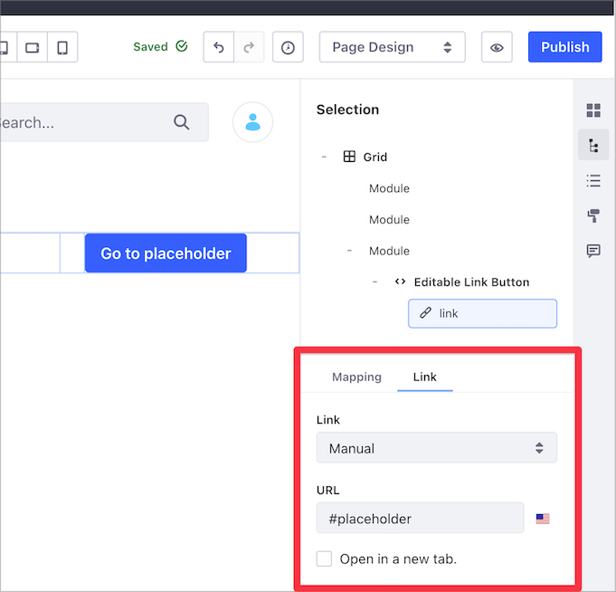

---
taxonomy-category-names:
- Development and Tooling
- Fragments
- Liferay Self-Hosted
- Liferay PaaS
- Liferay SaaS
uuid: e4661dfe-4cd7-4724-91d1-1f9f85fdfed9
---

# Fragment Specific Tags and Attributes Reference for Liferay 7.3 and Earlier Versions

Along with standard HTML, CSS, and JavaScript, you can use Liferay-specific tags and attributes to define editable sections, embed widgets, and more.

Editable elements can be modified before publication, which means that you can create simple, reusable fragments that have identical formatting, but contain elements that are adaptable to the specific context.

These Liferay-specific tags and attributes are available:

- [Editable Text](#making-text-editable)
- [Editable Images](#making-images-editable)
- [Editable Links](#creating-editable-links)
- [Editable HTML](#creating-editable-html)
- [Embedded Widgets](#including-widgets-within-a-fragment)
- [Localizable Fragment Fields](#localizing-fragment-configurations)

Since Liferay Portal 7.3 GA3 and Liferay DXP 7.3, you can use `data-lfr-editable*` attributes to define elements as editable, rather than wrapping editable elements with `lfr-editable` tags.

!!! warning
    Editable elements have a `data-lfr-editable-id` attribute, and it must be unique. Do not change the ID after the page fragment is added to a page; doing so causes you to lose changes made to the fragment.

The old tags still work for backwards compatibility, but you should use the newer data attributes if you're running Portal 7.3 GA3+ or Liferay DXP 7.3+, as they are easier to write.

!!! tip
    When you start typing the name of a tag, the [HTML editor](../../../developing-page-fragments/using-the-fragments-editor.md) provides auto-completion for `lfr` tags like editable elements and embeddable widgets.

This reference lists the available editable tags and attributes along with examples of how to use them in your fragments.

## Editable Elements

Create editable sections, dynamic and reusable fragments for building a site, or bring a fragment to life by including a widget embedded to a portlet using editable elements.

Provide text, images, links, and HTML code to these editable elements which become the default values for their fields. You may want to display the editable content in the final version of the page, or you may want filler content that should be replaced before publishing the page.

!!! warning
    Freemarker code in editable fields is executed only once when the fragment is added to the page (to set its default value).

    Avoid using it if you need the value re-evaluated. For example, if you localize a value using `${languageUtil.get(locale,'word')}`, the word is only localized when you add the fragment to the page. The code does not run again even if you change your portal's language.

Editable elements have many uses. Imagine you need a title, a small text box, an image, and a link to provide a product description. Create a fragment containing editable filler text, space for an editable image, the appropriate formatting, and an editable link.

You can then add the fragment to multiple pages and define the image, text, and link for each product you must describe.


!!! warning
    Nesting editable elements inside other editable elements in a fragment is not supported.

## Making Text Editable

You can make fragment text editable by including the `data-lfr-editable-type="text"` attribute in the image element. The `data-lfr-editable-id` must be a unique ID, like this example:

```html
<p data-lfr-editable-id="text1" data-lfr-editable-type="text">
   Placeholder
</p>
```

!!! note
    All block elements and inline elements are supported for editable text.

For Liferay Portal 7.3 GA2 and below, use the syntax below. A unique ID is required to render the element properly:

```html
<lfr-editable id="unique-id" type="text">
   This is editable text!
</lfr-editable>
```

If you need formatting options like text or color styles, use `rich-text`:

```html
<p data-lfr-editable-id="text1" data-lfr-editable-type="rich-text">
   Placeholder
</p>
```

!!! note
    All block element tags are supported for editable Rich text.

For Liferay Portal 7.3 GA2 and below, use the syntax below:

```html
<lfr-editable id="unique-id" type="rich-text">
   This is editable text that I can make bold or italic!
</lfr-editable>
```

!!! note
    If you want to make text inside an HTML element editable, you must use the `rich-text` type. The `text` type strips HTML formatting out of the text before rendering.

## Making Images Editable

Images use the same `data-lfr-editable-type` attribute as text, but with the `image` type. The `data-lfr-editable-id` must be a unique ID:

```html

```

For Liferay Portal 7.3 GA2 and below, use this syntax:

```html
<lfr-editable id="unique-id" type="image">
   
</lfr-editable>
```

After adding the `lfr-editable` tag with the `image` type to a fragment, you can then click on the editable image in the content page editor sidebar and configure its source and properties when the fragment is added to a page.


Most images can be handled like this, but to add an editable background image, you must set the `data-lfr-background-image-id` property. This ID is added to the fragment's main `div` and should match the editable image ID.

```html
<div data-lfr-background-image-id="background-img-unique-id">
   <h1 data-lfr-editable-id="h1-unique-id" data-lfr-editable-type="text">
      Placeholder
   </h1>
   <p data-lfr-editable-id="p-unique-id" data-lfr-editable-type="text">
      Placeholder
   </p>
</div>
```

Content mapping connects editable fields in your fragment with fields from an asset type like web content or blogs. For example, you can map an image field to display a preview image for a web content article. For more information on mapping fields, see [Fragment Mapping Settings](../../../../creating-pages/page-fragments-and-widgets/using-fragments/configuring-fragments/fragment-sub-elements-reference.md#mapping-settings).

## Creating Editable Links

There is also a specific syntax for creating editable link elements:

```html
<a
   href="#placeholder"
   target="_blank"
   data-lfr-editable-id="link1"
   data-lfr-editable-type="link"
>
   Go to placeholder
</a>
```

For Liferay Portal 7.3 GA2 and below, use this syntax:

```html
<lfr-editable id="unique-id" type="link">
   <a href="default-target-url-goes-here">Link text goes here</a>
</lfr-editable>
```

You can edit the type of link, target URL, and link mapping from the content page editor sidebar.



For more information on editable links, see [Editable Links](../../../../creating-pages/page-fragments-and-widgets/using-fragments/configuring-fragments/fragment-sub-elements-reference.md#link-settings).

## Creating Editable HTML

You can make general HTML elements editable as well by setting the `data-lfr-editable-type` attribute to `html`:

```html
<article data-lfr-editable-id="text1" data-lfr-editable-type="html">
   <h1>Placeholder</h1>
</article>
```

For Liferay Portal 7.3 GA2 and below, use this syntax:

```html
<lfr-editable type="html" id="text1">
   <h1>Placeholder</h1>
</lfr-editable>
```

## Including Widgets Within A Fragment

Each widget has a registered name and corresponding `lfr-widget-[name]` tag, which you must use to embed it in a fragment. For example, the Menu Display widget is registered as `nav`, so its tag is `<lfr-widget-nav />`. You can embed it in a block like this:

```html
<div class="nav-widget">
   <lfr-widget-nav>
   </lfr-widget-nav>
</div>
```

These are the widgets that can be embedded and their accompanying tags:

| Widget Name                | Tag                              |
|----------------------------|----------------------------------|
| DDL Display                | `<lfr-widget-dynamic-data-list>` |
| Form                       | `<lfr-widget-form>`              |
| Asset Publisher            | `<lfr-widget-asset-list>`        |
| Breadcrumb                 | `<lfr-widget-breadcrumb>`        |
| Category Filter            | `<lfr-widget-categories-nav>`    |
| Flash                      | `<lfr-widget-flash>`             |
| Media Gallery              | `<lfr-widget-media-gallery>`     |
| Menu Display               | `<lfr-widget-nav>`               |
| Polls Display              | `<lfr-widget-polls>`             |
| Related Assets             | `<lfr-widget-related-assets>`    |
| Site Map                   | `<lfr-widget-site-map>`          |
| Tag Cloud                  | `<lfr-widget-tag-cloud>`         |
| Tag Filter                 | `<lfr-widget-tags-nav>`          |
| Web Content Display        | `<lfr-widget-web-content>`       |
| RSS Publisher              | `<lfr-widget-rss>`               |
| Iframe                     | `<lfr-widget-iframe>`            |

### Enabling Embedding for Your Widget

If you have a custom widget that you want to embed in a fragment, you can configure that widget to be embeddable. To embed your widget, it must be an OSGi component. Inside the `@Component` annotation for the portlet class you want to embed, add this property:

```properties
com.liferay.fragment.entry.processor.portlet.alias=app-name
```

When you deploy your widget, it's available to add. The name you specify in the property must be appended to the `lfr-widget` tag like this:

```markup
<lfr-widget-app-name>
</lfr-widget-app-name>
```

!!! note
    According to the W3C HTML standards, custom elements can't be self-closing. Therefore, even though you can't add anything between the opening and closing `<lfr-widget...>` tags, you can't use the self-closing notation for the tag.

## Related Topics

- [Fragments Toolkit Command Reference](../../fragments-toolkit-command-reference.md)
- [Page Fragment Editor Interface Reference](../../page-fragment-editor-interface-reference.md)
- [Fragment Configuration Types Reference](../../fragment-configuration-types-reference.md)
