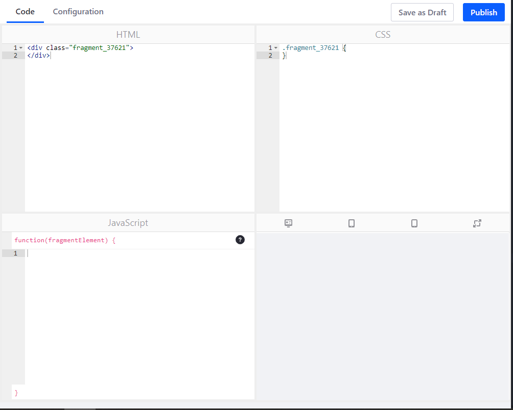

---
taxonomy-category-names:
- Development and Tooling
- Fragments
- Liferay Self-Hosted
- Liferay PaaS
- Liferay SaaS
uuid: bce2f5ae-9950-4e1b-ac76-5a7d7de6ee79
---

# Page Fragment Editor Interface Reference

The page fragment editor's interface is organized into two tabs:

- [Code Editor](#code-editor)
- [Configuration](#configuration)

The sections below cover how to use these portions of the interface. See [Developing Page Fragments](../developing-page-fragments.md) to learn how to develop Page Fragments.

## Code Editor

The code editor is split into four panes:

**HTML:** Supports standard HTML, along with Liferay Portal specific tags and FreeMarker (using the [alternative (square bracket) syntax](https://freemarker.apache.org/docs/dgui_misc_alternativesyntax.html)) that can be used to add dynamic behavior.

!!! tip
    Type `$(` to begin using auto-completion to find variable names. Type `[@` to use auto-completion to find taglib names.

**CSS:** Supports standard CSS.

**JavaScript:** Supports standard JavaScript and JQuery. You can also access configuration values in the FreeMarker context in the JavaScript pane.

**Preview:** provides a live preview of the component that updates as you write code. You can switch between desktop, mobile, tablet, and expanded views.

## Configuration

!!! note
    Defining configurations for Page Fragments is available in Liferay DXP 7.2 SP1+ and Liferay Portal GA2+.

The Configuration tab provides input for adding configuration options to the fragment's Configuration Menu. For example, you can add a selector to your fragment's configuration options that lets users choose a color for the fragment's heading. Defining configuration options for a fragment gives it more flexibility, reducing the number of fragments you must maintain.

!!! note
    Changes to the configuration automatically reflect in the code editor. If your configuration is invalid, you can't publish your fragment. Always ensure the JSON configuration is valid before previewing or publishing fragments.

Configuration values are made available to the fragment through the FreeMarker context in the HTML pane. You can combine configuration options with conditional values in the HTML to create dynamic experiences for the user. You can also access these values via JavaScript. See [Making Page Fragments Configurable](../../developing-page-fragments/adding-configuration-options-to-fragments.md) for more information.

## Related Topics

- [Developing Fragments](../developing-page-fragments.md)
- [Adding Configuration Options to Fragments](../developing-page-fragments/adding-configuration-options-to-fragments.md)
- [Fragment Configuration Type Reference](./fragment-configuration-types-reference.md)
