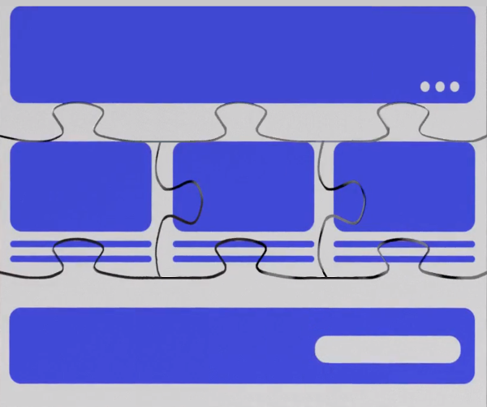

---
toc:
  - ./developing-page-fragments/using-the-fragments-editor.md
  - ./developing-page-fragments/using-the-fragments-toolkit.md
  - ./developing-page-fragments/adding-configuration-options-to-fragments.md
  - ./developing-page-fragments/best-practices-for-using-fragment-configurations.md
  - ./developing-page-fragments/defining-fragment-drop-zones.md
  - ./developing-page-fragments/using-custom-fields-in-page-fragments.md
  - ./developing-page-fragments/creating-a-contributed-fragment-set.md
  - ./developing-page-fragments/validating-fragment-configurations.md
  - ./developing-page-fragments/auto-deploying-fragments.md
  - ./developing-page-fragments/including-default-resources-with-fragments.md
  - ./developing-page-fragments/setting-the-order-of-elements-in-a-fragment.md
  - ./developing-page-fragments/creating-form-fragments.md
taxonomy-category-names:
- Development and Tooling
- Fragments
- Liferay Self-Hosted
- Liferay PaaS
- Liferay SaaS
uuid: faecb735-7bbf-4469-a702-fdda8a1b1427
---

# Developing Page Fragments

Page fragments are the building blocks for [content pages](../creating-pages/understanding-pages.md#content-pages). They're made from the three components of web pages: CSS, HTML, and JavaScript. To create a page you combine multiple fragments, and together they create the design for the page and its functionality. Fragments can make up a larger page element (such as cards or paragraph elements), or they can stand alone on their own (such as a banner).

!!! note
    For Liferay DXP 7.4+, fragment collections are called fragment sets in the Liferay UI.

## Fragment Sets

Sets organize fragments so that groups of related fragments can be managed and shared. Users navigate sets when selecting fragments to add to a page. So, create fragments in sets that make it easy to combine into pages.

An example appears in the admin page, which shows all the out-of-the-box fragments (and their code). A page fragment's code can be updated through the admin interface.

If you want your page fragment's code instead to be static (locked and unable to be edited through the interface), you can create a [contributed fragment set](./developing-page-fragments/creating-a-contributed-fragment-set.md).

## Tooling

Browser-based tools help you create fragments directly on your system, and CLI-based tools integrate with your own set to preserve your productivity:

- [The Built-in Fragments Editor](./developing-page-fragments/using-the-fragments-editor.md): use the built-in editor to develop page fragments in Liferay Portal.

- [The Fragments Toolkit](./developing-page-fragments/using-the-fragments-toolkit.md): use the fragments CLI to generate, import, and export page fragments and fragment sets from your desktop.

!!! note
    The Fragments Toolkit is deprecated as of Liferay 2024.Q1+/Portal 7.4 GA112+. See [Alternatives for the Fragments Toolkit](./developing-page-fragments/using-the-fragments-toolkit.md#alternatives-to-the-fragments-toolkit) for more information.

## Features

Fragments can be enhanced using the below resources, making them much more powerful than plain HTML, CSS, and JavaScript:

- [Editable Elements](./developing-page-fragments-reference/fragment-specific-tags-and-attributes-reference.md): make text, images, links, and "rich" text elements editable, so users can replace the content with custom text and images. This is the key feature of fragments that makes them reusable. You can also embed widgets.

- [Drop Zones](./developing-page-fragments/defining-fragment-drop-zones.md): Add drop zones to Fragments using the `<lfr-drop-zone></lfr-drop-zone>` label. Once added, you can drag and drop fragments and widgets into the defined area.

- [Configuration Options](./developing-page-fragments/adding-configuration-options-to-fragments.md): Add configuration options to the application's Configuration Menu, like modifying the fragment's font color.

- [FreeMarker](https://freemarker.apache.org/): FreeMarker is a templating language that enhances HTML with variables, conditional statements, and more. From your HTML, you can use the [alternative (square bracket) syntax](https://freemarker.apache.org/docs/dgui_misc_alternativesyntax.html) for FreeMarker.

!!! important
    Grant permission to create or edit templates in FreeMarker to trusted users only. See [Assigning Permissions to Web Content Structures and Templates](../../content-authoring-and-management/web-content/web-content-structures/assigning-permissions-to-structures-and-templates.md#security-considerations-for-web-content-templates) for information about web content templates security.

## Best Practices

We recommend these best practices when writing your Fragment code:

- Make your code semantic and highly reusable.
- Namespace your fragments properly so they don't interfere with other elements on the page outside of the fragment.
- Use the auto-generated fragment class as the basis for all CSS selectors you add to avoid impacting other fragments.
- Use JavaScript sparingly, since it isn't easily reusable. Instead, reference external JavaScript libraries.
- Escape fragment configuration text values.
